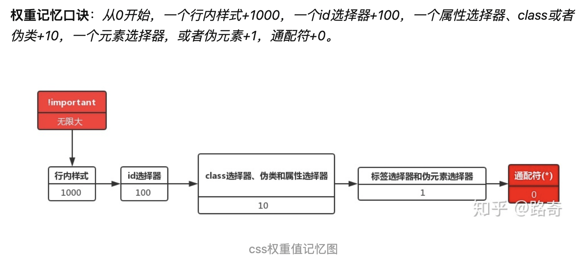

# css 样式优先级及权重

选择器：
* 属性选择器：[属性名]，如：`[disabled]`
* 伪类选择器(:)：用于匹配元素的**特定状态**或**位置**。如：hover(悬停)、focus(获得焦点)、first-child等..
* 伪元素选择器(::)：会创建虚拟元素。如：::before，在元素内容前插入虚拟元素

多个 class 名组合：
* 多类选择器：类名之间**无空格**（.a.b.c），表示 “**同时拥有这些 class 的元素**”
* 后代选择器：类名之间**有空格**（如 .a .b）

## 什么是权重
* “css权重关系到你的css规则是怎样显示的”。
* 当很多的样式被应用到某一个元素上时，权重是一个决定哪种样式生效，或者是优先级的过程。
* 如果两个选择器同时作用到一个元素上，权重高者生效。


**!important > 行内样式 > 内联样式 and 外联样式**

**注意：**内联样式的优先级并不一定比外联样式高。这与加载顺序有关，后面的样式会覆盖之前的样式。(css样式是单线程)

```html
<!DOCTYPE html>
<html>
	<head>
		<meta charset="UTF-8">
		<title>权重相等的情况下</title>
		<style>
			/* 权重值：201 */
			#box #box2 p{
				width: 200px;
				height: 200px;
				background-color: red;
			}
			/* 权重值：201,离目标最近 */
			#box #box3 p{
				width: 200px;
				height: 200px;
				background-color: yellow;
			}
		</style>
	</head>
	<body>
		<!-- 同等权重下,靠近目标的优先 -->
		<div id="box" class="boxs">
			<div id="box2" class="boxs2">
		    	        <div id="box3" class="boxs3">
		      		        <p></p>
		    	        </div>
		 	</div>
		</div>
	</body>
</html>
```

## 总结
* 常用选择器权重优先级：!important > id > class > tag
* 如果两个选择器同时作用到一个元素上，权重高者生效。
* !important可以提升样式优先级，但不建议使用。
> 因为!important被用于一个简写的样式属性，那么这条简写的样式属性所代表的子属性都会被应用上!important。 例如：
```css
background: blue !important;
```
* 内联/外联样式使用时，后面的会覆盖前面的
* 样式指向同一元素，权重规则生效，权重相同时，就近原则生效，后面定义的被应用

