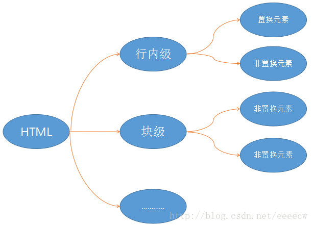

# 置换元素 与 非置换元素
**Html 元素划分：**
* 置换元素、非置换元素
* 行内元素、块级元素，具体介绍见：[块级元素、行内（块）元素](./块元素_行内元素.md)

## 置换元素：
置换元素是指**内容由外部资源（如图片、音视频等）决定，而非元素自身的内容！内容不由 CSS 渲染**的元素。浏览器会根据元素的属性（如src、alt等）来加载外部内容（如图像、视频等），并将其替换到元素在页面中的位置。且元素本身一般拥有固有尺寸（宽度，高度，宽高比）。

**替换元素就是浏览器根据元素的标签和属性，来决定元素的具体显示内容**。
> 例如浏览器会根据标签的src属性的值来读取图片信息并显示出来，而如果查看(X)HTML代码，则看不到图片的实际内容；又例如根据<input>标签的type属性来决定是显示输入框，还是单选按钮等。

3. 常见置换元素：
> img
> video、audio：音视频
> input、select、textarea 等表单控件
> iframe
> canvas
> object

4. 宽高计算（以宽度为例，高度计算同理）：
置换元素的宽高由**外部资源固有尺寸、CSS 样式**和**上下文约束（即：父级）**共同决定，优先级如下：
* **默认以外部资源的原始尺寸展示**（width、height的值均为auto时）
* CSS **明确指定 width 和 height 两个** 尺寸时，优先使用指定值，可能会拉伸或压缩外部资源。
* css**仅指定width、height中的一个**时，自动按原始比例计算另一个维度的尺寸（保持宽高比）
* 受父元素或容器约束时，
若设置了max-width/max-height或min-width/min-height，会进一步限制最终尺寸（不会超过最大值或小于最小值）。   
    > 例如：max-width: 100% 会让图片自适应父容器宽度，同时保持比例。
* 特殊情况：未加载或加载失败。  
此时宽高由浏览器默认占位规则决定（通常是固定的小尺寸，如28×30px），并显示alt文本或占位图标。

**注意：**
* 置换元素，只有可能是行内元素，块级元素 不可能   TODO:
* 对于行内元素的非置换元素，设置宽度和高度都是无效的，元素会取其默认宽高，就是内容的宽高，如

## 非置换元素：
非置换元素是指**内容由元素自身的文本或子元素构成，并由 CSS 负责渲染**的元素。其内容和渲染完全由 HTML 结构与 CSS 控制，不依赖外部资源替换。(X)HTML 的大多数元素是不可替换元素，如
，
，

2. 常见非置换元素：
* 
、、
、<h1>-<h6>
* <ul>、<li>、<a>、<strong>
* 大多数块级和行内元素（除置换元素外）
* 绝大多数非表单、非媒体元素