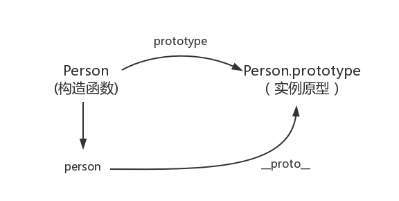

详情见链接：[原型及原型链](https://github.com/mqyqingfeng/Blog/issues/2)

__proto__

## 构造函数创建对象
```javascript
function Person() {

}
// 虽然写在注释里，但是你要注意：
// prototype是函数才会有的属性
Person.prototype.name = 'Kevin';
var person1 = new Person();
var person2 = new Person();
console.log(person1.name) // Kevin
console.log(person2.name) // Kevin
```
## prototype
每个函数都有一个 prototype 属性，也只有函数才具有该属性。函数的 prototype 属性指向了一个对象，这个对象正是调用该构造函数而“创建的实例的原型”，也就是这个例子中的 person1 和 person2 的原型。

那什么是原型呢？你可以这样理解：每一个JavaScript对象(null除外)在“创建”的时候就会与之关联另一个对象，这个对象就是我们所说的原型，每一个对象都会从原型"继承"属性。


## __proto__
每一个JavaScript对象(除了 null )都具有的一个属性，叫__proto__，这个属性会指向该对象的原型。

```javascript
function Person() {

}
var person = new Person();
console.log(person.__proto__ === Person.prototype); // true
```



既然“实例对象和构造函数”都可以指向“原型”，那么“原型”是否有属性指向“构造函数或者实例”呢？

## constructor
原型指向实例 倒是没有，因为一个构造函数可以生成多个实例；

原型指向构造函数倒是有的，这就要讲到第三个属性：constructor，每个原型都有一个 constructor 属性指向关联的构造函数。
```javascript
function Person() {

}
console.log(Person === Person.prototype.constructor); // true
```


上面讲述了构造函数、实例原型、和实例之间的关系，接下来我们讲讲实例和原型的关系：

## 实例与原型
当读取实例的属性时，如果找不到，就会查找与对象关联的原型中的属性，如果还查不到，就去找原型的原型，一直找到最顶层为止。
```javascript
function Person() {

}

Person.prototype.name = 'Kevin';

var person = new Person();

person.name = 'Daisy';
console.log(person.name) // Daisy

delete person.name;
console.log(person.name) // Kevin
```

## 原型的原型
原型也是对象。其实原型对象就是通过 Object 构造函数生成的，结合之前所讲，实例的 __proto__ 指向构造函数的 prototype ，所以我们再更新下关系图：


## 原型链
那 Object.prototype 的原型呢？null
```javascript
console.log(Object.prototype.__proto__ === null) // true
```


图中由相互关联的原型组成的链状结构就是原型链，也就是蓝色的这条线。

## 补充--易混淆的点
1. 实例的constructor

```javascript
function Person() {

}
var person = new Person();
console.log(person.constructor === Person); // true
```
 person 中并没有 constructor 属性,当不能读取到constructor 属性时，会从 person 的原型也就是 Person.prototype 中读取，正好原型中有该属性


2. Person.prototype的__proto__

__proto__ ，绝大部分浏览器都支持这个非标准的方法访问原型，然而它并不存在于 Person.prototype 中，实际上，它是来自于 Object.prototype 。

与其说是一个属性，不如说是一个 getter/setter，当使用 obj.__proto__ 时，可以理解成返回了 Object.getPrototypeOf(obj)。

