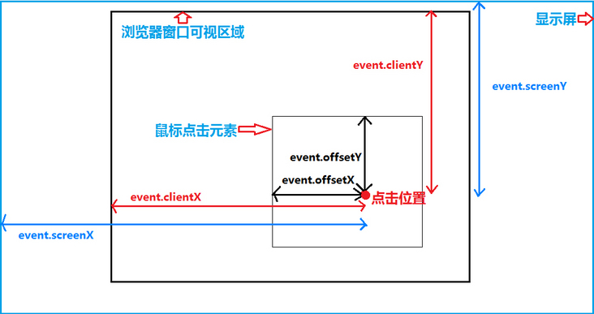
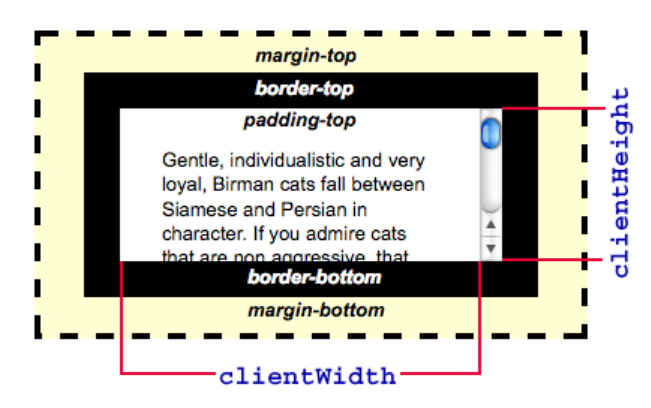
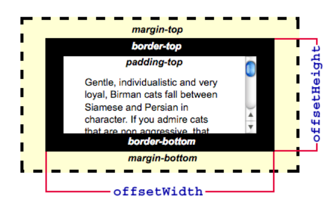

# JS基础：clientX、pageX、screenX、offsetX、clientWidth、offsetWidth 详解

在一些DOM操作中我们经常会跟元素的位置打交道，很多情况下都会傻傻分不清楚，而且不同的浏览器下会有不同的结果。通常都是看了忘 忘了又再看，很痛苦。因此，本篇文章专门对此做了一些简单的总结。


## 属性介绍
关于js鼠标事件综合各大浏览器能获取到坐标的属性总共以下六种，分别是相对于**被触发的dom、视口、文档、显示屏**的位置：

* clientX、clientY：相对视口..
* pageX、pageY：相对文档..
* offsetX、offsetY：相对被触发dom..
* screenX、screenY：相对屏幕..
* clientWidth、clientHeight：元素内部宽度，`padding + width`
* offsetWidth、offsetHeight：元素的布局宽度，`滚动条的宽度 + border + padding + width`
* offsetParent


### 1. clientX、clientY
* clientX、clientY 获取到的是触发点相对**浏览器可视区域（视口）**左上角距离，**不随页面滚动而改变**。
* 兼容性：所有浏览器均支持。


### 2. pageX、pageY
* pageX、pageY 获取到的是触发点相对**文档区域**左上角距离，**会随着页面滚动而改变**。
* 兼容性：除IE6/7/8不支持外，其余浏览器均支持。
```js
// pageX、pageY两种方法：
pageY || (clienY + 随页面滚动的高度)
pageX || (clienX + 随页面滚动的宽度)

// 其中滚动位移的计算，不同浏览器表现不同：
IE浏览器：document.body.xx，(xx是scrollLeft、scrollTop)
大部分现代浏览器，如Chrome：document.documentElement.xx (xx 是 scrollLeft、scrollTop)

// 页面滚动宽度：
scrollX = document.documentElement.scrollLeft || document.body.scrollLeft
// 页面滚动高度：
scrollY = document.documentElement.scrollTop || document.body.scrollTop

// 因此：
pageX = e.pageX || e.clientX + scrollX;
pageY = e.pageY || e.clientY + scrollY;
```
至于浏览器为什么会有这种差异？可以参考：[文档模式：标准模式、怪异模式](https://juejin.cn/post/6932769062909018125)

### 3. offsetX、offsetY
* offsetX、offsetY 获取到是触发点相对**被触发dom**的左上角距离。
  > 不同浏览器中表现不同：
  > 1. IE中以内容区左上角为基准点不包括边框，如果触发点在边框上会返回负值；
  > 2. 而chrome中以边框左上角为基准点。

* 兼容性：IE所有版本，chrome，Safari均完美支持，Firefox不支持。

### 4. screenX、screenY
* screenX、screenY 获取到的是触发点相对**显示器屏幕**左上角的距离，**不随页面滚动而改变**。
* 兼容性：所有浏览器均支持。


一张图来解释，如图所示：


### 5. clientWidth、clientHeight
* clientWidth 表示元素的内部宽度。该属性只包括元素宽度、内边距 padding，不包括垂直滚动条及其他。
* 内联元素、没有 CSS 样式的元素的 clientWidth 属性值为 0。




### 6. offsetWidth、offsetHeight
* offsetWidth 为一个元素的布局宽度。由包含元素的边框、水平线上的内边距、竖直方向滚动条（如果存在的话）、以及CSS设置的宽度 共同组成。
* 如果元素被隐藏（例如 元素style.display被设置为none），则返回0。
* 不包含:before或:after等伪类元素的宽度。
  


### 7. offsetParent 
offsetParent 它返回一个指向最近的（指包含层级上的最近）包含该元素的定位元素或者最近的 table,td,th,body元素。

offsetTop 和 offsetLeft 都是相对于offsetParent内边距边界来计算的。

兼容性：
1. 在 Webkit 中，若：
    * 该元素的style.display 为 "none"、style.position 被设为 "fixed"，
    * 该元素的祖先元素的 style.display 为 "none"

    则该属性返回 null。

2. 在 IE 9 中，若该元素的 style.position 被设置为 "fixed"（display:none 无影响），则该属性返回 null。