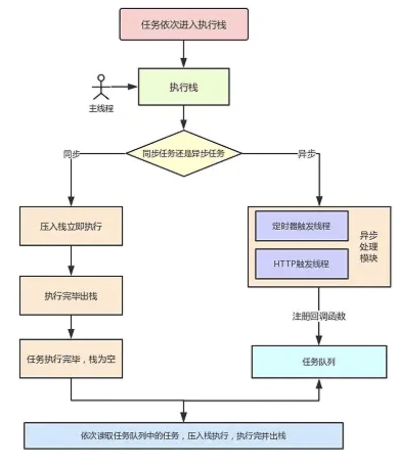
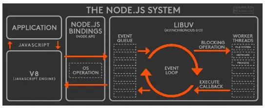
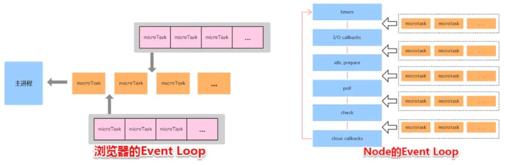

# 事件循环 (event loop)

js实现异步的核心就是事件循环

参考文章：
1. 概览：https://juejin.cn/post/6844903761949753352#heading-13
2. 概览：https://zhuanlan.zhihu.com/p/33058983
3. Node 事件循环：http://lynnelv.github.io/js-event-loop-nodejs

## 主要需要了解的内容：
1. JS为什么是一种单线程的语言？为什么不阻塞？
2. 进程/线程
3. 浏览器内核
4. 浏览器事件循环
5. Node事件循环，
6. Node/浏览器 事件循环的异同;

## 一、js为什么是一种单线程的语言？为什么不阻塞？
javascript从诞生之日起就是一门 **单线程、非阻塞的脚本语言**。这是由其最初的用途来决定的：与浏览器交互。
1. 单线程: javascript代码在执行的任何时候，都'只有一个主线程'来处理所有的任务。
2. 非阻塞: 则是当代码需要进行一项异步任务(不能立刻返回结果)的时候，主线程会挂起（pending）这个任务，然后在'异步任务返回结果的时候'再根据一定规则去执行相应的回调.

单线程的必要性：原因之一是 JS 最初、最主要的执行环境——是在 浏览器 中，我们需要进行各种各样的dom操作。试想一下 如果javascript是多线程的，那么当两个线程同时对dom进行一项操作，例如一个向其添加事件，而另一个删除了这个dom，此时该如何处理呢？

## 二、进程/线程
进程是 CPU资源分配的最小单位；线程是 CPU调度的最小单位。
进程/线程关系：
    1. 一个进程由一个或多个线程组成；
    2. 一个进程的内存空间是共享的，每个线程都可用这些共享内存。

## 三、浏览器内核
浏览器内核是多线程，在内核控制下各线程相互配合以保持同步，一个浏览器通常由以下常驻线程组成：
* GUI 渲染线程
* JavaScript引擎线程
* 定时触发器线程
* 事件触发线程
* 异步http请求线程

1.GUI渲染线程
> * 主要负责页面的渲染，解析HTML、CSS，构建DOM树，布局和绘制等。
> * 当界面需要重绘或者由于某种操作引发'回流'时，将执行该线程。
> * 该线程与'JS引擎线程'互斥，当执行JS引擎线程时，GUI渲染会被挂起，当任务队列空闲时，主线程才会去执行GUI渲染。

2.JS引擎线程
> * 主要负责处理 JavaScript脚本，执行代码。
> * 主要负责执行准备好待执行的事件，即定时器计数结束，或者异步请求成功并正确返回时，将依次进入任务队列，等待JS引擎线程的执行。
> * 该线程与'GUI渲染线程'互斥，当 JS引擎线程执行 JavaScript脚本时间过长，将导致页面渲染的阻塞。
> * JS引擎 通常包括以下几个步骤：
> > 词法分析：将源代码分解为有意义的分词
> > 语法分析：用语法分析器将分词解析成语法树
> > 代码生成：生成机器能运行的代码
> > 代码执行

3.定时器触发线程
> * 负责执行异步定时器一类的函数的线程，如： setTimeout，setInterval。
> * 主线程依次执行代码时，遇到'定时器'，会将定时器交给该线程处理，当计数完毕后，事件触发线程会将'计数完毕后的事件'加入到任务队列的尾部，等待JS引擎线程执行。

4.事件触发线程
> * 主要负责将准备好的事件交给 JS引擎线程执行。
> * 比如 setTimeout定时器计数结束， ajax等异步请求成功并触发回调函数，或者用户触发点击事件时，该线程会将整装待发的事件依次加入到任务队列的队尾，等待 JS引擎线程的执行。

5.异步http请求线程
> * 负责执行异步请求一类的函数的线程，如： Promise，axios，ajax等。
> * 主线程依次执行代码时，遇到'异步请求'，会将函数交给该线程处理，当监听到状态码变更，'如果有回调函数，事件触发线程'会将回调函数加入到任务队列的尾部，等待JS引擎线程执行。

## 四、浏览器事件循环
### 1. Micro-Task 与 Macro-Task
浏览器端事件循环中的异步队列有两种：macro（宏任务）队列和 micro（微任务）队列。宏任务队列可以有多个，微任务队列只有一个。 

**常见的 宏任务**：
|  -   | 浏览器  | Node  |
|  ----  | ----  | ----  |
| I/O  | √ | √ |
| setTimeout  | √ | √ |
| setInterval  | √ | √ |
| setImmediate  | × | √ |
| requestAnimationFrame  | √ | × |
| script  | √ | × |
| UI渲染  | √ | × |

**常见的 微任务**：
|  表头   | 浏览器  | Node  |
|  ----  | ----  | ----  |
| process.nextTick	  | × | √ |
| MutationObserver  | √ | × |
| Promise.then catch finally | √ | √ |


### 事件循环过程：  
关键点：**先同步，再异步；先微任务，再宏任务**

micro：微任务
macro：宏任务



* 一开始**执行栈**空，我们可以把**执行栈认为是一个存储函数调用的栈结构，遵循后进先出的原则**。micro 队列空，macro 队列里有且只有一个 script 脚本（整体代码）。

* 全局上下文（script 标签）被推入执行栈，同步代码执行。在执行的过程中，会判断是同步任务还是异步任务，通过对一些接口的调用，可以产生新的 macro-task 与 micro-task，它们会分别被推入各自的任务队列里。同步代码执行完了，script 脚本会被移出 macro 队列。

* 接下来处理的是 micro-task。但需要注意的是：当 **macro-task 出队时，任务是一个一个执行**的；而 **micro-task 出队时，任务是一队一队执行**的。
    * 一个宏任务执行完之后，会立即执行 微任务队列中的所有微任务，微任务执行完之后，浏览器会判断“是否渲染”？并不是每次 微任务执行完都会立即渲染的。还要结合刷新时机等策略来综合判断，如果距离上一次渲染时间过短、或者当前没有需要更新的视觉内容，都不会触发渲染的。  
    * 要想渲染，是一定要清空微任务队列才可以的。但是当前宏任务执行完、微任务队列也清空了，却不一定渲染。如果微任务执行中又产生了新的微任务，会继续执行，直到微任务队列完全为空；
    * 渲染操作之后，浏览器才会继续处理下一个宏任务。

* 执行渲染操作，更新界面
    
* 检查是否存在 Web worker 任务，如果有，则对其进行处理

* 上述过程循环往复，直到两个队列都清空

### 每轮事件循环分为3个步骤：
* 执行macrotask队列的一个任务
* 执行完当前microtask队列的所有任务；如果微任务执行中又产生了新的微任务，会继续执行，直到微任务队列完全为空
* UI render 

然后，循环往复...，直到 macro、micro 两个队列均为空

浏览器只保证requestAnimationFrame的回调在重绘之前执行，没有确定的时间，何时重绘由浏览器决定，可能是在一次或多次事件循环的 UI render阶段。

参考：[requestAnimationFrame执行时机](./code/事件循环2.html)，可能每次运行都不一样，该样例中requestAnimationFrame有在第一次事件循环完执行的，也有在第三次事件循环完执行的！


### 事件循环总结
当**当前执行栈执行完毕**时会立刻先处理**所有微任务队列**中的事件，然后再去**宏任务队列**中取出一个事件。同一次事件循环中，微任务永远在宏任务之前执行。执行宏任务的过程中，遇到微任务，依次加入微任务队列。

📢 其他可能混淆的点：
* **new Promise 本身是同步执行的**（仅创建实例），而 **Promise 的 “微任务特性” 体现在 then/catch/finally 中**。
* **执行宏任务时，有个微任务，那么这个微任务的执行时机是**？
    > 事件循环会在当前宏任务执行完毕之后，在下一个宏任务执行之前，优先执行微任务队列中的所有微任务。只有当微任务队列清空后，事件循环才会去检查并执行下一个宏任务。   

### 为什么要有微任务？宏任务不就可以实现异步吗？
1. 区分异步任务的优先级，不然所有的异步任务都是一样的优先级，无法处理紧急、需要立即响应的高优先级事务，降低用户体验
2. 代码层面更清晰、可读


## 五、Node事件循环


## 六、Node/浏览器 事件循环的异同
1. 浏览器环境下，每执行完一个宏任务后，会立即清空整个微任务队列（包括执行微任务过程中新增的微任务），然后才会执行下一个宏任务或判断是否渲染。
    > 顺序为：`宏任务1 → 清空微任务 → 宏任务2 → 清空微任务 → ...`
2. Node.js中，microtask会在事件循环的各个阶段之间执行，也就是一个阶段执行完毕，就会去执行microtask队列的任务。微任务有两个优先级不同的队列：
    * 高优先级：process.nextTick 队列，优先级最高，会在所有其他微任务前执行。专门处理 process.nextTick 回调。
    * 普通优先级：其他微任务队列
    > 顺序为：`阶段1任务 → 清空微任务 → 阶段2任务 → 清空微任务 → ...`
3. 表格对比：

| 维度	| 浏览器事件循环| 	Node.js 事件循环| 
| ---- |  ---- |  ---- | 
| 宏任务处理方式| 	单队列，按入队顺序执行单个宏任务	| 多阶段队列，按阶段顺序执行，每个阶段处理一类宏任务| 
| 微任务执行时机| 	单个宏任务执行完毕后| 	每个阶段的宏任务队列清空后| 
| 微任务优先级	| 所有微任务优先级相同	| process.nextTick 优先级高于其他微任务| 
| 渲染相关	| 微任务清空后可能触发渲染	| 无渲染阶段（非浏览器环境）| 


<br/>



### 7. 示例：
同一段代码在浏览器、Node中不一样的运行结果。

```javascript
setTimeout(()=>{
    console.log('timer1')
    Promise.resolve().then(function() {
        console.log('promise1')
    })
}, 0)
setTimeout(()=>{
    console.log('timer2')
    Promise.resolve().then(function() {
        console.log('promise2')
    })
}, 0)
```
浏览器端运行结果：`timer1=>promise1=>timer2=>promise2`  <br/><br/>


Node端运行结果分两种情况：
1. node11版本：一旦执行一个阶段里的一个宏任务(setTimeout,setInterval和setImmediate)就立刻执行微任务队列，这就跟浏览器端运行一致，最后的结果为`timer1=>promise1=>timer2=>promise2`

2. node10及其之前版本：要看第一个定时器执行完，第二个定时器是否在完成队列中。
    * 如果是第二个定时器还未在完成队列中，最后的结果为`timer1=>promise1=>timer2=>promise2`
    * 如果是第二个定时器已经在完成队列中，则最后的结果为`timer1=>timer2=>promise1=>promise2` <br/><br/>


