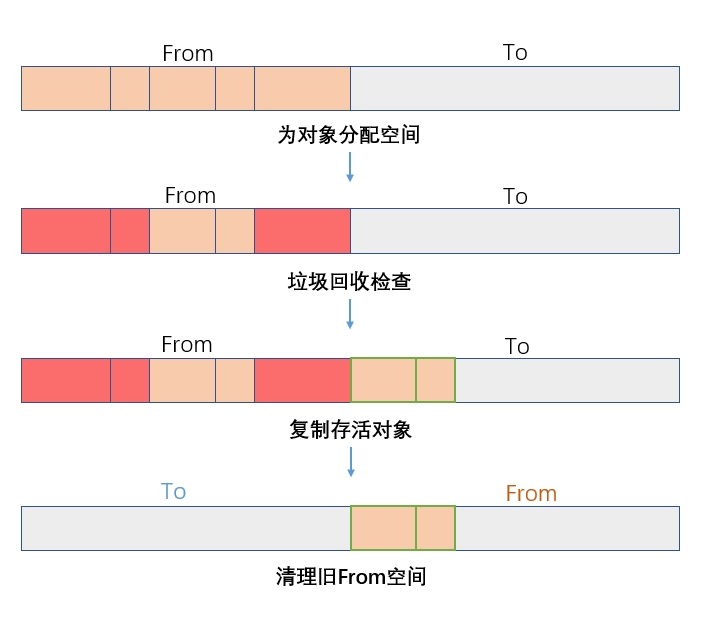

# 新生代 与 老生代

https://juejin.cn/post/6981588276356317214(讲的最好)


https://juejin.cn/post/6844904097703804936


https://juejin.cn/post/7019626125814923278

https://zhuanlan.zhihu.com/p/499264959

JS具有自动垃圾回收机制！

回收的基本原理：找出那些不再继续使用的变量，然后释放其内存。垃圾收集器会按照固定的时间间隔周期性地执行这一操作。

垃圾收集的两种方法：
* 标记清除：最常用
* 引用计数：循环引用的对象很难被释放。

### 标记清除
当变量进入环境时，这个变量就被标记为“进入环境”，
当变量离开环境时，这个变量就被标记为“离开环境”。

1. 先给内存里的每一个变量都打上 “待回收” 的标记
2. 去掉 “有用变量” 的标签：找到当前执行环境中能访问到的变量，以及这些变量 “间接引用” 的变量，把它们的 “待回收” 标签去掉。
3. 经过前两步后，还带着 “待回收” 标签的变量，就是 “垃圾”
4. 最后，垃圾收集器会把这些带标记的 “垃圾变量” 销毁，回收内存。


### 引用计数：
声明了一个变量并将一个引用类型的值赋给这个变量时，那么这个值的引用次数就是1。如果同一个值又被赋给另一个变量，则该值的引用次数加1。相反，如果对这个值引用的变量指向了另一个值，那么这个值的引用次数减1。

缺点：循环引用的对象很难被释放。
```js
function problem(){ 
 var objectA = new Object(); 
 var objectB = new Object(); 
 objectA.someOtherObject = objectB; 
 objectB.anotherObject = objectA; 
}
```

## V8对内存的优化
**分代式垃圾回收**：在V8中，主要将内存分为新生代和老生代两类。

新生代指的是那些**存活时间较短**的对象，小空间，**高频率回收、低开销**、复制算法

老生代指的是存活时间较长的或者常驻内存的对象。大空间、低频率回收、高开销、标记/清除 + 标记/整理

### 新生代
**1. 区域划分：From 空间 + To 空间**    
V8 将新生代划分为两个完全相等的「半空间」：
* From 空间：当前正在使用的内存区域（对象创建时优先分配到这里）；
* To 空间：空闲的备用区域（回收时用于存放「存活对象」）。

两个空间的大小固定且较小（比如 64 位系统中每个半空间约 16MB），目的是让回收操作「快进快出」。



如果复制一个对象到空闲区时，空闲区空间占用超过了 25%，那么这个对象会被直接晋升到老生代空间中

### 老生代
Mark-Sweep(**标记清除**)
优点：不需要复制对象；清除后会产生大量「内存碎片」，后续创建大对象时可能因找不到连续空闲块而触发频繁 GC。

Mark-Compact(**标记整理**)
解决内存碎片问题；开销更高

### 优化
* 增量标记：传统标记阶段是「全暂停」，会阻塞 JS 执行。增量标记是将标记阶段拆分为多个小步骤，穿插在 JS 代码执行间隙进行。
* 并行标记：标记阶段由专门的后台线程执行，与 JS 主线程并行