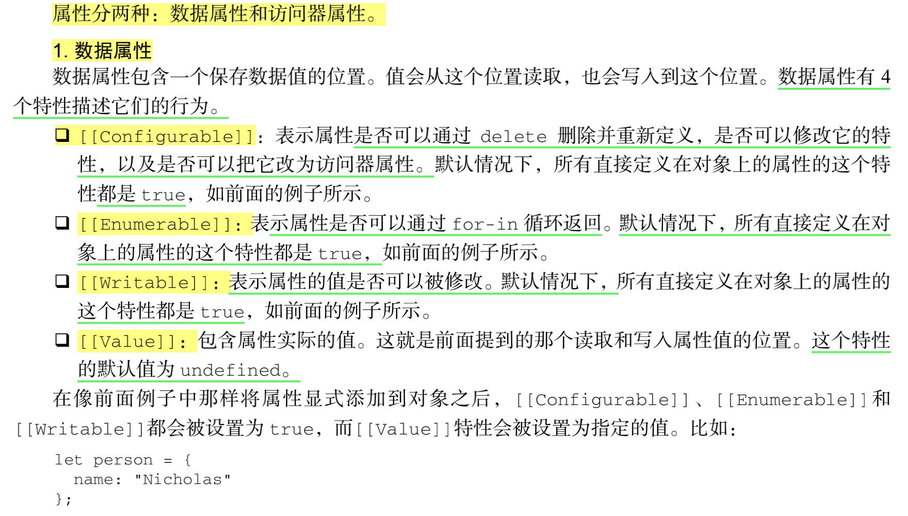
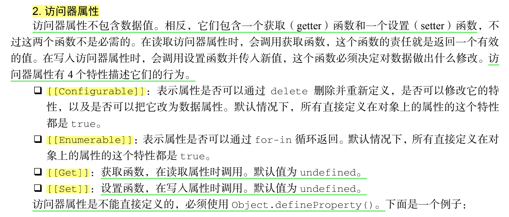
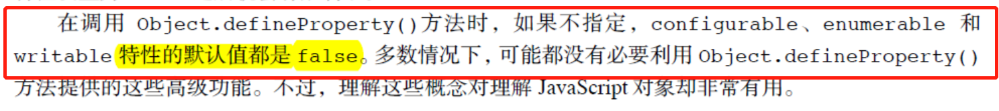
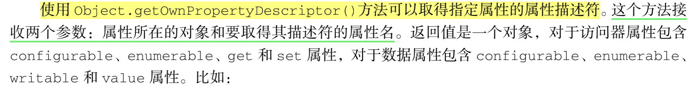
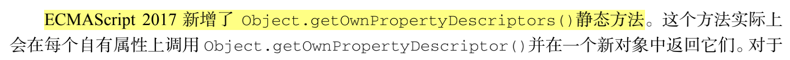

# 对象基本介绍

**1. 数据属性：**
数据属性比访问器属性多 value ， writable 这两个属性



**2. 访问器属性：**
比数据属性多 get， set 这两个属性


**3. 定义对象**

定义对象方式不同，相应的属性值也不同；
```JS
// 方法一：
let person1 = {};   
Object.defineProperty(person, "name", {    //configurable属性为false
    value: "Nicholas"
}

// 方法二：
let person = {            //configurable属性为true
    name: "Nicholas" 
};
```

**4. 获得对象的属性值**




**5. 合并对象：**
Object.assign()方法。这个方法接收一个目标对象和一个或多个源对象作为参数，然后将每个源对象中 **可枚举属性** 和 **自有属性** 复制到目标对象

```JS
// 查看 属性是否可枚举。若是的话，返回true
Object.propertyIsEnumerable()  

// 查看 对象自身属性中 是否具有指定的属性，若有，返回true
Object.hasOwnProperty()
```

**6. 对象相等判定**
ECMAScript 6 规范新增了 Object.is()，这个方法与 === 很像，但同时也考虑
到了 NaN、+0、-0、0等情况

```JS
// ES5

// 要确定 NaN 的相等性，必须使用极为讨厌的 isNaN()
NaN === NaN // false 
isNaN(NaN) // true

// 不同 JavaScript 引擎中表现不同，但仍被认为相等，这是错误的
+0 === -0 // true 
+0 === 0 // true 
-0 === 0 // true

+0 == -0 // true 
+0 == 0 // true 
-0 == 0 // true
```
```JS
// ES6 判断

// 正确的 NaN 相等判定
Object.is(NaN, NaN) // true

// 正确的 0、-0、+0 相等/不等判定
Object.is(+0, -0) // false 
Object.is(+0, 0) // true 
Object.is(-0, 0) // false
```

**7. 判断是否是空对象**
```JS
let obj = {}

// 法1：
JSON.stringify(obj) == "{}"

// 法2：
var judgeObj = function(obj){
    for(var item in obj){
        return true;
    }
    return false;
}

// 法3：
let isNullObj = Object.keys(obj).length  == 0 ? true: false
```

**8. 检测对象类型**
```JS
function type(obj) {
    return Object.prototype.toString.call(obj).replace(/\[object\s|\]/g, "");
}
```

**9. 原型对象相关的方法**

见：[原型相关的方法总结](https://github.com/1194964459/FE-Interview-Notebook/blob/main/JS/%E5%AF%B9%E8%B1%A1_%E7%B1%BB_%E9%9D%A2%E5%90%91%E5%AF%B9%E8%B1%A1/1.1_%E5%88%9B%E5%BB%BA%E5%AF%B9%E8%B1%A1.md)

