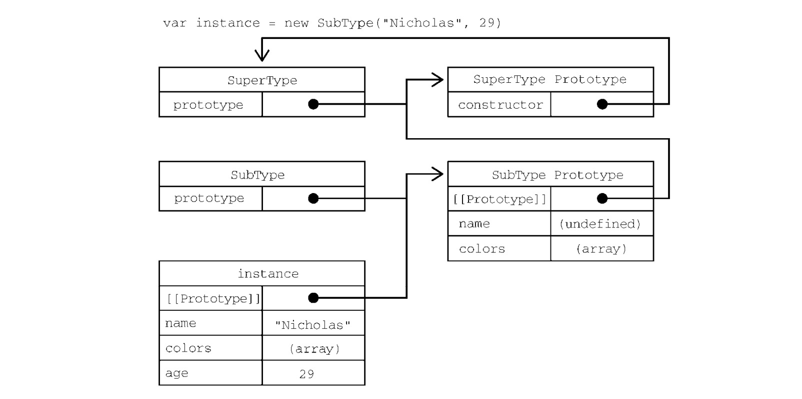

# JS 继承
ECMAScript 中的继承是通过**原型链**实现的。

本文主要讲述实现继承的几种方法及对应的优缺点分析，继承方法有：原型链、盗用构造函数、组合继承、原型式继承、寄生式继承、寄生组合继承，。

## 一、原型链
**目标**：基本思想就是通过原型继承多个引用类型的属性和方法。

**关键实现步骤**：把原型作为另一个类型的实例。原理见：[原型及原型链](./2.0_原型及原型链.md)

```JS
function SuperType() { 
    this.property = true; 
} 
SuperType.prototype.getSuperValue = function() { 
    return this.property; 
}; 
function SubType() { 
    this.subproperty = false; 
} 
// 继承 SuperType 
SubType.prototype = new SuperType(); 
SubType.prototype.getSubValue = function () {
    return this.subproperty; 
}; 
let instance = new SubType(); 
console.log(instance.getSuperValue()); // true，调用父元素方法
```
**1. 原型与继承关系：**

原型与实例的关系，有两种方法来确定：
* 使用 instanceof 操作符：若原型链中出现过相应的构造函数，则 instanceof 返回 true。 
```js
console.log(instance instanceof Object); // true 
console.log(instance instanceof SuperType); // true 
console.log(instance instanceof SubType); // true 
```

* 使用 isPrototypeOf()方法：原型链中的每个原型都可以调用这个方法。
```JS
console.log(Object.prototype.isPrototypeOf(instance)); // true 
console.log(SuperType.prototype.isPrototypeOf(instance)); // true 
console.log(SubType.prototype.isPrototypeOf(instance)); // true
```
**2. 关于方法**
* 子类有时候需要**覆盖父类的方法**，或者**增加父类没有的方法**。为此，这些方法必须在**原型赋值之后**再添加到原型上。
```JS
// 继承 SuperType 
SubType.prototype = new SuperType(); 
// 新方法
SubType.prototype.getSubValue = function () { 
    return this.subproperty; 
}; 
// 覆盖已有的方法
SubType.prototype.getSuperValue = function () { 
    return false; 
};
```

* 以**对象字面量方式 创建原型方法 会破坏之前的原型链**，因为这相当于重写了原型链。
```JS
// 继承 SuperType 
SubType.prototype = new SuperType(); 

// 通过对象字面量添加新方法，这会导致上一行无效
SubType.prototype = { 
    getSubValue() { 
        return this.subproperty; 
    }, 
    someOtherMethod() { 
        return false; 
    } 
}; 
let instance = new SubType(); 
console.log(instance.getSuperValue()); // 出错！
```
子类的原型在被赋值为 SuperType 的实例后，又被一个对象字面量覆盖了。覆盖后的原型是一个 Object 的实例，而不再是 SuperType 的实例。因此之前的原型链就断。SubType和 SuperType 之间也没有关系了。

**3. 原型链的问题**
* 原型中包含的引用值会在所有实例间共享。这也是为什么属性通常会在构造函数中定义而不会定义在原型上的原因。在使用原型实现继承时，原型实际上变成了另一个类型的实例。这意味着原先的实例属性摇身一变成为了原型属性。具体原因在[创建对象一文 中'原型的问题'](./1.1_创建对象.md)也提到过。
* 子类型在实例化时 不能给父类型的构造函数传参。

所以，就导致原型链基本不会被单独使用。

## 二、盗用构造函数

“盗用构造函数”（constructor stealing），又称作‘对象伪装’或‘经典继承’。

**目标：解决原型包含引用值导致的继承问题；以及子类示例化时 不能向父类构造函数传参问题。**

**关键实现步骤：在子类构造函数中调用父类构造函数。**

```JS
function SuperType() { 
    this.colors = ["red", "blue", "green"]; 
} 
function SubType() { 
    // 继承 SuperType 
    SuperType.call(this); 
} 
let instance1 = new SubType(); 
instance1.colors.push("black"); 
console.log(instance1.colors); // "red,blue,green,black" 

let instance2 = new SubType(); 
console.log(instance2.colors); // "red,blue,green"
```

**1. 传递参数：**
```JS
function SuperType(name){ 
    this.name = name; 
} 
function SubType() { 
    // 继承 SuperType 并传参
    SuperType.call(this, "Nicholas"); 
    // 实例属性
    this.age = 29; 
} 
let instance = new SubType(); 
console.log(instance.name); // "Nicholas"; 
console.log(instance.age); // 29
```

**2. 盗用构造函数问题**
* 必须在构造函数中定义方法，因此函数不能重用。（这也是使用构造函数模式自定义类型的问题）
* 子类也不能访问父类原型上定义的方法，因此所有类型只能使用构造函数模式。

由于存在这些问题，盗用构造函数基本上也不能单独使用。

## 三、组合继承
组合继承 也称 ‘伪经典继承’，综合了 原型链 和 盗用构造函数，将两者的优点集中了起来。是 JavaScript 中使用最多的继承模式。

**基本思路：使用原型链 继承 原型上的属性和方法，而通过 盗用构造函数 继承 实例属性。** 这样既可以把方
法定义在原型上以实现重用，又可以让每个实例都有自己的属性。

**缺点：**存在效率问题。最主要的效率问题就是**父类构造函数始终会被调用两次。**

```JS
function SuperType(name){ 
    this.name = name; 
    this.colors = ["red", "blue", "green"]; 
} 
SuperType.prototype.sayName = function() { 
    console.log(this.name); 
}; 
function SubType(name, age){ 
    // 继承属性
    SuperType.call(this, name);  //  第二次调用 SuperType()
    this.age = age; 
} 
// 继承方法
SubType.prototype = new SuperType();    // 第一次调用 SuperType()
SubType.prototype.sayAge = function() { 
    console.log(this.age); 
};

let instance1 = new SubType("Nicholas", 29); 
instance1.colors.push("black"); 
console.log(instance1.colors); // "red,blue,green,black" 
instance1.sayName(); // "Nicholas"; 
instance1.sayAge(); // 29 

let instance2 = new SubType("Greg", 27); 
console.log(instance2.colors); // "red,blue,green" 
instance2.sayName(); // "Greg"; 
instance2.sayAge(); // 27
```

## 四、原型式继承
**目标：即使不自定义类型 也可以通过原型实现对象之间的信息共享。**
```js
function object(o) { 
    function F() {} 
    F.prototype = o; 
    return new F(); 
}
```

示例如下：
```JS
let person = { 
    name: "Nicholas", 
    friends: ["Shelby", "Court", "Van"] 
}; 
let anotherPerson = object(person);  // 调用上面封装的 object 函数
anotherPerson.name = "Greg"; 
anotherPerson.friends.push("Rob"); 

let yetAnotherPerson = object(person); 
yetAnotherPerson.name = "Linda"; 
yetAnotherPerson.friends.push("Barbie"); 

console.log(person.friends); // "Shelby,Court,Van,Rob,Barbie"
```
person.friends 不仅是 person 的属性，也会跟 anotherPerson 和 yetAnotherPerson 共享。

**ECMAScript 5 通过增加 Object.create()方法将原型式继承的概念规范化了**。这个方法接收两个
参数：作为新对象原型的对象，以及给新对象定义额外属性的对象（第二个可选）。在只有第一个参数时，
Object.create()与这里的 object()方法效果相同

**Object.create()的第二个参数与 Object.defineProperties()的第二个参数一样**：每个新增
属性都通过**各自的描述符**来描述。以这种方式添加的属性 会 **遮蔽原型对象上的同名属性**
```JS
let person = { 
    name: "Nicholas", 
    friends: ["Shelby", "Court", "Van"] 
}; 
let anotherPerson = Object.create(person, { 
    name: { 
        value: "Greg" 
    } 
}); 
console.log(anotherPerson.name); // "Greg"
```
原型式继承**非常适合不需要单独创建构造函数，但仍然需要在对象间共享信息的场合**。但要记住，属性中包含的引用值始终会在相关对象间共享，跟使用原型模式是一样的。

## 五、寄生式继承
寄生式继承（parasitic inheritance）是一种与原型式继承比较接近的一种继承方式。

```JS
function createAnother(original){ 
    // object()函数不是寄生式继承所必需的，任何返回新对象的函数都可以在这里使用。
    let clone = object(original); // 通过调用函数创建一个新对象

    clone.sayHi = function() { // 以某种方式增强这个对象
        console.log("hi"); 
    }; 
    return clone; // 返回这个对象
}

let person = { 
    name: "Nicholas", 
    friends: ["Shelby", "Court", "Van"] 
}; 
let anotherPerson = createAnother(person); 
anotherPerson.sayHi(); // "hi"
```
这个例子基于 person 对象返回了一个新对象。新返回的 anotherPerson 对象具有 person 的所有属性和方法，还有一个新方法叫 sayHi()。

**寄生式继承 存在的问题**：通过寄生式继承 **给对象添加函数会导致函数难以重用**，与构造函数模式类似。

## 六、寄生组合式继承

先说说组合式继承方式，如下：

```JS
function SuperType(name){ 
    this.name = name; 
    this.colors = ["red", "blue", "green"]; 
} 
SuperType.prototype.sayName = function() { 
    console.log(this.name); 
}; 
function SubType(name, age){ 
    // 继承属性
    SuperType.call(this, name);  //  第二次调用 SuperType()
    this.age = age; 
} 
// 继承方法
SubType.prototype = new SuperType();    // 第一次调用 SuperType()
SubType.prototype.sayAge = function() { 
    console.log(this.age); 
};

let instance1 = new SubType("Nicholas", 29); 
```

**组合式继承存在的主要问题有：**
* 父类构造函数始终会执行 2 次。这样的话，就会有两组 name 和 colors 属性：一组在实例上，另一组在 SubType 的原型上。如下：


**上面的问题，可以用 寄生组合式继承 来解决，如下：**

```JS
function inheritPrototype(subType, superType) { 
    let prototype = object(superType.prototype); // 是创建父类原型的一个副本
    prototype.constructor = subType; // 给返回的prototype 对象设置 constructor 属性，解决由于重写原型导致默认 constructor 丢失的问题
    subType.prototype = prototype; // 将新创建的对象 赋值 给子类型的原型
}
```
该方法可以实现前给子类型原型赋值。

**寄生组合式继承 关键实现步骤：**
* 使用 寄生式继承 来 继承父类原型；（不是通过调用父类构造函数给子类原型赋值，而是取得父类原型的一个副本。）
* 将返回的新对象 赋值给 子类原型。

寄生式组合继承基本是引用类型继承的最佳模式。

```JS
function SuperType(name) { 
    this.name = name; 
    this.colors = ["red", "blue", "green"]; 
} 
SuperType.prototype.sayName = function() { 
    console.log(this.name); 
}; 
function SubType(name, age) { 
    SuperType.call(this, name);
    this.age = age; 
} 
inheritPrototype(SubType, SuperType);  // 给子类型原型赋值
SubType.prototype.sayAge = function() { 
    console.log(this.age); 
};
```

这里只调用了一次 SuperType 构造函数，避免了 SubType.prototype 上不必要也用不到的属性，因此可以说这个例子的效率更高。而且，原型链仍然保持不变，因此 instanceof 操作符和isPrototypeOf()方法正常有效。寄生式组合继承可以算是引用类型继承的最佳模式。