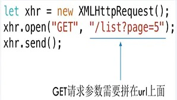
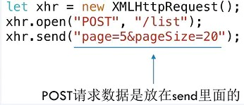

# 计算机网路基础知识
 

目录：
* HTTP及优缺点
* 网络模型
* HTTP长连接
* HTTP请求方法
* GET与POST
* HTTP 常用的状态码
    * 302及应用场景
    * 302、303、307
* TCP
    * 三次握手与四次挥手
    * 滑动窗口
    * 拥塞控制
* HTTPS
* Ajax，Fetch，Axios 区别

## 一、HTTP是什么？优缺点？哪一层的协议？（应用层）
HTTP是一种超文本传输协议，用于完成客户端和服务器端等等一系列的运作流程。

**1. 优点**：
* **灵活可扩展**，除了规定空格分隔单词，换行分隔字段以外，其他都没有限制，不仅仅可以**传输文本，还可以传输图片、视频等任意资源**
* **可靠传输**，基于 TCP/IP 所以继承了这一特性
* **请求-应答，有来有回**
* **无状态**，每次 HTTP 请求都是独立的，无关的、默认不需要保存上下文信息

**2. 缺点**：
* **通信使用明文，内容会被窃听**。
    > **解决方案：加密处理防止窃听**，最常见的两种加密方式是 通信加密(https) 和 内容加密。
* **不验证通信方的身份，可能遭遇伪装**
    > 任何人都可以发起请求：服务器只要收到请求，不管是谁都会返回一个响应（仅限发送端的 IP 地址和端口号没被 Web 服务器设置限制访问的前提下）；
    > 服务端、客户端有可能都是伪装的；
    > 易造成 Dos 攻击（Denial of Service，拒绝服务器攻击）
    > **解决方案：查明对方的证书**

* **无法证明报文的完整性，可能已遭到篡改**
    > **解决方案：MD5 和 SHA-256（SHA-1已经不安全了）**

## 二、OSI七层模型和TCP/IP四层模型

**各层传输的PDU(协议数据单元)**:
* 传输层：段
* 网络层：包
* 数据链路层：帧
* 物理层：比特流

**TCP/IP 四层概念**：
* 应用层：应用层决定了向用户提供应用服务时通信的活动。比如，FTP(文件传输协议)和 DNS(域名解析系统)。HTTP 协议也在该层。
* 传输层：提供处于网络连接中的两台计算机之间的数据传送。该层有两个不同的协议：TCP 传输控制协议和 UDP 用户数据协议。
* 网络层：用来处理在网络上的数据包。数据包是网络传输的最小数据单位。网络层的作用就是在多条路线中选出一条传输路线进行数据传输。
* 数据链路层：用来处理连接网络的硬件部分。包括什么操作系统、硬件的设备、什么路由器啊之类的等等，都属于该层。

## 三、HTTP 如何实现长连接？在什么时候会超时？
**背景**：Http协议采用“请求-应答”模式，当使用普通模式，即非Keep-Alive模式时，每个请求/应答，客户端和服务器都要新建一个连接，完成之后立即断开连接；当使用Keep-Alive模式时，Keep-Alive功能使客户端到服务器端的连接持续有效，当出现对服务器的后继请求时，Keep-Alive功能避免了建立或者重新建立连接。

通过在头部（请求和响应头）设置 Connection: keep-alive。**http1.0中默认是关闭的，需要在http头加入”Connection: Keep-Alive”，才能启用Keep-Alive；从HTTP1.1协议以后，连接默认都是长连接**

* HTTP 一般会有 http 的守护进程，里面可以设置 keep-alive timeout，当 httpd 闲置超过这个时间就会关闭，也可以在 HTTP 的 header 里面设置超时时间
* TCP 的 keep-alive 包含三个参数，支持在系统内核的 net.ipv4 里面设置：当 TCP 连接之后，闲置了 tcp_keepalive_time，则会发生侦测包，如果没有收到对方的 ACK，那么会每隔 tcp_keepalive_intvl 再发一次，直到发送了 tcp_keepalive_probes，就会丢弃该连接。
tcp_keepalive_intvl = 15
tcp_keepalive_probes = 5
tcp_keepalive_time = 1800

* 实际上 HTTP 没有长短连接，只有 TCP 有，TCP 长连接可以复用一个 TCP 连接来发起多次 HTTP 请求，这样可以减少资源消耗，比如一次请求 HTML，可能还需要请求后续的 JS/CSS/图片等

> 参考：[Http长连接和Keep-Alive以及Tcp的Keepalive](https://blog.csdn.net/weixin_37672169/article/details/80283935)

## 四、HTTP 的请求方法
* GET：获取服务器资源。
* POST：提交信息给服务器。
* PUT：同POST，但 PUT 请求是幂等的。
* HEAD：和 GET 方法一样。但是只返回响应头部。作用是确定 URL 的有效性和资源更新的时间。
* DELETE：删除指定的资源。
* OPTIONS：列出可对资源实行的请求方法，常用于跨域。
* TRACE：追踪请求-响应的传输路径
* CONNECT：建立连接渠道，用于代理服务器。

## 4.1 简单请求与复杂请求
参考：[MDN 跨域中提到的简单/复杂请求](https://developer.mozilla.org/zh-CN/docs/Web/HTTP/CORS)

**（1）简单请求必须符合以下规定**：
* 只能使用get/post/head请求方式

* 除了被用户代理自动设置的首部字段（例如 Connection ，User-Agent）和在 Fetch 规范中定义为 禁用首部名称 的其他首部，**允许人为设置的字段集合为**：
> Accept  
> Accept-Language  
> Content-Language  
> Content-Type （需要注意额外的限制）  
> DPR  
> Downlink  
> Save-Data  
> Viewport-Width  
> Width  

* content-type**只能设置以下内容**：
> text/plain  
> multipart/form-data  
> application/x-www-http-urlencoded  

* 不能为 XMLHttpRequestUpload 注册监听器

* 请求中没有使用readableStream对象

**（2）复杂请求**：除了简单请求，其余的都是复杂请求

## 五、GET 与 POST 
参考：https://www.runoob.com/tags/html-httpmethods.html
* **get 请求**：

 

* **post 请求**:

* **区别**：

|     | GET  | POST  |
|  ----  | ----  | ----  |
| 后退按钮、刷新 | 无害	| 数据会被重新提交（浏览器应该告知用户数据会被重新提交）。 | 
| 书签 | 可收藏为书签 |	不可收藏为书签 |
| 缓存 | 能被缓存 |	不能缓存 |
| 编码类型 | application/x-www-form-urlencoded | application/x-www-form-urlencoded 或 multipart/form-data。为二进制数据使用多重编码。 |
| 历史 | 参数保留在浏览器历史中。 |	参数不会保存在浏览器历史中。 |
| 对数据长度的限制 | 当发送数据时，GET 方法向 URL 添加数据；URL 的长度是受限制的（URL 的最大长度是 2048 个字符）。 | 无限制。 |
| 对数据类型的限制 | 只允许 ASCII 字符。 | 没有限制。也允许二进制数据。 |
| 安全性 | 与 POST 相比，GET 的安全性较差，因为所发送的数据是 URL 的一部分。不要用GET请求发送密码或其他敏感信息 | POST 比 GET 更安全，因为参数不会被保存在浏览器历史、web 服务器日志中。 |
| 可见性 |	数据在 URL 中对所有人都是可见的。 |	数据不会显示在 URL 中。 |

* GET和POST只是HTTP协议中的两种请求方式，而HTTP协议之基于TCP/IP的应用层协议，无论**POST和GET都是用同一个传输层协议**，所以传输上没有区别。
* GET和POST能做的事情是一样的，给**GET加上request body，给POST加上url参数，技术上完全是行得通**的。
* GET产生一个TCP数据包；POST产生两个TCP数据包。
    > GET请求：浏览器会把**http header和data一并发送出去**，服务器响应200(返回数据);
    > POST请求：浏览器**先发送header，服务器响应100 continue，浏览器再发送data**，服务器响应200 ok(返回数据)。

## 六、HTTP 常用的状态码及使用场景
* 1xx：表示目前是协议的中间状态，还需要后续请求
* 2xx：表示请求成功
* 3xx：表示重定向状态，需要重新请求
* 4xx：表示请求报文错误
* 5xx：服务器端错误

**常用状态码**：

* 101 切换请求协议，从 HTTP 切换到 WebSocket
* 200 请求成功，有响应体
* 301 永久重定向：会缓存，以后使用新 url 访问
* 302 临时重定向：不会缓存
* 304 协商缓存命中
* 400（Bad Request）：请求报文中存在语法错误
* 401（Unauthorized）：发送的请求要通过 HTTP 认证的认证消息。如果之前请求过一次，就表示用户认证失败。
* 403（Forbidden）：服务器拒绝访问
* 404（Not Found）：资源找不到
* 500（Internal Serve Error）：服务器端错误
* 503（Service Unavailable）： 服务器繁忙

## 七、302 是什么？应用场景？

* 而 **302 表示临时重定向**，这个资源只是**暂时不能被访问**了，但是之后**过一段时间还是可以继续访问**，一般是**访问某个网站的资源需要权限**时，会需要用户去登录，**跳转到登录页面，登录之后，还可以继续访问**。

* **301 类似，都会跳转到一个新的网站**，但是 **301 代表访问的地址的资源被永久移除了**，以后都不应该访问这个地址，搜索引擎抓取的时候也会用新的地址替换这个老的。可以在返回的响应的 location 首部去获取到返回的地址。301 的场景如下：
    > 比如从 http://baidu.com，跳转到 https://baidu.com，域名换了

## 八、302，303，307 状态码异同
303和307是HTTP1.1新加的服务器响应文档的状态码，它们是对HTTP1.0中的302状态码的细化，主要用在对非GET、HEAD方法的响应上。

* [RFC2616](http://tools.ietf.org/html/rfc2616#section-10.3.3)文档中：**HTTP1.1在介绍302时说，如果客户端发出非GET、HEAD请求后，收到服务端的302状态码，那么就不能自动的向新URI发送重复请求，除非得到用户的确认**。

* 文档中规定**303状态码**的响应：POST重定向为GET。与现有浏览器对302状态码的处理一致，实践在前而文档在后。

* HTTP1.1文档中**307状态码**，当客户端的POST请求收到服务端307状态码响应时，需要跟用户询问是否应该在新URI上发起POST方法，也就是说，307是不会把POST转为GET的。

    > 303和307的存在，归根结底是由于POST方法的非幂等属性引起的。
    > **HTTP方法的幂等性**：是指一次和多次请求某一个资源应该具有同样的副作用

* 在HTTP1.1中，302理论上是要被放弃掉的，它被细化为303和307，但为了兼容，它目前还在业界中大量使用，原因主要有：
(1) POST 方法重定向的使用场景太少，使得307状态码没有用武之地；
(2) GET 方法虽然常需要使用重定向，但使用302状态码也能正确运转，也就没有使用303的必要了。

> 参考：[302、303、307状态码的来龙去脉](https://www.cnblogs.com/cswuyg/p/3871976.html)

## 九、TCP 关键知识点
[三次握手 与 四次挥手](https://zhuanlan.zhihu.com/p/86426969)

<!-- TODO -->
[TCP 滑动窗口](https://juejin.cn/post/6844904070889603085#heading-38)

## 十、TCP 如何保证可靠传输及拥塞控制原理?

**1. 保证可靠传输**：

tcp 是面向连接的、可靠的、传输层通信协议。

可靠体现在：有状态、可控制

* **有状态**是指 TCP 会确认发送了哪些报文，接收方收到了哪些报文，哪些没有收到，保证数据包按序到达，不允许有差错
* **可控制**的是指，如果出现**丢包或者网络状况不佳**，则会调整自己的行为，减少发送的速度或者重发

所以上面能保证数据包的有效传输。

**2. 拥塞控制原理**

原因是有可能整个网络环境特别差，容易丢包，那么发送端就应该注意了。

主要用三种方法：
* 慢启动阈值 + 拥塞避免
* 快速重传
* 快速回复

**(1) 慢启动阈值 + 拥塞避免**
对于拥塞控制来说，TCP 主要维护两个核心状态：
* 拥塞窗口（cwnd）
* 慢启动阈值（ssthresh）

> 在发送端使用拥塞窗口来控制发送窗口的大小。

然后采用一种比较保守的慢启动算法来慢慢适应这个网络，在开始传输的一段时间，发送端和接收端会首先通过三次握手建立连接，确定各自接收窗口大小，然后初始化双方的拥塞窗口，接着每经过一轮 RTT（收发时延），拥塞窗口大小翻倍，直到达到慢启动阈值。

然后开始进行拥塞避免，拥塞避免具体的做法就是之前每一轮 RTT，拥塞窗口翻倍，现在每一轮就加一个。

**(2) 快速重传**
在 TCP 传输过程中，如果发生了丢包，接收端就会发送之前重复 ACK，比如 第 5 个包丢了，6、7 达到，然后接收端会为 5，6，7 都发送第四个包的 ACK，这个时候发送端受到了 3 个重复的 ACK，意识到丢包了，就会马上进行重传，而不用等到 RTO （超时重传的时间）

选择性重传：报文首部可选性中加入 SACK 属性，通过 left edge 和 right edge 标志那些包到了，然后重传没到的包

**(3) 快速恢复**
如果发送端收到了 3 个重复的 ACK，发现了丢包，觉得现在的网络状况已经进入拥塞状态了，那么就会进入快速恢复阶段：

* 会将拥塞阈值降低为 拥塞窗口的一半
* 然后拥塞窗口大小变为拥塞阈值
* 接着 拥塞窗口再进行线性增加，以适应网络状况

## 十一、HTTPS 是什么？具体流程
见：[对称加密 与 非对称加密](./3.2__https加密流程%20%20(非)对称加密.md)

## 十二、WebSocket与Ajax的区别
|     | websocket  | Ajax  |
|  ----  | ----  | ----  |
| 本质  | HTML5 的一种新协议，实现了浏览器和服务器的实时通信 | 异步 JavaScript 和 XML，是一种创建交互式网页的应用的网页开发技术 |
| 生命周期不同  | 长连接，会话一直保持 | 发送/接收之后就会断开 |
| 适用场景  | 前后端实时交互数据 | 非实时... |
| 发起人  | 服务器端和客户端相互推送 | 客户端发起 |

## 十三、Ajax，Fetch，Axios 区别

