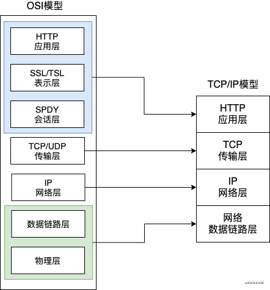

# 计算机网路基础知识
<br/>

目录：
* HTTP及优缺点
* 网络模型
* HTTP长连接
* HTTP请求方法
* GET与POST
* HTTP 常用的状态码
    * 302及应用场景
    * 302、303、307
* TCP
    * 三次握手与四次挥手
    * 滑动窗口
    * 拥塞控制
* HTTPS
* Ajax，Fetch，Axios 区别


## 一、HTTP是什么？优缺点？哪一层的协议？（应用层）
HTTP是一种超文本传输协议，用于完成客户端和服务器端等等一系列的运作流程。

**1. 优点**：
* **灵活可扩展**，除了规定空格分隔单词，换行分隔字段以外，其他都没有限制，不仅仅可以**传输文本，还可以传输图片、视频等任意资源**
* **可靠传输**，基于 TCP/IP 所以继承了这一特性
* **请求-应答，有来有回**
* **无状态**，每次 HTTP 请求都是独立的，无关的、默认不需要保存上下文信息

**2. 缺点**：
* **通信使用明文，内容会被窃听**。
    > **解决方案：加密处理防止窃听**，最常见的两种加密方式是 通信加密(https) 和 内容加密。
* **不验证通信方的身份，可能遭遇伪装**
    > 任何人都可以发起请求：服务器只要收到请求，不管是谁都会返回一个响应（仅限发送端的 IP 地址和端口号没被 Web 服务器设置限制访问的前提下）；
    > 服务端、客户端有可能都是伪装的；
    > 易造成 Dos 攻击（Denial of Service，拒绝服务器攻击）
    > **解决方案：查明对方的证书**

* **无法证明报文的完整性，可能已遭到篡改**
    > **解决方案：MD5 和 SHA-256（SHA-1已经不安全了）**

## 二、OSI七层模型和TCP/IP四层模型



**各层传输的PDU(协议数据单元)**:
* 传输层：TCP段/UDP报文  ```（传输层头部：含源端口、目的端口等信息）```
* 网络层：数据包  ```（网络层头部：含源 IP、目的 IP、TTL 等信息）```
* 数据链路层：帧
* 物理层：比特流

### TCP/IP 四层概念：  
* **应用层**：**面向用户和应用程序**，提供 “具体业务的网络服务”。关键协议：
    * HTTP/HTTPS：超文本传输协议，用于网页浏览
    * FTP/SFTP：文件传输协议
    * SMTP/POP3/IMAP：邮件传输协议，分别用于邮件发送（SMTP）、接收（POP3）和邮件同步（IMAP）；
    * DNS：域名系统，将 “域名（如www.baidu.com）” 解析为 “IP 地址，是互联网访问的 “地址簿”；
    * Telnet/SSH：远程登录协议，用于远程控制服务器（Telnet 未加密，SSH 加密）。   
* **传输层**：负责 “**主机的应用程序之间（端到端）**” 的数据传输   
    * 建立/维护应用程序间的通信链路（通过 “端口号” 标识应用程序）；
    * 该层有两种不同的协议：TCP 传输控制协议和 UDP 用户数据协议。
    * 处理数据分片（将应用层大数据拆分为网络层可传输的小片段）、流量控制（避免接收方过载）、拥塞控制（避免网络拥堵）。
    * **数据单位**：TCP段（Segment）（数据 + TCP 报头）、UDP数据报（Datagram）（数据 + UDP 报头）

|  协议 |	传输模式 | 核心特点 | 适用场景 |
| ---- | ----| ----| ---- |
| TCP（传输控制协议） | 可靠、面向连接 |	三次握手建立连接、四次挥手关闭连接；<br/> 支持重传、确认、流量控制、拥塞控制；无丢包、无乱序|	**对可靠性要求高的场景**：<br/> 网页浏览（HTTP/HTTPS）、文件传输（FTP）、邮件（SMTP）|
|UDP（用户数据报协议） |	不可靠、无连接	 |无需建立连接，直接发送数据；<br/> 无重传、无确认；传输速度快、开销小 |	**对实时性要求高的场景**：<br/> 视频通话（WebRTC）、直播、DNS 查询、游戏数据传输 |


* **网络层**：负责 “**主机到主机（跨网络的设备之间）**” 的路由选择和数据转发。
    * **定义 “IP 地址” 作为主机的唯一网络标识**，实现跨网络设备的定位；
    * *选择最优路由*（通过路由表），将数据从源主机转发到目标主机（可能经过多个路由器）；
    * 处理 IP分片（将传输层的 “段/数据报” 拆分为符合底层 MTU（最大传输单元）的 IP 数据包）。
    * **数据单位**：数据包（Packet）（传输层的段/数据报 + IP 报头）

    > 关键协议：
    > 
    > * IP（网际协议）：核心协议，负责给数据添加 IP 报头（包含源 IP、目标 IP），实现跨网路由；主流版本为 IPv4（32 位地址，如 192.168.1.1）和 IPv6（128 位地址，解决 IPv4 地址耗尽问题）；  
    > * ICMP（互联网控制消息协议）：用于网络故障诊断和控制，如 “ping” 命令（检测主机可达性）、“traceroute” 命令（追踪路由路径）；   
    > * ARP（地址解析协议）：将 “IP 地址” 转换为 “MAC 地址”（网络接口层的硬件地址），实现局域网内的设备定位；   
    > * 路由协议：如 RIP、OSPF、BGP，用于路由器之间交换路由信息，生成最优路由表（仅在路由器中运行）。  


* **数据链路层**：负责 “物理介质上的信号传输”。
    * 定义 “帧（Frame）” 格式，将**网络层的 IP 数据包封装为帧，添加 “MAC 地址”**（源/目标设备的硬件地址）实现局域网内的设备识别；
    * 关键协议/技术：
        > * 以太网（Ethernet）：最主流的局域网技术；  
        > * Wi-Fi（802.11 系列）：无线局域网技术，通过无线电波传输帧；   
        > * MAC 地址：48 位硬件地址（如 00:1A:2B:3C:4D:5E），固化在网卡中，是局域网内设备的唯一标识（与 IP 地址的 “逻辑地址” 不同）。
    * **数据单位：帧（Frame）**（网络层的 IP 数据包 + 帧头（含 MAC 地址） + 帧尾（含校验码））。
    * 物理介质：网线(双绞线、光纤)、无线电波（Wi-Fi、4G/5G）、同轴电缆等。

### 网络层、传输层对比
| 对比纬度 | 网路层 | 传输层 |
| ----| ----| ----| 
| 核心定位 | 解决 “**跨网络的主机间路由**” 问题（**主机到主机**） | 解决 “**主机内应用间通信**” 问题（**进程到进程**） |
| 通信对象 | 目标主机的**IP 地址**（定位 “哪台机器”）|	目标应用的**端口号**（定位 “机器上哪个程序”）|
| 数据单位	|数据包（Packet）|		数据段（Segment，TCP）/ 数据报（Datagram，UDP）|
| 核心功能	|路由选择、IP 寻址、分片/重组、拥塞控制（网络级）|		可靠传输（TCP）、端口寻址、流量控制（端到端）、差错恢复|
| 可靠性保证 | IP 协议是 “尽不保证可靠力交付”，丢包不重传 |		可选可靠：TCP 保证可靠，UDP 不保证|
| 关键协议	|IP（IPv4/IPv6）、ICMP、OSPF、RIP、BGP 等|		TCP（传输控制协议）、UDP（用户数据报协议）|

**两层最本质的区别：“主机到主机” vs “进程到进程”**
* **网络层**：只关心 “数据从 A 主机出发，如何通过路由器、交换机等设备，跨越多个网络（如家庭 WiFi→运营商网络→公司内网），最终到达 B 主机”。它不关心数据是主机上的 “浏览器” 还是 “微信” 发送的，只负责定位 “目标主机”。

* **传输层**：*在网络层已将数据送到目标主机后，负责把数据 “交给正确的应用程序”*。例如：主机 B 收到一个数据包后，传输层会通过 “端口号” 判断 —— 是交给 80 端口的浏览器（HTTP），还是 21 端口的 FTP 客户端，或是 443 端口的 HTTPS 服务。


## 三、HTTP 如何实现长连接？在什么时候会超时？
**背景**：Http协议采用“请求-应答”模式，当使用普通模式，即非Keep-Alive模式时，每个请求/应答，客户端和服务器都要新建一个连接，完成之后立即断开连接；当使用Keep-Alive模式时，Keep-Alive功能使客户端到服务器端的连接持续有效，当出现对服务器的后继请求时，Keep-Alive功能避免了建立或者重新建立连接。

通过在头部（请求和响应头）设置 Connection: keep-alive。**http1.0中默认是关闭的，需要在http头加入”Connection: Keep-Alive”，才能启用Keep-Alive；从HTTP1.1协议以后，连接默认都是长连接**

* HTTP 一般会有 http 的守护进程，里面可以设置 keep-alive timeout，当 httpd 闲置超过这个时间就会关闭，也可以在 HTTP 的 header 里面设置超时时间
* TCP 的 keep-alive 包含三个参数，支持在系统内核的 net.ipv4 里面设置：当 TCP 连接之后，闲置了 tcp_keepalive_time，则会发生侦测包，如果没有收到对方的 ACK，那么会每隔 tcp_keepalive_intvl 再发一次，直到发送了 tcp_keepalive_probes，就会丢弃该连接。
tcp_keepalive_intvl = 15
tcp_keepalive_probes = 5
tcp_keepalive_time = 1800

* 实际上 HTTP 没有长短连接，只有 TCP 有，TCP 长连接可以复用一个 TCP 连接来发起多次 HTTP 请求，这样可以减少资源消耗，比如一次请求 HTML，可能还需要请求后续的 JS/CSS/图片等

> 参考：[Http长连接和Keep-Alive以及Tcp的Keepalive](https://blog.csdn.net/weixin_37672169/article/details/80283935)

## 四、HTTP 的请求方法
* GET：获取服务器资源。
* POST：提交数据，但同一个请求多次执行会生成多个资源，是非幂等的。请求的URL仅仅是处理资源的接口，服务端进行额外的校验、处理后才会给资源分配URL
* PUT：同POST，但 PUT 请求是幂等的（同一个请求 即使重复执行 结果也不会变化）。请求的URL 就是资源的最终地址
* HEAD：和 GET 方法一样。但是只返回响应头部。作用是确定 URL 的有效性和资源更新的时间。
* DELETE：删除指定的资源。
* OPTIONS：列出可对资源实行的请求方法，常用于跨域。
* TRACE：追踪请求-响应的传输路径
* CONNECT：建立连接渠道，用于代理服务器。

参考：[POST与PUT详情对比](POST与PUT对比)

## 4.1 简单请求与复杂请求
参考：[MDN 跨域中提到的简单/复杂请求](https://developer.mozilla.org/zh-CN/docs/Web/HTTP/CORS)

**（1）简单请求必须符合以下规定**：
* 只能使用get/post/head请求方式

* 除了被**用户代理自动设置的首部字段**（例如 Connection ，User-Agent），**允许人为设置的字段集合为**：
    > Accept  
    > Accept-Language  
    > Content-Language  
    > Content-Type （需要注意额外的限制）  
    > Range 

* content-type**只能设置以下内容**：
    > text/plain：普通文本，无格式  
    > multipart/form-data：表单提交，包含**文件上传** 的表单   
    > application/x-www-http-urlencoded：最常见的表单格式，数据以 **键值对** 形式编码    

* 不能为 XMLHttpRequestUpload 注册监听器

* 请求中没有使用readableStream对象

**（2）复杂请求**：除了简单请求，其余的都是复杂请求
如果请求头中有不是简单请求限定的“请求头”（如 X-Token、Authorization），则自动升级为复杂请求。尽管 Authorization 也是HTTP标准头。

## 五、GET 与 POST 
参考：https://www.runoob.com/tags/html-httpmethods.html
* **get 请求**：


<br/>

* **post 请求**:


* **区别**：

|     | GET  | POST  |
|  ----  | ----  | ----  |
| 后退按钮、刷新 | 无害	| 数据会被重新提交（浏览器应该告知用户数据会被重新提交）。 | 
| 书签 | 可收藏为书签 |	不可收藏为书签 |
| 缓存 | 能被缓存 |	不能缓存 |
| 编码类型 | application/x-www-form-urlencoded | application/x-www-form-urlencoded 或 multipart/form-data。为二进制数据使用多重编码。 |
| 历史 | 参数保留在浏览器历史中。 |	参数不会保存在浏览器历史中。 |
| 对数据长度的限制 | 当发送数据时，GET 方法向 URL 添加数据；URL 的长度是受限制的（URL 的最大长度是 2048 个字符）。 | 无限制。 |
| 对数据类型的限制 | 只允许 ASCII 字符。 | 没有限制。也允许二进制数据。 |
| 安全性 | 与 POST 相比，GET 的安全性较差，因为所发送的数据是 URL 的一部分。不要用GET请求发送密码或其他敏感信息 | POST 比 GET 更安全，因为参数不会被保存在浏览器历史、web 服务器日志中。 |
| 可见性 |	数据在 URL 中对所有人都是可见的。 |	数据不会显示在 URL 中。 |


* GET和POST只是HTTP协议中的两种请求方式，而HTTP协议之基于TCP/IP的应用层协议，无论**POST和GET都是用同一个传输层协议**，所以传输上没有区别。
* GET和POST能做的事情是一样的，给**GET加上request body，给POST加上url参数，技术上完全是行得通**的。
* GET产生一个TCP数据包；POST产生两个TCP数据包。
    > GET请求：浏览器会把**http header和data一并发送出去**，服务器响应200(返回数据);
    > POST请求：浏览器**先发送header，服务器响应100 continue，浏览器再发送data**，服务器响应200 ok(返回数据)。

## 六、HTTP 常用的状态码及使用场景
* 1xx：表示目前是协议的中间状态，还需要后续请求
* 2xx：表示请求成功
* 3xx：表示重定向状态，需要重新请求
* 4xx：表示请求报文错误
* 5xx：服务器端错误

**常用状态码**：

* 101 切换请求协议，从 HTTP 切换到 WebSocket
* 200 请求成功，有响应体
* 301 永久重定向：会缓存，以后使用新 url 访问
* 302 临时重定向：不会缓存
* 304 协商缓存命中
* 400（Bad Request）：请求报文中存在语法错误
* 401（Unauthorized）：发送的请求要通过 HTTP 认证的认证消息。如果之前请求过一次，就表示用户认证失败。
* 403（Forbidden）：服务器拒绝访问
* 404（Not Found）：资源找不到
* 500（Internal Serve Error）：服务器端错误
* 503（Service Unavailable）： 服务器繁忙

## 七、302 是什么？应用场景？

* 而 **302 表示临时重定向**，这个资源只是**暂时不能被访问**了，但是之后**过一段时间还是可以继续访问**，一般是**访问某个网站的资源需要权限**时，会需要用户去登录，**跳转到登录页面，登录之后，还可以继续访问**。

* **301 类似，都会跳转到一个新的网站**，但是 **301 代表访问的地址的资源被永久移除了**，以后都不应该访问这个地址，搜索引擎抓取的时候也会用新的地址替换这个老的。可以在返回的响应的 location 首部去获取到返回的地址。301 的场景如下：
    > 比如从 http://baidu.com，跳转到 https://baidu.com，域名换了


## 八、302，303，307 状态码异同
303和307是HTTP1.1新加的服务器响应文档的状态码，它们是对HTTP1.0中的302状态码的细化，主要用在对非GET、HEAD方法的响应上。

* [RFC2616](http://tools.ietf.org/html/rfc2616#section-10.3.3)文档中：**HTTP1.1在介绍302时说，如果客户端发出非GET、HEAD请求后，收到服务端的302状态码，那么就不能自动的向新URI发送重复请求，除非得到用户的确认**。

* 文档中规定**303状态码**的响应：POST重定向为GET。与现有浏览器对302状态码的处理一致，实践在前而文档在后。

* HTTP1.1文档中**307状态码**，当客户端的POST请求收到服务端307状态码响应时，需要跟用户询问是否应该在新URI上发起POST方法，也就是说，307是不会把POST转为GET的。

    > 303和307的存在，归根结底是由于POST方法的非幂等属性引起的。
    > **HTTP方法的幂等性**：是指一次和多次请求某一个资源应该具有同样的副作用

* 在HTTP1.1中，302理论上是要被放弃掉的，它被细化为303和307，但为了兼容，它目前还在业界中大量使用，原因主要有：
(1) POST 方法重定向的使用场景太少，使得307状态码没有用武之地；
(2) GET 方法虽然常需要使用重定向，但使用302状态码也能正确运转，也就没有使用303的必要了。

> 参考：[302、303、307状态码的来龙去脉](https://www.cnblogs.com/cswuyg/p/3871976.html)


## 九、TCP 关键知识点
[TCP详解](./1.1__TCP.md)

[三次握手 与 四次挥手](https://zhuanlan.zhihu.com/p/86426969)

<!-- TODO -->
[TCP 滑动窗口](https://juejin.cn/post/6844904070889603085#heading-38)

## 十、TCP 如何保证可靠传输及拥塞控制原理?
[TCP详解](./1.1__TCP.md)

## 十一、HTTPS 是什么？具体流程
见：[对称加密 与 非对称加密](./3.2__https加密流程%20%20(非)对称加密.md)

## 十二、WebSocket与Ajax的区别
参考：[Websocket详解](./6.0__Websocket.md)
|     | websocket  | Ajax  |
|  ----  | ----  | ----  |
| 本质  | HTML5 的一种新协议，实现了浏览器和服务器的实时通信 | 异步 JavaScript 和 XML，是一种创建交互式网页的应用的网页开发技术 |
| 生命周期不同  | 长连接，会话一直保持 | 发送/接收之后就会断开 |
| 适用场景  | 前后端实时交互数据 | 非实时... |
| 发起人  | 服务器端和客户端相互推送 | 客户端发起 |

## 十三、Ajax，Fetch，Axios 区别
参考：[xhr、fetch、axios、ajax详细说明](./5.0__fetch和axios和Ajax区别.md)

