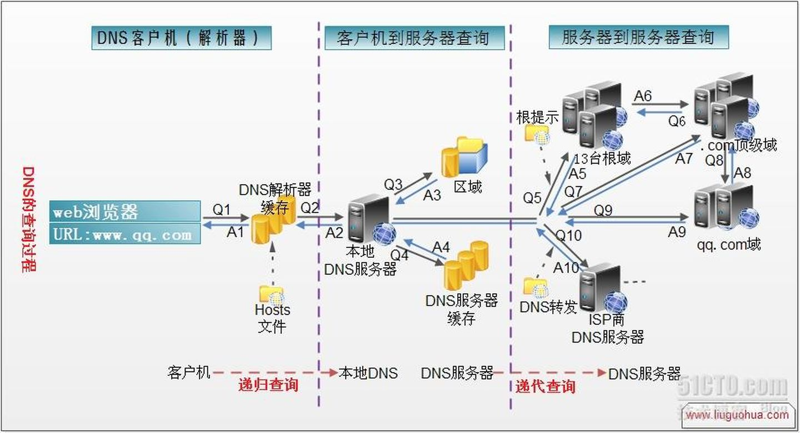

# dns 及 dns 解析过程

参考：https://www.zhihu.com/question/23042131

## 按 DNS 层级划分服务器
DNS服务器有四种：```根 → 顶级域 → 权威域 → 本地```，服务器都属于网络层面的
* **根DNS服务器**：
    * 最高层，是所有域名解析的 “起点”，**全球共 13 组逻辑根服务器**。
    * **不直接解析具体域名**，仅返回 “**查询顶级域名服务器地址**”。
* **顶级DNS服务器**（Top-Level Domain Server，TLD 服务器）：
    * 位于根服务器之下，指定某个国家/地区、组织使用的域名，如：com、org、edu、gov。
    * **不直接返回目标域名的 IP**，而是接收根服务器转发的请求，*返回 “目标域名的二级域名对应的**权威服务器地址**”*。
* **权威DNS服务器**：
    * 个人/组织在Internet上使用的注册名称，如：baidu.com。
    * 是某一特定域名（或域名段）的 **“官方解析源”** 
    * **直接返回目标域名的最终解析结果**（如 IP 地址），是 **DNS 解析流程中 “提供最终答案” 的服务器**。
    * 管理归属：由域名持有者选择的 DNS 服务商提供，如：阿里云、腾讯云等服务商提供的权威服务器
    * 主要有两种：
        * “**主”权威服务器**：存储域名解析记录的 “原始文件”。
        * **“从”权威服务器**：通过“区域传输” *从主权威服务器同步解析记录，作为冗余备份，避免主服务器故障导致解析失效*。
* **本地 DNS服务器**：
    * 位于DNS层级的“最底层”，是用户设备（电脑、手机）直接对接的 DNS 服务器，
    * 接受用户请求，本地DNS缓存中没有域名对应的IP时，依次像 根、顶级、权威服务器 发起查询，直到获取 IP地址，把IP地址返回给用户 并且 缓存下来。


## 本地DNS解析器、本地DNS服务器 区分
**本地 DNS解析器**：指客户端设备(电脑/手机)自身的 DNS 解析模块，**负责发起解析请求**、**优先 查客户端本地缓存(不是“本地 DNS 服务器缓存”)**。  
* 简单说：是你电脑/手机里，“帮你发起域名解析” 的内置功能，会先查自己的小缓存、再查 hosts文件。  
* 本地 DNS解析器在解析域名时，会严格按照 ```“客户端自身缓存 → hosts文件 → 本地 DNS 服务器”```*的顺序查询；客户端缓存是存在内存里的，而hosts文件是个静态文件* 存在磁盘上，因此缓存 相比 hosts文件 具有优先级。  
* **“客户端自身缓存” 里又细分 “浏览器缓存” 和 “系统解析器缓存”**，先应用程序(浏览器)、再系统！即使应用程序卸载了，系统缓存依旧在，避免向上层再查询。因此更准确的优先级是：<br/>```浏览器缓存 → 系统解析器缓存 → hosts 文件 → 本地 DNS 服务器查询```

**本地 DNS服务器**：是网络里为你提供 DNS 服务的服务器（如运营商给你的 DNS、你手动填的 8.8.8.8 ），**负责帮客户端查域名**。
* 它会查自己的服务器端缓存、查区域配置，还会去向上级 DNS 迭代/转发查询*。


## 一、NDS 解析简单步骤：
* **客户端自身缓存**
    * **浏览器自身缓存**
    * **系统解析器缓存**
* **本地hosts文件**   
    > 以上3项 是本地NDS解析器干的事，和服务器没关系！
* **本地dns服务器**：
    * **查服务器本地缓存**：先看自己的服务器缓存 有没有此网络映射关系的记录，有就直接返回（这时候**返回的结果 “不权威”，因为是缓存的** ）。
    * **查本地区域配置**：如果服务器配置了“区域解析”（比如企业DNS 自己管qq.com域名），直接返回权威结果（**具有权威性**）
        > 不过普通运营商DNS 一般不会配这个
* 若上述几个条件均不满足，根据**本地DNS服务器的设置（是否设置转发器）进行查询**，迭代/转发查询：
    * **迭代模式**：本地DNS服务器 自己去问 “根 → 顶级域 → 权威域”，一步步迭代查（就是流程里说的 “找 13 台根，再找 .com 顶级域，再找 qq.com 权威” ），直到找到www.qq.com主机。
    * **转发模式**：本地DNS服务器 把请求 “转发” 给上级 DNS，让上级去查，自己等结果。
* 把**最终的解析结果返回给本地DNS服务器**，本地DNS服务器**把返回的结果保存到缓存**，以备下一次使用，同时**将该结果反馈给客户端，客户端通过这个IP地址与web服务器建立链接**。(与查的过程刚好相反！)

<br/>




<!-- 下面的步骤貌似 不太准，参考上面的即可！ -->
## 二、DNS 解析的详细步骤是：

**1.** 在浏览器中输入www.qq.com 域名，**浏览器会先检查 浏览器自身缓存**中有没有被解析过的这个域名对应的ip地址，如果有，解析结束。同时域名被缓存的时间也可通过 TTL 属性来设置。

**2.** 如果浏览器缓存中没有这个域名的映射，**操作系统 会检查自己本地的hosts文件**是否有这个网址映射关系，如果有，就先调用这个IP地址映射，完成域名解析。 
> 这种操作系统级别的域名解析规程也被很多黑客利用，通过修改你的hosts文件里的内容把特定的域名解析到他指定的ip地址上，造成所谓的“域名劫持”。所以在“windows7中将hosts文件设置成了readonly，防止被恶意篡改”。

**3.** 如果hosts里没有这个域名的映射，则查找**本地DNS解析器缓存**，是否有这个网址映射关系，如果有，直接返回，完成域名解析。 

**4.** 如果*hosts 与 本地DNS解析器缓存*都没有相应的网址映射关系，**首先会找*TCP/ip参数中设置的首选DNS服务器*，即本地DNS服务器**，此服务器收到查询时，如果要查询的域名，**包含在本地配置区域资源中**，则返回解析结果给客户机，完成域名解析，此解析具有权威性。 

**5.** 如果要查询的域名，**不由本地DNS服务器区域*解析*，但该服务器已缓存**了此网址映射关系，则调用这个IP地址映射，完成域名解析，此解析不具有权威性。 

**6.** 如果*本地DNS服务器 本地区域文件 与 缓存解析 都*失效，则根据**本地DNS服务器的设置（是否设置转发器）进行查询**:

* 如果**未用转发模式：**

    * (1) 本地DNS就把请求发至**13台根DNS服务器**，根DNS服务器收到请求后会判断这个域名(.com)是谁来授权管理，并会返回一个**负责该顶级域名服务器的一个IP（com、org、net、edu、gov）**。

    * (2) 本地DNS服务器收到IP信息后，将会联系负责*.com域*的这台服务器。这台负责.com域的服务器收到请求后，如果自己无法解析，它就会找一个**管理.com域的下一级DNS服务器地址**(http://qq.com)给本地DNS服务器。
    
    * (3) 当本地DNS服务器收到这个地址后，就会找http://qq.com域服务器，**重复上面的动作，进行查询，直至找到www.qq.com主机**。 

* 如果用的是**转发模式：**

    * (1) 此DNS服务器就会**把请求转发至上一级DNS服务器**，由上一级服务器进行解析，上一级服务器如果不能解析，或找**根DNS**或**把转请求转至上上级**，以此循环。


不管是本地DNS服务器是用**转发**，还是**根提示**，最后都会把**最终的解析结果返回给本地DNS服务器**，本地DNS服务器**把返回的结果保存到缓存**，以备下一次使用，同时**将该结果反馈给客户端，客户端通过这个IP地址与web服务器建立链接**。

## 三、dns优化：
dns优化，可以在html页面头部写入dns缓存地址

```html
<meta http-equiv="x-dns-prefetch-control" content="on" />
<link rel="dns-prefetch" href="http://bdimg.share.baidu.com" />
```
