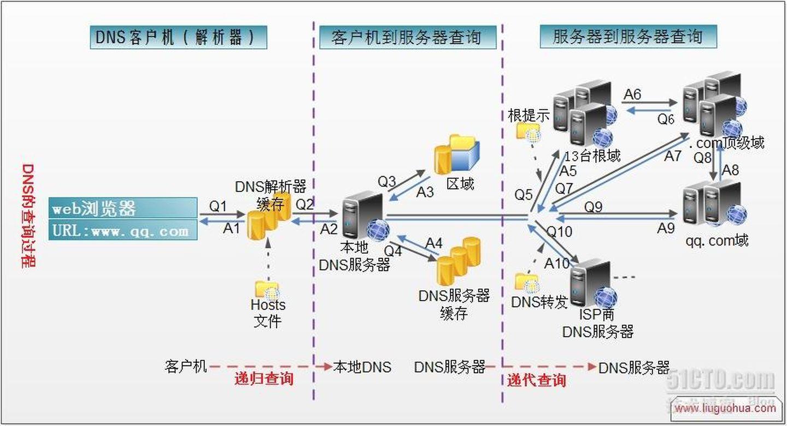

# dns 解析过程

参考：https://www.zhihu.com/question/23042131

## 一、NDS 解析简单步骤：
* **浏览器自身缓存**
* **本地hosts文件**
* **本地dns解析器缓存**
* **本地dns服务器**：
（1）首先看 要查询的域名是否**包含在本地配置区域资源中**，如果在，则返回解析结果给客户机（具有权威性）；
（2）若不能由 本地dns服务器 解析，则查看该服务器 **是否存在此网络映射关系的缓存**，若是...
* 若上述几个条件均不满足，根据**本地DNS服务器的设置（是否设置转发器）进行查询**:
（1）未用转发模式：13台根DNS服务器 ---> 顶级域名服务器 ---> 管理.com域的下一级DNS服务器 ---> ...，直到找到www.qq.com主机。
（2）使用转发模式：把请求转发至上一级DNS服务器 ---> 上上级DNS ---> ... ---> 根DNS
* 把**最终的解析结果返回给本地DNS服务器**，本地DNS服务器**把返回的结果保存到缓存**，以备下一次使用，同时**将该结果反馈给客户端，客户端通过这个IP地址与web服务器建立链接**。

 

从**客户端 到 本地DNS服务器**是属于**递归查询**，而**DNS服务器之间**就是的交互查询就是**迭代查询**。

## 二、DNS 解析的详细步骤是：

**1.** 在浏览器中输入www.qq.com 域名，**浏览器会先检查 浏览器自身缓存**中有没有被解析过的这个域名对应的ip地址，如果有，解析结束。同时域名被缓存的时间也可通过TTL属性来设置。

**2.** 如果浏览器缓存中没有这个域名的映射，**操作系统 会检查自己本地的hosts文件**是否有这个网址映射关系，如果有，就先调用这个IP地址映射，完成域名解析。 

    > 这种操作系统级别的域名解析规程也被很多黑客利用，通过修改你的hosts文件里的内容把特定的域名解析到他指定的ip地址上，造成所谓的“域名劫持”。所以在“windows7中将hosts文件设置成了readonly，防止被恶意篡改”。

**3.** 如果hosts里没有这个域名的映射，则查找**本地DNS解析器缓存**，是否有这个网址映射关系，如果有，直接返回，完成域名解析。 

**4.** 如果*hosts 与 本地DNS解析器缓存*都没有相应的网址映射关系，**首先会找*TCP/ip参数中设置的首选DNS服务器*，即本地DNS服务器**，此服务器收到查询时，如果要查询的域名，**包含在本地配置区域资源中**，则返回解析结果给客户机，完成域名解析，此解析具有权威性。 

**5.** 如果要查询的域名，**不由本地DNS服务器区域*解析*，但该服务器已缓存**了此网址映射关系，则调用这个IP地址映射，完成域名解析，此解析不具有权威性。 

**6.** 如果*本地DNS服务器 本地区域文件 与 缓存解析 都*失效，则根据**本地DNS服务器的设置（是否设置转发器）进行查询**:

* 如果**未用转发模式：**

    * (1) 本地DNS就把请求发至**13台根DNS服务器**，根DNS服务器收到请求后会判断这个域名(.com)是谁来授权管理，并会返回一个**负责该顶级域名服务器的一个IP（com、org、net、edu、gov）**。

    * (2) 本地DNS服务器收到IP信息后，将会联系负责*.com域*的这台服务器。这台负责.com域的服务器收到请求后，如果自己无法解析，它就会找一个**管理.com域的下一级DNS服务器地址**(*http://qq.com*)给本地DNS服务器。
    
    * (3) 当本地DNS服务器收到这个地址后，就会找http://qq.com域服务器，**重复上面的动作，进行查询，直至找到www.qq.com主机**。 

* 如果用的是**转发模式：**

    * (1) 此DNS服务器就会**把请求转发至上一级DNS服务器**，由上一级服务器进行解析，上一级服务器如果不能解析，或找**根DNS**或**把转请求转至上上级**，以此循环。

不管是本地DNS服务器是用**转发**，还是**根提示**，最后都会把**最终的解析结果返回给本地DNS服务器**，本地DNS服务器**把返回的结果保存到缓存**，以备下一次使用，同时**将该结果反馈给客户端，客户端通过这个IP地址与web服务器建立链接**。