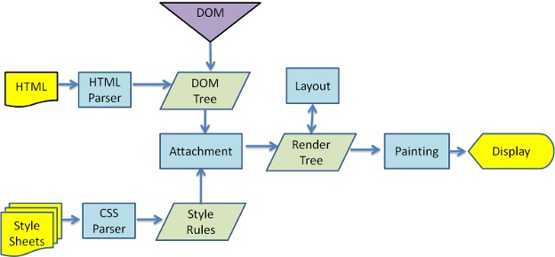

# URL 从输入到页面展示

参考：
https://juejin.cn/post/6928677404332425223

https://www.imooc.com/article/45936

<br/>

###  一、 URL从输入到页面展示流程
**1. 浏览器输入访问URL地址**

**2. URL 解析**
> 解析之前转义过的url，因为url如果不转义会出现歧义。比如http:www.baidu.com?key=value，假如我的key本身就包括等于=符号，比如ke=y=value，就会出现歧义

**3. DND解析，将域名转化为 IP地址**（见：[dns解析流程](https://github.com/1194964459/FE-Interview-Notebook/blob/main/Network/1.0.1__dns%E5%8F%8Adns%E8%A7%A3%E6%9E%90.md)）

**4. 与服务器建立连接** （见：[三次握手 与 四次挥手](https://zhuanlan.zhihu.com/p/86426969)）

**5. 发起HTTP请求**

**6. 服务器响应HTTP请求**

**7. 关闭连接**

**8. 浏览器解析文档**（参考：[浏览器渲染流程](https://juejin.cn/post/6844903565610188807)）


> 加载HTML文件
> 加载完后解析HTML，并在解析的过程中构建DOM树
> 解析CSS生成CSSOM规则树
> 将DOM树与CSSOM规则树合并在一起生成Render Tree(渲染树)。
> 遍历渲染树开始布局，计算每个节点的位置大小信息
> 将渲染树每个节点绘制到屏幕

**HTML解析时，遇到 src、pref 属性相关的 link、script、img、iframe 这类标签**时，浏览器会向服务器发送请求资源。处理过程如下：
* script的加载或者执行都会阻塞html解析、其他下载线程以及渲染线程。
* link加载完css后会解析为CSSOM(层叠样式表对象模型,一棵仅含有样式信息的树)。css的加载和解析不会阻塞html的解析，但会阻塞渲染。
* img的加载不会阻塞html的解析，但img加载后并不渲染，它需要等待Render Tree生成完后才和Render Tree一起渲染出来。未下载完的图片需等下载完后才渲染。


### 二、URL解析详情补充
**1. <code>encodeURIComponent 与 encodeURI </code>区别及联系**：

以<code>http://www.jxbh.cn/illegal value.htm</code>为例：

* encodeURI()主要用于整个URI（<code>http://www.jxbh.cn/illegal value.htm</code>）
* encode-URIComponent()主要用于对URI中的某一段进行编码（如前面URI中的<code>illegal value．htm</code>）,转义的字符比较多

```js
// 不转义的字符：
  - _ . ! ~ * ' ( )  A-Z a-z 0-9
```
```js
var set1 = ";,/?:@&=+$";  // 保留字符
var set2 = "-_.!~*'()";   // 不转义字符
var set3 = "#";           // 数字标志
var set4 = "ABC abc 123"; // 字母数字字符和空格

console.log(encodeURI(set1)); // ;,/?:@&=+$
console.log(encodeURI(set2)); // -_.!~*'()
console.log(encodeURI(set3)); // #
console.log(encodeURI(set4)); // ABC%20abc%20123 (the space gets encoded as %20)

console.log(encodeURIComponent(set1)); // %3B%2C%2F%3F%3A%40%26%3D%2B%24
console.log(encodeURIComponent(set2)); // -_.!~*'()  
console.log(encodeURIComponent(set3)); // %23
console.log(encodeURIComponent(set4)); // ABC%20abc%20123 (the space gets encoded as %20)
```

## 三、CSS、JS 阻塞相关
[前端优化时要避免空的src](https://blog.csdn.net/Panda_m/article/details/78456358)

[阻塞相关](https://juejin.cn/post/6844904040346681358#heading-21)

[浏览器内核](https://github.com/1194964459/FE-Interview-Notebook/blob/main/JS/%E4%BA%8B%E4%BB%B6/event-loop.md)

浏览器是多进程架构。每新开一个Tab页，就会新建一个进程。

* JS 是一门单线程的语言！
* JS 会阻塞页面的加载、执行
  > 浏览器中 GUI 渲染线程与 JavaScript 引擎是互斥的。
  > （1）GUI渲染线程：负责解析 HTML,CSS,构建 DOM 树和 RenderObject 树,布局和绘制。
  > （2）JS引擎线程：负责解析 Javascript 脚本,运行代码。
  至于为什么互斥？因为：JavaScript 是可操纵 DOM 的，如果在修改这些元素属性同时渲染界面（即 JavaScript 线程和 UI 线程同时运行），那么渲染线程前后获得的元素数据就可能不一致了。

* CSS 加载不会阻塞 DOM 解析（DOM 和 CSSOM 是并行构建的）；但CSS 加载会阻塞 DOM 渲染（因为 DOM 渲染 依赖于CSSOM Tree 的构建）。CSS 会阻塞在它后面 JS 的执行。CSS是由单独的下载线程异步下载的。
* ```<link href="xxx" />、、<iframe src="" >``` 并不会阻塞 html 页面的加载和解析，但是空的 href 和 src 会影响首屏渲染。

  > 避免使用空的 src 属性确实可以缩减浏览器首屏渲染的时间，因为浏览器在渲染过程中会把 src 属性中的空内容进行加载，直至加载失败，影响 DOMContentLoaded 与 Loaded 事件之间的资源准备过程，拉长了首屏渲染所用的时间；但空的 href 属性对首屏渲染的影响比较小。

这些自上而下渲染解析代码有些是同步的，但是有些操作也是异步的，比如：
 1. 遇到CSS资源的加载。
    * 遇到的是<style></style>内联样式。同步地交给GUI渲染线程解析
    * 遇到的是"<link></link>"外联样式。
       =>异步地进行处理，开辟一个新的http网络请求线程。(注意：同一个源下，根据不同的浏览器，最多只允许同时开辟4~7个HTTP线程，也就是“HTTP的并发数”)。
       =>不等待资源信息请求回来，GUI渲染线程继续往下渲染。
       =>GUI渲染线程同步操作完成后，再把基于Http网络线程请求回来的资源文件进行解析渲染。
    * 遇到@import "导入式样式"。
       => "同步"地开辟一个新的HTTP网络请求线程，去请求资源文件
       => 但是在资源文件没有请求回来之前，GUI渲染线程会被“阻塞”，不允许其继续向下渲染。
       => @import是阻碍GUI渲染线程渲染，因此，@import一般在项目中很少使用。

1. 遇到<script></script>资源的请求
   => 默认都是同步的：必须基于HTTP网络线程，把资源请求回来之后，并且交给“JS”渲染线程渲染解析完成后，GUI渲染线程才能继续向下渲染。
   => script默认也是阻碍GUI渲染机制向下渲染。
   => async属性实现异步渲染。遇到<script async></script>首先也是会开辟一个HTTP网络线程去请求加载资源文件，但是与此同时GUI渲染线程也会继续向下渲染。把默认的同步改成异步。但是一旦资源请求回来后，会中断GUI的渲染，会先将请求回来的资源文件进行解析渲染完成，才会继续后面的代码的解析渲染。
   => defer属性：遇到<script defer></script>首先也是会开辟一个HTTP网络线程去请求加载资源文件,但是与此同时GUI渲染线程也会继续向下渲染。但是`defer`是在GUI渲染完成之后，也就是同步代码执行完毕之后，才会渲染解析defer请求回来的资源。
2. 遇到`img``audio`>`等音视频资源。
   => 默认都是异步的，也会发送HTTP网络线程去请求加载对应的资源文件，不阻碍GUI的渲染，当GUI渲染完成之后，才会将请求回来的资源进行解析。

## 四、性能优化及指标
[触发重排，避免重排](./1.0.2__重绘与重排.md)

[阮一峰 网页性能管理详解](http://www.ruanyifeng.com/blog/2015/09/web-page-performance-in-depth.html)

[性能优化指南](https://mp.weixin.qq.com/s?__biz=Mzg4MTYwMzY1Mw==&mid=2247495787&idx=1&sn=b36f83fa2ea6683c45448ab419e8c165&source=41#wechat_redirect)


一秒之间能够完成多少次重新渲染，这个指标就被称为"刷新率"，英文为FPS（frame per second）。60次重新渲染，就是60FPS。

```js
// 性能监控的一些指标
DCL：DOMContentLoaded  // DOM解析完
L：Onload        // 图片、脚本、样式表等静态资源都已经加载完毕
FP：First Paint  // 
FCP：First Contentful Paint
LCP：Largest Contentful Paint
```

## 四、window.requestAnimationFrame()
调节重新渲染，大幅提高网页性能。其中最重要的，就是 window.requestAnimationFrame() 方法。它可以将某些代码放到下一次重新渲染时执行。
```js
function doubleHeight(element) {
    var currentHeight = element.clientHeight;
    element.style.height = (currentHeight * 2) + 'px';
}
elements.forEach(doubleHeight);
```

使用循环操作，将每个元素的高度都增加一倍。可是，每次循环都是，读操作后面跟着一个写操作。这会在短时间内触发大量的重新渲染，显然对于网页性能很不利。

可改写成：
```js
function doubleHeight(element) {
    var currentHeight = element.clientHeight;
    window.requestAnimationFrame(function () {
        element.style.height = (currentHeight * 2) + 'px';
    });
}
elements.forEach(doubleHeight);
```
使用window.requestAnimationFrame()，让读操作和写操作分离，把所有的写操作放到下一次重新渲染。

页面滚动事件（scroll）的监听函数、网页动画，就很适合用 window.requestAnimationFrame() 。

## 五、window.requestIdleCallback()
也用来调节重新渲染。它指定只有当一帧的末尾有空闲时间，才会执行回调函数。
```js
requestIdleCallback(fn);
```
只有当前帧的运行时间小于16.66ms时，函数fn才会执行。否则，就推迟到下一帧，如果下一帧也没有空闲时间，就推迟到下下一帧，以此类推。

它还可以接受第二个参数，表示指定的毫秒数。如果在指定 的这段时间之内，每一帧都没有空闲时间，那么函数fn将会强制执行。
```js
requestIdleCallback(fn, 5000);
```