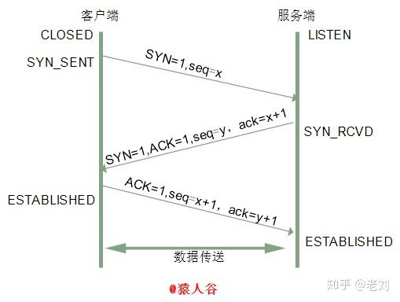
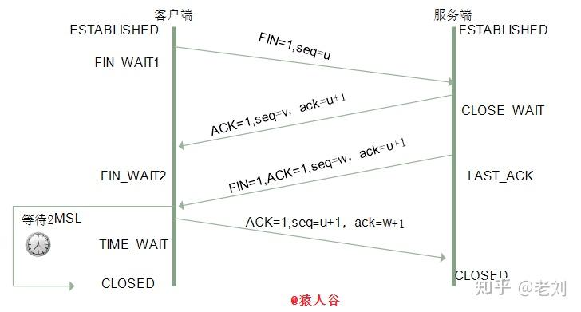
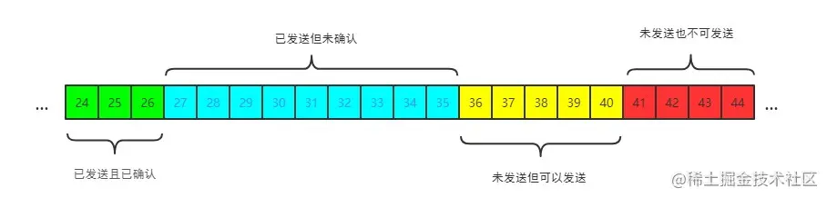
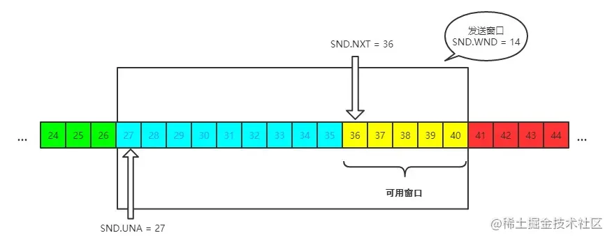
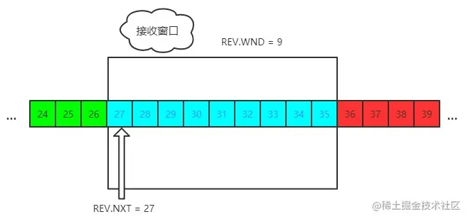

# TCP
参考：
[三次握手 与 四次挥手](https://zhuanlan.zhihu.com/p/86426969)

[TCP 滑动窗口](https://juejin.cn/post/6844904070889603085#heading-38)

TCP（传输控制协议 Transmission Control Protocol ）是一种面向连接的、可靠的、**基于字节流**的传输层通信协议，其连接建立、连接终止分别通过三次握手和四次挥手实现

> 基本模式是：客户端/服务器会因为“没收到确认” 而超时重发某种报文

TCP 的**核心设计原则**：
* *TCP 是 “面向连接的可靠字节流协议”，其目标是确保数据按发送顺序完整、无差错地交付给应用层*。
* 乱序数据无法直接交给应用层（会破坏 “有序” 特性），因此即使先收到了后面序号的数据 也不会确认，而是持续确认“**当前已收到的最大连续数据的序号 + 1**”，直接导致“队头阻塞”。发送方只有收到连续有序的确认号 发送窗口才会向前移动，接受方只有收到连续有序的数据 接受窗口才会向前移动！因为 TCP 是基于字节流传输的，与数据的字节长度有关的！
    > TCP 给每个字节分配一个唯一的序号！   
    > 而基于 UDP 的 QUIC 协议通过 “流（Stream）” 的设计解决了这一问题 —— 每个流的序号独立，某一流的乱序数据不会影响其他流的确认和交付。

疑问❓：TCP段一般有多大啊？
TCP 段的大小并非固定值，核心是为了适配底层网络的传输能力，避免数据在链路层被分片（分片可能增加丢包风险和处理开销）。TCP 段的大小由最大传输单元（MTU）、TCP MSS（最大分段大小） 以及实际传输的数据量共同决定！

* MTU（最大传输单元，Maximum Transmission Unit）：数据链路层（如以太网、WiFi）规定的 “单个数据包的最大字节数”（包含链路层头部）
* TCP MSS（Maximum Segment Size，最大分段大小）：单个 TCP 段中可承载的最大应用层数据字节数
* TCP 段是 TCP 层的数据单元，它需要封装在 IP 数据包中传输，因此 TCP 段的最大有效数据量由 TCP MSS 决定！
```
TCP MSS = IP MTU - IP 头部大小（通常 20 字节，无选项时） - TCP 头部大小（通常 20 字节，无选项时）
```


## 一、TCP报头
报头固定部分（20个字节）、可选部分（0-40 字节）


**你需要注意这么几点**：

* TCP的包是没有IP地址的，那是IP网络层上的事。但是有源端口和目标端口。
* 一个TCP连接需要四个元组来表示是同一个连接（src_ip, src_port, dst_ip,dst_port）准确说是五元组，还有一个是协议。但因为这里只是说TCP协议，所以，这里我只说四元组。

## 二、连接建立（三次握手）
三次握手的目的是**同步双方的序列号，确保双方都能收发数据**，并协商初始参数（如窗口大小）。
### 核心概念
* **序列号**（Sequence Number）：**发送方为每个字节分配的唯一编号**，用于保证数据*有序性和去重*。
* **确认号**（Acknowledgment Number）：*期望收到的下一个字节的序列号，用于确认已接收的数据，解决丢包问题*。
* Window又叫Advertised-Window，也就是著名的**滑动窗口（Sliding Window）**，用于**解决流量控制**的。
* TCP Flag ，也就是包的类型，主要是用于操控TCP的状态机的。
* **标志位**：
    * SYN（同步）：用于发起连接，请求同步序列号。
    * ACK（确认）：用于确认已接收的数据。



> 序列号：x，y，x+1

### 1. 为什么需要三次握手，两次不行吗？
答：两次不行的！ 三次握手主要是为了解决网络中 “失效连接请求” 的问题，其次是为了同步双方的初始序列号。  
> TCP 通过序列号保证数据的有序性、完整性和去重，三次握手的另一个核心功能是**交换初始序列号并确认**。    
> 如果仅两次握手，客户端无法确认服务器是否收到了自己的序列号，可能导致数据同步混乱。

网络中可能存在**延迟的失效报文**（例如：客户端发送的连接请求因网络拥堵滞留，超时后客户端已放弃，但报文后续仍到达服务器）。如果没有三次握手，这类报文可能导致错误连接。

**（1）具体场景模拟（假设只有两次握手）**：
* 客户端发送连接请求 SYN（序列号 x），但因网络延迟滞留。
* 客户端超时未收到回应，认为请求失败，重*新发送 SYN 并与服务器成功建立连接、通信、断开*（注意：此时传送完数据已经断开了）。
* 此时，**滞留的旧 SYN 报文到达服务器**，服务器误以为是新的连接请求。
* *若仅需两次握手*，服务器会直接发送 SYN+ACK 并进入连接状态，等待客户端发送数据。
* 但*客户端已断开连接，不会理会服务器的回应，导致服务器长期维持一个无效连接，浪费资源（如内存、端口）*。


**（2）三次握手如何解决这个问题？**  
第三次握手的关键是**客户端对服务器的最终确认**，确保双方都认可连接的有效性：

* 客户端发送 SYN（第一次握手）。
* 服务器回应 SYN+ACK（第二次握手）。
* **客户端必须发送最终的 ACK（第三次握手）**，服务器只有收到这个 ACK 后，才确认连接建立。


## 三、连接断开（四次挥手）
四次挥手用于终止已建立的连接，双方需分别释放发送和接收数据的能力（半关闭状态）。  

标志位：FIN（结束），用于通知对方自己已完成数据发送，请求关闭连接。


> 序列号：u，v，w，u+1

### 1. 挥手为什么要四次？
* TCP 连接是**全双工**的（双方可同时收发数据），关闭连接时需分别释放*两个方向*的通信通道。
* 服务器收到客户端的 FIN 后，可能还有数据未发送完毕，因此先回复 ACK 确认关闭请求，待数据发送完成后再发送 FIN 报文，这就导致挥手过程需要四次交互。

### 2. 2MSL等待状态
第4次挥手时：  
客户端*收到服务端的连接释放报文段后，对此发出确认报文段（ACK=1，seq=u+1，ack=w+1），客户端进入TIME_WAIT（时间等待）状态。此时TCP未释放掉，需要等待2MSL（Maximum Segment Lifetime，报文最大生存时间）后，客户端才进入CLOSED状态*。原因如下：  
（1）确保最后一个 ACK 报文能到达服务器
四次挥手的最后一步是客户端向服务器发送确认报文（ACK），用于确认已收到服务器的终止请求（FIN）。但**这个ACK报文可能因网络故障丢失**：
* 若ACK丢失，*服务器会因未收到确认而超时重发FIN报文*。
* *客户端在TIME_WAIT状态等待 2MSL，刚好能覆盖 “服务器重发FIN的最大超时时间”*：
    * MSL 是一个报文在网络中存活的最长时间（通常设为 30 秒或 1 分钟，由系统定义）。
    * *2MSL 保证客户端有足够时间收到服务器重发的FIN，并重新发送ACK*，避免服务器因未收到确认而一直滞留于LAST_ACK状态。  
（2）防止 “失效报文” 干扰新连接  
**案例**：TCP 连接由 “源 IP、源端口、目的 IP、目的端口” 唯一标识。假如没有2MSL，那么客户端此时会直接关闭连接。客*户端有可能会在关闭连接后立即使用相同的四元组建立新连接*，*网络中可能残留旧连接的延迟报文（如未被处理的数据包）*，这些报文会干扰新连接。  
**解决：** **2MSL 的等待时间能确保旧连接的所有报文都从网络中消失：**
        > 因为最长存活时间为 MSL，经过 2MSL 后，即使旧报文有往返延迟，也会被网络丢弃，新连接不会受到干扰。


## 四、SYN、ACK、FIN等控制位是否消耗序号？是否携带数据？
TCP 的每个报文段（Segment）都包含一个 32 位的 “序号”（Sequence Number），用于标识数据字节的位置。

标志位**是否消耗序号**，取决于其是否 “**占据字节流空间**”；而是否携带数据，则取决于报文中是否包含应用层数据。

* SYN 和 FIN：不携带数据，但各消耗 1 个序号（因需占据字节流位置）；
    > 因此发送方的序号会在 SYN 或者 FIN 报文后 + 1（例如，初始序号为 x，发送 SYN 后，下一个报文的序号为 x+1）。

* ACK（确认）标志位：可携带数据（消耗对应数据长度的序号）或不携带数据（不消耗序号）；
    > 1. 作用：用于确认已收到对方的数据，报文中的 “确认号” 表示期望收到的下一个序号。
    > 2. 当接收方确认收到的数据时（发送 ACK），可能自己也有数据要发送，这时可以将 ACK 标志与数据合并到一个报文中（即 “带 ACK 的数据报文”），而非单独发送一个纯 ACK 报文。这减少了网络中的总报文数，降低了带宽消耗和延迟。(例：若报文携带 100 字节数据且包含 ACK 标志，序号会增加 100；若仅 ACK 无数据，序号不变。)
    > 3. 若接受的时候没有数据要发送，则只发送一个纯 ACK 控制报文即可，这时候没携带数据，也不消耗 序列号 seq


## 五、TCP 如何保证可靠传输及拥塞控制原理?

### 1. 保证可靠传输：

tcp 是面向连接的、可靠的、传输层通信协议。

可靠体现在：有状态、可控制

* **有状态**是指 TCP 会确认发送了哪些报文，接收方收到了哪些报文，哪些没有收到，保证数据包按序到达，不允许有差错（不丢失、不重复）
    > (1) 序号机制（seq）、确认机制（ACK）、去重等。     
    > (2) 重传机制：应对数据丢失。超时重传、快速重传...  
    > (3) 排序与重组：确保 “数据有序”  (接收方维护一个 “接收缓冲区”，将乱序到达的数据包按序号暂存，当缺失的数据包被重传并到达后，再按序号拼接成完整的字节流，提交给上层应用。)
* **可控制**的是指，如果出现**丢包或者网络状况不佳**，则会调整自己的行为，减少发送的速度或者重发
    > (1) 拥塞控制：避免 “网络拥堵”
    > (2) 流量控制：避免 “接收方过载”
    > 两种控制的对比请看下面的第3条“流量控制 与 拥塞控制 对比”

所以上面能保证数据包的有效传输。

### 2. 拥塞控制原理

原因是有可能**整个网络环境**特别差，容易丢包，那么发送端就应该注意了。

主要用三种方法：
* 慢启动阈值 + 拥塞避免
* 快速重传
* 快速恢复

**(1) 慢启动阈值 + 拥塞避免**   
对于拥塞控制来说，TCP 主要维护两个核心状态：
* 拥塞窗口（cwnd）
* 慢启动阈值（ssthresh）

> 在发送端使用拥塞窗口来控制发送窗口的大小。

然后采用一种比较保守的慢启动算法来慢慢适应这个网络，在开始传输的一段时间，发送端和接收端会首先通过三次握手建立连接，确定各自接收窗口大小，然后初始化双方的拥塞窗口，接着**每经过一轮 RTT（收发时延），拥塞窗口大小翻倍，直到达到慢启动阈值**。

然后开始进行**拥塞避免**，拥塞避免具体的做法就是之前每一轮 RTT，拥塞窗口翻倍，现在**每一轮就加一个**。

**(2) 快速重传**  
当发送端连续收到**3 个相同确认号的重复 ACK**（Acknowledgment） 时，会判定对应的数据包已丢失，并立即重传该丢失的数据包，无需等待 RTO（超时重传的时间）。

> 场景示例：发送端依次发送包 1、2、3、4、5、6、7。接收端成功收到包 1~4，但包 5 丢失，之后又收到了包 6、7（乱序到达）。  
> 接收端已确认包 1~4，此时期望收到的下一个包是 5，因此 ACK 的确认号始终为 “5”。即使收到包 6、7，由于包 5 缺失，接收端无法按顺序交付数据给上层应用 
>
> TCP 接收方在收到乱序数据（如先收到后续序号数据、未收到前面序号数据）时，不会确认后续乱序数据的序号，而是会持续确认 “**当前已收到的最大连续数据的序号 + 1**”， 

**超时重传**：发送端发送数据后，等到 RTO 时间后一直未收到ACK，这时候会触发”超时重传“  
**选择性重传**：报文首部可选性中加入 SACK 属性，通过 left edge 和 right edge 标志那些包到了，然后重传没到的包

**(3) 快速恢复**
如果发送端收到了 3 个重复的 ACK，发现丢包了，觉得现在的网络状况已经进入拥塞状态了，那么就会进入快速恢复阶段：

* 会将拥塞阈值降低为 拥塞窗口的一半
* 然后拥塞窗口大小变为拥塞阈值
* 接着 拥塞窗口再进行线性增加，以适应网络状况

### 3. 流量控制 与 拥塞控制 对比
**流量控制**：若发送方速度远快于接收方的处理能力，接收方缓冲区可能溢出导致丢包。TCP 通过**滑动窗口机**制实现流量控制。

|  机制   |  流量控制 | 拥塞控制 |
|  ----  | ----  | ----  |
| 核心目标 | 防止**发送端发送速度过快，导致接收端缓冲区溢出**（接收方处理能力不足），仅关注 “发送端 - 接收端” 的局部链路。| 防止**整个网络（如路由器、链路）负载过高**，避免因数据量超过网络承载能力导致的拥塞（如延迟增加、丢包），关注 “全局网络” 的稳定性。|
| 范围 | 仅涉及**发送端和接收端之间的点到点链路**，是 “端到端” 的局部控制。| 涉及**整个网络路径**（包括中间路由器、交换机等），是 “全局网络” 的控制。| 
| 触发条件 | 接收端缓冲区不足（rwnd减小）。 | 网络出现丢包（超时重传或 3 个重复 ACK）、延迟增加等拥塞迹象。 | 
| 反馈信号来源 | 仅来自接收端的 ACK 报文（携带rwnd信息）。 |  来自网络的间接反馈（如丢包、重复 ACK），或主动探测（如 ECN 显式拥塞通知）。 |
| 核心参数 | 接收窗口（rwnd） | 拥塞窗口（cwnd）|
| 控制逻辑 | 接收端主动反馈，发送端被动遵守 （接收端通过 TCP 头部的 “窗口大小” 字段告知发送端）	| 发送端主动探测网络，动态调整 |

发送端的**实际发送窗口**受cwnd和rwnd中的最小值限制（发送窗口 = **min(cwnd, rwnd)**）。  
所有有三个窗口：发送窗口、接受窗口、拥塞窗口。

### 4. 滑动窗口
* **接收窗口（rwnd，Receiver Window）**
    * 由接收端通过 TCP 头部的 “窗口大小” 字段告知发送端，表示*接收端当前缓冲区的剩余容量*（单位：字节）。
    * 作用：实现**流量控制**，防止发送端发送过快导致接收端缓冲区溢出。
* **拥塞窗口（cwnd，Congestion Window）**
    * 由**发送端**根据网络拥塞状况动态计算，表示**当前网络可承载的最大数据量**（单位：字节）。
    * 作用：实现**拥塞控制**，避免发送端发送数据量超过网络承载能力（如路由器队列满导致丢包）。
* **实际发送窗口（Send Window）**
    * 发送端的实际发送范围由上述两个窗口的最小值决定：
    * 发送窗口 = min(rwnd, cwnd)


**(1) 发送窗口**  
发送端的滑动窗口结构如下，其中包含四大部分:
* 已发送且已确认
* 已发送但未确认
* 未发送但可以发送
* 未发送也不可以发送




发送窗口中的相关概念：  
  
发送窗口就是图中被框住的范围。  
* SND 即send, 
* WND 即window, 
* UNA 即unacknowledged, 表示未被确认，
* NXT 即next, 表示下一个发送的位置。

注意📢：**发送窗口的滑动**由接收方的确认报文（ACK） 触发。
* 发送窗口的范围由 “左边界”（最早未被确认的字节）和 “右边界”定义（右边界：左边界 + 发送窗口大小，即min(rwnd, cwnd)）。
* 左边界随 ACK 前移，右边界随窗口大小（min(rwnd, cwnd)）变化而调整。

**(2) 接收窗口**   
接收端的窗口结构如下:   



REV 即 receive，NXT 表示下一个接收的位置，WND 表示接收窗口大小 (rwind)。

注意📢：**接受窗口滑动的触发的两个条件**：
* 当接收方**成功接收并确认**了**连续的字节流**（即收到了 “期望的下一个字节”），
    > 若接收方收到乱序数据（如先收到 103，未收到 101-102），左边界不会移动，窗口也不会滑动，直到缺失的数据被补齐。
* **应用层读取数据释放了缓冲区空间**时，接收窗口会向前滑动。

接收窗口的范围由 “左边界”（已确认的最后一个字节 + 1）和 “右边界”（左边界 + rwnd）定义。  
左边界随连续确认的字节前移，右边界随 rwnd 增大而扩展（应用层读取数据后 rwnd 增大）。


**(3) 疑问❓：TCP为什么会有对头阻塞**问题？  
TCP 的 “**字节流有序交付**” 特性：TCP丢包后，必须等缺失数据重传后，才能**按顺序**将**连续的字节流交给应用层**。  

TCP 会有对头阻塞问题，主要是由其**顺序传输**和**按序确认机制**以及**滑动窗口机制**决定的，具体如下：  
* **发送窗口的队头阻塞**：  
    * **TCP 发送出去的数据需要按序确认**，**只有在数据都被按顺序确认完后，发送窗口才会往前滑动**。  

        > 若某个**数据报文丢失**或者其**对应的 ACK 报文在网络中丢失**，会导致发送方无法移动发送窗口。此时，即使发送方收到了后面数据的 ACK 确认报文，由于 “队头” 数据未被确认，*发送窗口也不会向前移动，从而无法继续发送后面的数据，产生队头阻塞*。

* **接收窗口的队头阻塞**：  
    * 接收方收到的数据范围必须**在接收窗口范围内**，且只有收到**有序数据**时，接收窗口才能往前滑动，然后*那些已经接收并且被确认的「有序」数据才可以被应用层读取*。
        > 如果收到的数据*不是有序的*，比如先收到了后面序号的数据，但前面序号的数据未收到，*接收窗口就无法向前滑动*，即使后面的数据已到达，也无法被应用层读取，这就造成了接收窗口的队头阻塞。

<br/>

> **丢包时拥塞控制与队头阻塞的叠加影响**：    
> * *队头阻塞会让已传输的乱序数据无法被应用层利用*
> * 丢包时，拥塞窗口缩小（如降为一半），但缺失的数据还没重传，网络带宽被用于传输 “暂时无用” 的数据（因为应用层用不了）    
> 
> 解决：只有等确实的字节数据重传收到后，才可以缓解！
<br/>

**(4)滑动窗口的核心作用**
* **实现批量传输，提高效率**
    > 无需每发送一个数据包就等待确认（类似 “停 - 等协议”），而是可以一次性发送窗口范围内的所有数据，大幅提升传输效率。
* **流量控制**
    > 通过 rwnd 限制发送端速度，匹配接收端的处理能力（如接收端缓冲区满时，rwnd=0，发送端暂停发送）。
* **拥塞控制**
    > 通过 cwnd 动态调整发送速率，避免网络拥塞（如丢包时减小 cwnd，网络通畅时增大 cwnd）。
* **应对乱序与丢包**
    > 发送端通过窗口跟踪未确认数据，接收端通过窗口暂存乱序数据，结合重传机制保证数据完整性。

## 六、RTT（往返时间） 与 RTO（超时重传时间）
1. **RTT（Round-Trip Time，往返时间）**：
RTT 是网络延迟的直接度量，是计算 RTO 的基础。

RTT 指的是**发送端发送一个数据包到收到该包对应的 ACK 确认所经历的时间**，它反映了数据在发送端和接收端之间往返一次的网络延迟（包括传输、处理、排队等时间）。

**特点**：**RTT 是动态变化的**，受网络拥塞、路由变化、链路质量等因素影响（例如高峰时段 RTT 可能变长，空闲时段可能变短）。

2. **RTO（超时重传时间）：触发超时重传的阈值**。
RTO 是发送端设置的一个超时时间，用于判断数据包是否丢失：

当**发送端发送一个数据包后，会启动一个计时器**，若在RTO 时间内未收到该包的 ACK，则判定该包丢失，触发重传（即 “超时重传”）。

RTO 并非固定值，而是基于 RTT 动态调整的，目的是适应网络的实时变化。

3. 总结：两者共同作用于 TCP 的超时重传机制，确保数据传输的可靠性。