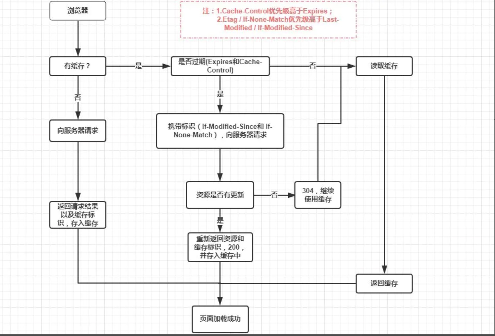

参考：
* 彻底理解浏览器的缓存机制：https://juejin.cn/post/6844903593275817998
* 一文读懂前端缓存（百度 FE）：https://juejin.cn/post/6844903747357769742

## 强制缓存
1. 强制缓存的三种情况：
    * 不存在 该缓存结果和缓存标识，强制缓存失效
    * 存在 该缓存结果和缓存标识，但结果已失效，因此强制缓存失效，此时需采用‘**协商缓存**’
    * 存在 该缓存结果和缓存标识，且该结果尚未失效，**强制缓存生效**，直接返回该结果。

2. 控制强制缓存的字段分别是Expires和Cache-Control，其中**Cache-Control优先级比Expires高**。
    * Expires是HTTP/1.0 控制网页缓存的字段，存储的是个‘绝对值’；
    * Cache-Control是HTTP/1.1 控制网页缓存的字段，存储的是个‘相对值’。主要解决的场景问题是：客户端与服务端的时间不同步，易发生误差（例如时区不同；客户端和服务端有一方的时间不准确）
    * <code>from memory cache</code>代表使用内存中的缓存，<code>from disk cache</code>则代表使用的是硬盘中的缓存，浏览器读取缓存的顺序是：先memory –> 后disk。

3. Cache-Control:
    在HTTP/1.1中，Cache-Control是最重要的规则，主要用于控制网页缓存，主要取值为：
    * public：所有内容都将被缓存（客户端和代理服务器都可缓存）
    * private：Cache-Control的默认取值，所有内容只有客户端可以缓存
    * no-cache：可以在客户端存储资源，但每次都「必须去服务器做新鲜度校验」，来决定从服务器获取最新资源 (200) 还是从客户端读取缓存 (304)，即所谓的协商缓存
    * no-store：「永远都不要在客户端存储资源」，每次永远都要从原始服务器获取资源。
    * max-age=xxx (xxx is numeric)：缓存内容将在xxx秒后失效

## 协商缓存
协商缓存就是强制缓存失效后，浏览器携带缓存标识向服务器发起请求，由服务器根据缓存标识决定是否使用缓存（判断资源有无更新）的过程，主要有以下两种情况：

控制协商缓存的字段分别有：<code>Last-Modified / If-Modified-Since</code>和<code>Etag / If-None-Match</code>，其中<code>Etag / If-None-Match</code>的优先级比<code>Last-Modified / If-Modified-Since</code>高，同时存在则只有Etag / If-None-Match生效。

* Etag是服务器响应请求时，返回当前**资源文件的一个唯一标识**(由服务器生成)。
* <code>If-None-Match</code>是客户端再次发起该请求时，携带上次请求返回的唯一标识Etag值，服务器收到后 将If-None-Match的字段值与该资源在服务器的Etag值做对比,...
* Last-Modified是服务器响应请求时，返回该**资源文件在服务器最后被修改的时间**
* <code>If-Modified-Since</code>则是客户端再次发起该请求时，携带上次请求返回的Last-Modified值，通过此字段值告诉服务器该资源上次请求返回的最后被修改时间。
> 若服务器的资源最后被修改时间大于If-Modified-Since的字段值，则重新返回资源，状态码为200；否则则返回304，代表资源无更新，可继续使用缓存文件，

注：Etag / If-None-Match优先级高于Last-Modified / If-Modified-Since，同时存在则只有Etag / If-None-Match生效。
