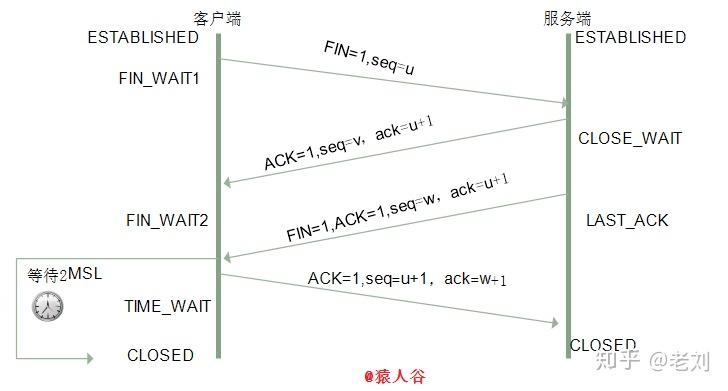

# TCP
参考：https://zhuanlan.zhihu.com/p/86426969

TCP（传输控制协议）是一种面向连接的、可靠的传输层协议，其连接的建立和终止分别通过三次握手和四次挥手实现

> 基本模式是：客户端/服务器会因为“没收到确认” 而超时重发某种报文

## 一、连接建立（三次握手）
三次握手的目的是**同步双方的序列号，确保双方都能收发数据**，并协商初始参数（如窗口大小）。
### 核心概念
* **序列号**（Sequence Number）：发送方为每个字节分配的唯一编号，用于保证数据*有序性和去重*。
* **确认号**（Acknowledgment Number）：*期望收到的下一个字节的序列号，用于确认已接收的数据*。
* **标志位**：
    * SYN（同步）：用于发起连接，请求同步序列号。
    * ACK（确认）：用于确认已接收的数据。

> 序列号：x，y，x+1

### 1. 为什么需要三次握手，两次不行吗？
答：两次不行的！ 三次握手主要是为了解决网络中 “失效连接请求” 的问题，其次是为了同步双方的初始序列号。  
> TCP 通过序列号保证数据的有序性、完整性和去重，三次握手的另一个核心功能是**交换初始序列号并确认**。    
> 如果仅两次握手，客户端无法确认服务器是否收到了自己的序列号，可能导致数据同步混乱。

网络中可能存在**延迟的失效报文**（例如：客户端发送的连接请求因网络拥堵滞留，超时后客户端已放弃，但报文后续仍到达服务器）。如果没有三次握手，这类报文可能导致错误连接。

**（1）具体场景模拟（假设只有两次握手）**：
* 客户端发送连接请求 SYN（序列号 x），但因网络延迟滞留。
* 客户端超时未收到回应，认为请求失败，重*新发送 SYN 并与服务器成功建立连接、通信、断开*（注意：此时传送完数据已经断开了）。
* 此时，**滞留的旧 SYN 报文到达服务器**，服务器误以为是新的连接请求。
* *若仅需两次握手*，服务器会直接发送 SYN+ACK 并进入连接状态，等待客户端发送数据。
* 但*客户端已断开连接，不会理会服务器的回应，导致服务器长期维持一个无效连接，浪费资源（如内存、端口）*。

**（2）三次握手如何解决这个问题？**  
第三次握手的关键是**客户端对服务器的最终确认**，确保双方都认可连接的有效性：

* 客户端发送 SYN（第一次握手）。
* 服务器回应 SYN+ACK（第二次握手）。
* **客户端必须发送最终的 ACK（第三次握手）**，服务器只有收到这个 ACK 后，才确认连接建立。

## 二、连接断开（四次挥手）
四次挥手用于终止已建立的连接，双方需分别释放发送和接收数据的能力（半关闭状态）。  

标志位：FIN（结束），用于通知对方自己已完成数据发送，请求关闭连接。

> 序列号：u，v，w，u+1

### 1. 挥手为什么要四次？
* TCP 连接是**全双工**的（双方可同时收发数据），关闭连接时需分别释放*两个方向*的通信通道。
* 服务器收到客户端的 FIN 后，可能还有数据未发送完毕，因此先回复 ACK 确认关闭请求，待数据发送完成后再发送 FIN 报文，这就导致挥手过程需要四次交互。

### 2. 2MSL等待状态
第4次挥手时：  
客户端*收到服务端的连接释放报文段后，对此发出确认报文段（ACK=1，seq=u+1，ack=w+1），客户端进入TIME_WAIT（时间等待）状态。此时TCP未释放掉，需要等待2MSL（Maximum Segment Lifetime，报文最大生存时间）后，客户端才进入CLOSED状态*。原因如下：  
（1）确保最后一个 ACK 报文能到达服务器
四次挥手的最后一步是客户端向服务器发送确认报文（ACK），用于确认已收到服务器的终止请求（FIN）。但**这个ACK报文可能因网络故障丢失**：
* 若ACK丢失，*服务器会因未收到确认而超时重发FIN报文*。
* *客户端在TIME_WAIT状态等待 2MSL，刚好能覆盖 “服务器重发FIN的最大超时时间”*：
    * MSL 是一个报文在网络中存活的最长时间（通常设为 30 秒或 1 分钟，由系统定义）。
    * *2MSL 保证客户端有足够时间收到服务器重发的FIN，并重新发送ACK*，避免服务器因未收到确认而一直滞留于LAST_ACK状态。  
（2）防止 “失效报文” 干扰新连接  
**案例**：TCP 连接由 “源 IP、源端口、目的 IP、目的端口” 唯一标识。假如没有2MSL，那么客户端此时会直接关闭连接。客*户端有可能会在关闭连接后立即使用相同的四元组建立新连接*，*网络中可能残留旧连接的延迟报文（如未被处理的数据包）*，这些报文会干扰新连接。  
**解决：** **2MSL 的等待时间能确保旧连接的所有报文都从网络中消失：**
        > 因为最长存活时间为 MSL，经过 2MSL 后，即使旧报文有往返延迟，也会被网络丢弃，新连接不会受到干扰。

