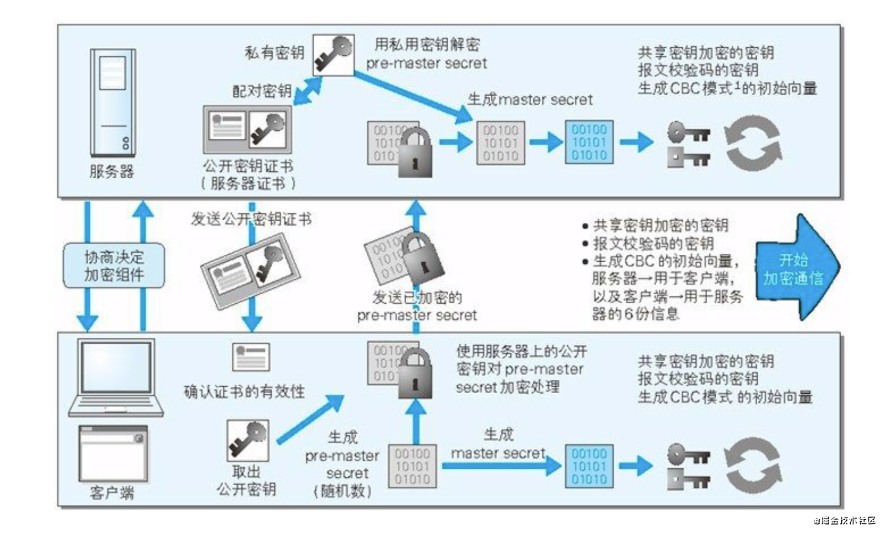

# HTTPS
参考：https://www.runoob.com/w3cnote/http-vs-https.html  
知乎（点赞人数多）：https://zhuanlan.zhihu.com/p/43789231  
菜鸟（简单易懂）：https://www.runoob.com/w3cnote/http-vs-https.html  

 
HTTPS = HTTP + 加密 + 认证 + 完整性保护  

http的不足：
* 通信使用未加密的明文，内容容易被窃取
* 不验证通信方的身份，容易遭遇伪装
* 无法验证报文的完整性，容易被篡改

https就是为了解决上述http协议的安全性问题诞生的。https并非是应用层的新协议，是基于http协议的，将http和tcp协议接口部分用SSL和TLS协议代替而已。  
http: IP ➜ TCP ➜ HTTP（应用层）  
https: IP ➜ TCP ➜ SSL ➜ HTTP（应用层）  

###  一、加密
* SSL（Secure Sockets Layer安全套接字层协议）
* TLS（Transport Layer Security传输层安全协议）

**对称加密**：用同一个密钥加密、解密。常用对称加密算法：AES，RC4，3DES     
**非对称加密**：用一个密钥加密的数据，必须使用另一个密钥才能解密。常用非对称加密算法：RSA，DSA/DSS  
**常用HASH算法**：MD5，SHA1，SHA256  

其中**非对称加密算法**用于在握手过程中**加密生成的密码**，**对称加密算法**用于**对真正传输的数据进行加密**，而**HASH算法**用于**验证数据的完整性**。

由于*浏览器生成的密码*是整个数据加密的关键，因此在传输的时候使*用了非对称加密算法对其加密*。

**非对称加密算法**会生成公钥和私钥，公钥只能用于加密数据，因此可以随意传输，而网站的私钥用于对数据进行解密，所以网站都会非常小心的保管自己的私钥，防止泄漏。

###  二、CA 证书包含的信息：：
CA（Certification Authority证书颁发机构）
* 公钥
* 网站地址
* 证书的颁发机构
* 过期时间
###  三、https加密通信的流程：
1. 浏览器输入url请求网站，并附带自己支持的一套加密规则。
2. 网站制作证书，这个应该是网站建站的时候就已经弄好了。证书分为服务器证书和客户端证书，我们所说的证书一般都是指服务器证书（ssl证书详细解读）。制作过程如下：
    1. 制作CSR文件。就是制作Certificate Secure Request证书请求文件，制作过程中，系统会产生2个密钥，一个是公钥就是这个CSR文件，另一个是私钥，存在服务器上。
    2. CA认证。将CSR文件提交给CA，一般有两种认证方式：域名认证 和 企业文档认证。
    3. 证书安装。收到CA证书后，将证书部署在服务器上。
3. 网站从浏览器发过来的加密规则中选一组自身也支持的加密算法和hash算法，并向浏览器发送带有公钥的证书，当然证书还包含了很多信息，如网站地址、证书的颁发机构、过期时间等。
4. 浏览器解析证书。
    1. 验证证书的合法性。如颁发机构是否合法、证书中的网站地址是否与访问的地址一致，若不合法，则浏览器提示证书不受信任，若合法，浏览器会显示一个小锁头。
    2. 若合法，或用户接受了不合法的证书，浏览器会生成一串随机数的密码（即密钥），并用证书中提供的公钥加密。
    3. 使用约定好的hash计算握手消息，并使用生成的随机数（即密钥）对消息进行加密，最后将之前生成的所有消息一并发送给网站服务器。
5. 网站服务器解析消息。用已有的私钥将密钥解密出来，然后用密钥解密发过来的握手消息，并验证是否跟浏览器传过来的一致。然后再用密钥加密一段握手消息，发送给浏览器。
6. 浏览器解密并计算握手消息的HASH，如果与服务端发来的HASH一致，此时握手过程结束，之后所有的通信数据将由之前浏览器生成的随机密码并利用对称加密算法进行加密。这里浏览器与网站互相发送加密的握手消息并验证，目的是为了保证双方都获得了一致的密码，并且可以正常的加密解密数据，为后续真正数据的传输做一次测试。

下图表示https加密通信的过程： 

### 问题
https中间被篡改了怎么识别？