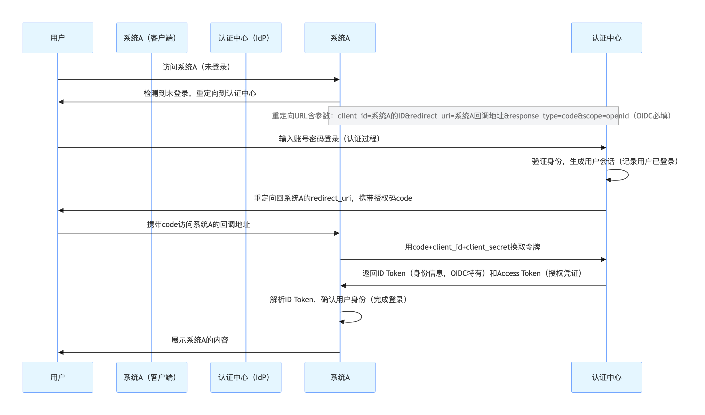

# OAuth2.0 与 单点登录SSO

OAuth 2.0 是一种授权协议，侧重于**授予第三方应用访问用户资源的权限**（如使用微信登录第三方网站），而单点登录（SSO）是一种身份验证解决方案，旨在让用户通过一次登录访问多个应用。

SSO 通常用于企业内部系统，强调在同一信任体系下的一次登录，而 **OAuth 2.0 则常用于跨域场景，通过令牌而非密码来授权**。 

OAuth2.0中客户端和资源服务器（如微信）不属于同一个互信体系。


## OAuth2.0
阮一峰介绍的：https://www.ruanyifeng.com/blog/2014/05/oauth_2_0.html

一次完整的授权过程，写的非常清晰，强烈推荐：
https://www.ruanyifeng.com/blog/2019/04/github-oauth.html


直接用密码来授权的缺点：直接暴漏密码是不安全的、回收权限时不用专门改密码啥的 若改了一个 可能其他平台就不能访问资源了、基于用户名/密码是获取了用户获取所有资源的权利  应该针对某些资源开发 并且是时间限制。

流程：
1. A 网站让用户跳转到 GitHub。
2. GitHub 要求用户登录，然后询问"A 网站要求获得 xx 权限，你是否同意？"
3. 用户同意，GitHub 就会重定向回 A 网站，同时发回一个授权码。
4. A 网站使用授权码，向 GitHub 请求令牌。
5. GitHub 返回令牌.
6. A 网站使用令牌，向 GitHub 请求用户数据。

## SSO（Single Sign On）单点登录
https://developer.aliyun.com/article/636281

* SSO系统：只有登录模块，
    * 也称为IDP。即：身份提供商 (Identity Provider)
* 业务系统：没有登录模块，当需要登录时需要先跳到SSO系统中完成登录。
    * 也称为服务提供商（SP）

单点登录需要前端做什么？https://www.doubao.com/chat/24957082483918082

## IAM 与 IDP区别：
IDP主要是在用户登录时验证其身份，并签发令牌以允许其访问其他服务。
IAM是一个更宏观的概念，关注的是**整个访问权限**的管理策略；而 IdP 专注于具体的**身份验证**和信息传递流程。两者是包含关系

## SSO 与  OAuth2.0是怎么配合的？
OAuth 2.0 本身是 “授权协议”（解决 “允许谁访问什么资源”），而 SSO 需要 “身份认证”（解决 “你是谁”），

因此实际中会用 OIDC（OpenID Connect）——OAuth 2.0 的扩展协议，专门增加了身份认证能力，成为 SSO 的主流实现方案。是目前实现 SSO（单点登录）最主流、最标准化的方案

OIDC 与 OAuth2.0令牌差异：
* OAuth 2.0：主要用 Access Token（访问令牌），用于访问用户资源；
* OIDC：新增 ID Token（身份令牌），专门用于传递用户身份信息（如用户 ID、昵称、邮箱），是 JWT 格式（可解析、可验证签名）；同时仍保留 Access Token 用于授权。

本质：OIDC = OAuth 2.0 + ID Token（身份令牌）

## 基于 OIDC（OAuth 2.0 扩展）实现 SSO 的过程中，前端需要做什么？


前端主要负责用户交互层的跳转、参数传递和本地状态管理。

1. 触发登录：未登录时重定向到认证中心   
检测本地登录状态：通过检查本地存储（如 localStorage）中是否存在有效的 token（系统 A 本地的登录凭证），判断用户是否已登录。
```js
// 系统 A 前端页面初始化时
const checkLocalLogin = () => {
  const localToken = localStorage.getItem('systemA_token');
  if (!localToken) {
    // 未登录，触发跳转认证中心流程
    redirectToAuthCenter();
  }
};
```

生成跳转参数并重定向：若未登录，前端需按 OIDC 协议拼接参数（client_id、redirect_uri、scope=openid 等），重定向到认证中心的登录页。
```js
const redirectToAuthCenter = () => {
  const clientId = 'systemA-client-id'; // 系统 A 在认证中心注册的唯一标识
  const redirectUri = encodeURIComponent('https://systemA.com/callback'); // 认证成功后回调地址（系统 A 前端页面）
  const state = Math.random().toString(36).substring(2); // 防 CSRF 随机串
  localStorage.setItem('oidc_state', state); // 存储 state 用于后续校验

  // 拼接认证中心登录地址（OIDC 授权码模式）
  const authUrl = `https://auth-center.com/authorize?` +
    `client_id=${clientId}&` +
    `redirect_uri=${redirectUri}&` +
    `response_type=code&` +
    `scope=openid&` +
    `state=${state}`;

  window.location.href = authUrl; // 重定向到认证中心
};
```

2. 接收认证中心回调：传递授权码给后端  
用户在认证中心登录成功后，会被重定向回系统 A 前端的 redirect_uri，并携带 code（授权码）和 state（之前传递的随机串）。前端需：
校验 state 一致性（防 CSRF 攻击）；
将 code 传递给系统 A 后端，由后端完成令牌换取（避免前端暴露 client_secret）。
```js
// 系统 A 前端的回调页面（如 https://systemA.com/callback）
const handleAuthCallback = async () => {
  const searchParams = new URLSearchParams(window.location.search);
  const code = searchParams.get('code');
  const state = searchParams.get('state');
  const storedState = localStorage.getItem('oidc_state');

  // 校验 state 防止 CSRF 攻击
  if (state!== storedState) {
    alert('登录验证失败，请重试');
    return;
  }

  // 将 code 传递给系统 A 后端，换取本地登录凭证
  try {
    const res = await axios.post('/api/systemA/exchange-token', { code });
    const { systemA_token } = res.data;
    // 存储系统 A 本地的 token（用于后续前端请求鉴权）
    localStorage.setItem('systemA_token', systemA_token);
    // 清除 URL 中的 code 和 state 参数（避免刷新重复处理）；核心原因是因为code 是一次性的（用过后失效），
    window.history.replaceState({}, document.title, '/home');
    // 跳转系统 A 首页
    window.location.href = '/home';
  } catch (error) {
    alert('登录失败，请重试');
    window.location.href = '/login';
  }
};
```
3. 维护本地登录状态：   

(1) 请求拦截器：携带令牌，系统 A 前端后续发起的所有请求（如获取用户信息、业务数据），需携带本地 systemA_token 供后端验证，通过 Axios 拦截器统一处理：
```js
axios.interceptors.request.use(config => {
  const token = localStorage.getItem('systemA_token');
  if (token) {
    config.headers.Authorization = `Bearer ${token}`;
  }
  return config;
});
```
(2) 响应拦截器：当 token 过期或无效（后端返回 401）时，前端需触发重新登录流程
```js
axios.interceptors.response.use(
  response => response,
  async error => {
    if (error.response?.status === 401) {
      // token无效，清除本地状态
      localStorage.removeItem('systemA_token');
      // 重定向到认证中心重新登录（携带当前地址，登录后返回）
      const redirectUri = encodeURIComponent(window.location.href);
      window.location.href = `https://auth-center.com/login?client_id=your-clientId&redirect_uri=${redirectUri}`;
    }
    return Promise.reject(error);
  }
);
```
4. 实现免登   
当用户已在其他系统登录（认证中心存在有效会话），访问当前系统时需实现 “免登”（无需重复输入账号密码）。

核心逻辑：
* 前端跳转认证中心时，认证中心会检查用户是否已有会话：
    * 若有会话，直接返回code或token，前端无需展示登录页，直接完成登录；
    * 若无会话，才展示登录页。
* 前端无需额外处理，上述 “触发登录” 和 “处理回调” 的逻辑已天然支持免登（因为认证中心会自动判断会话状态）。


5. 处理登出：清除本地状态并触发全局登出   
    用户点击登出时，前端需：
    * 清除本地存储的 systemA_token；
    * 重定向到认证中心的登出接口，通知认证中心销毁全局会话（确保其他系统同步登出）。
```js
const logout = () => {
  // 清除系统 A 本地登录状态
  localStorage.removeItem('systemA_token');
  // 重定向到认证中心登出接口，携带回调地址
  const redirectUri = encodeURIComponent('https://systemA.com/login');
  window.location.href = `https://auth-center.com/logout?client_id=systemA-client-id&redirect_uri=${redirectUri}`;
};
```

### 注意事项：
token 存储：
* 普通场景：用localStorage存储（方便跨域访问，但需防范 XSS 攻击）；
* 高安全场景：用httpOnly Cookie（由后端设置，前端无法读取，防 XSS）。


## 基础
| 操作方式| 	是否刷新页面	| 是否新增历史记录| 	适用场景| 
| ---- |---- |---- |---- |
| window.location.href = '/home'| 	是	| 是	| 需要跳转到新页面并刷新内容| 
| window.history.pushState({}, '', '/home')	| 否	| 是	| 不刷新页面，新增一条历史记录（如 SPA 路由跳转）| 
| window.history.replaceState({}, '', '/home')| 	否	| 否| 	不刷新页面，替换当前历史记录（如清除回调页参数）| 