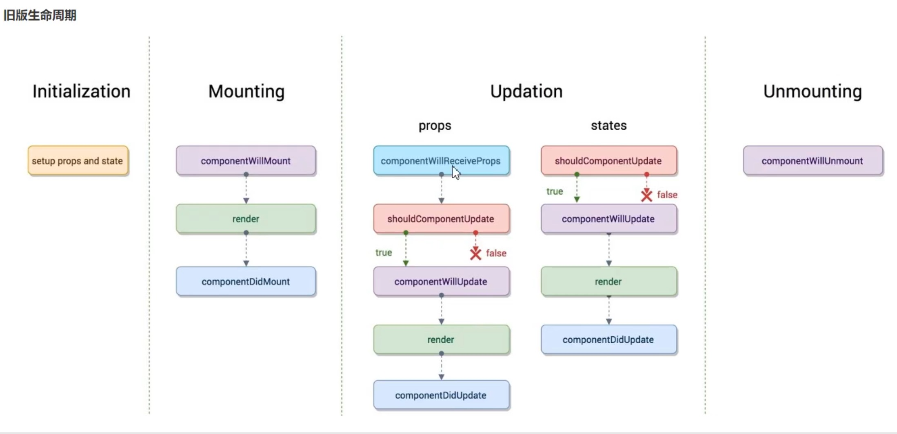
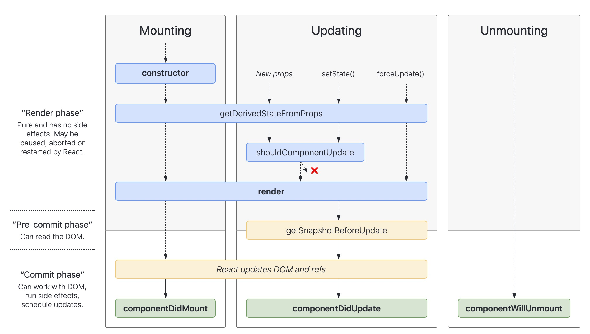

# React.component
目录：
* 生命周期
* class属性
* 实例属性
* 其他APIs

## 生命周期



**1. render()**
* render() 方法是 class 组件中唯一必须实现的方法。
* render() 函数应该为纯函数，这意味着在不修改组件 state 的情况下，每次调用时都返回相同的结果，并且它不会直接与浏览器交互。
**注意**：如果 shouldComponentUpdate() 返回 false，则不会调用 render()。

**2. constructor()**
```js
constructor(props)
```
* 如果不初始化 state 或不进行方法绑定，则不需要为 React 组件实现构造函数。
* 在 <code>constructor()</code> 中需调用 <code>super(props)</code>。
* 在 <code>constructor()</code> 中不要调用 <code>setState()</code>方法。只能在构造函数中直接为 this.state 赋值。

**3. componentDidMount()**
componentDidMount() 会在组件挂载后（插入 DOM 树中）立即调用。如需通过网络请求获取数据，此处是实例化请求的好地方。

这个方法是比较适合添加订阅的地方。如果添加了订阅，请不要忘记在 componentWillUnmount() 里取消订阅

**4. componentDidUpdate()**
```js
componentDidUpdate(prevProps, prevState, snapshot)
```

```js
componentDidUpdate(prevProps) {
    // 典型用法（不要忘记比较 props）：
    if (this.props.userID !== prevProps.userID) {
        this.fetchData(this.props.userID);
    }
}
```
* componentDidUpdate() 会在更新后会被立即调用。首次渲染不会执行此方法。
* 如果组件实现了 getSnapshotBeforeUpdate() 生命周期（不常用），则它的返回值将作为 componentDidUpdate() 的第三个参数 “snapshot” 参数传递。否则此参数将为 undefined。

```js
注意：
如果 shouldComponentUpdate() 返回值为 false，则不会调用 componentDidUpdate()。
componentDidUpdate() 中直接调用 setState()，但请注意它必须被包裹在一个条件语句里，否则将会导致死循环
```
**5. componentWillUnmount()**
* 组件卸载及销毁之前调用该方法。在此方法中执行必要的清理操作，例如，清除 timer，取消网络请求或清除在 componentDidMount() 中创建的订阅等。

* componentWillUnmount() 中不应调用 setState()，


**6. shouldComponentUpdate()**
使用阶段：**更新 Update 阶段用**；
具体使用阶段：render**之前**，有新的props、state**之后**，首次渲染或使用 forceUpdate() 时不会调用该方法。

```js
shouldComponentUpdate(nextProps, nextState)
```
默认返回值为 true，当props 或 state 发生变化时，shouldComponentUpdate() 会在渲染执行之前被调用（询问组件是否要更新）
返回值为false，即使 props 或 state 改变，组件也不会重新渲染。
此方法仅作为**性能优化**的方式而存在
不建议在 shouldComponentUpdate() 中进行深层比较或使用 JSON.stringify()。这样非常影响效率，且会损害性能。

**7. static getDerivedStateFromProps()**
```js
static getDerivedStateFromProps(nextProps, prevState)
```
应用场景：需要通过 属性 props得到 状态 state时用

**8. static getSnapshotBeforeUpdate**
```js
getSnapshotBeforeUpdate(prevProps, prevState)
```
使用阶段：update更新阶段
具体使用阶段：render**之后**，React 更新 Dom 和 Ref **之前**调用。

它使得组件能在发生更改之前从 DOM 中捕获一些信息（例如，滚动位置）。此生命周期方法的任何返回值将作为参数传递给 componentDidUpdate()。应返回 snapshot 的值（或 null）。

此用法并不常见，但它可能出现在 UI 处理中，如需要以特殊方式处理滚动位置的聊天线程等。

9. UNSAFE_componentWillReceiveProps
```js
UNSAFE_componentWillReceiveProps(nextProps)
```
挂载时，不会触发该生命周期；只会在组件的 props 更新时调用此方法；调用 this.setState()不会触发...

使用此生命周期方法通常会出现 bug 和不一致性：

10. UNSAFE_componentWillUpdate()
```js
UNSAFE_componentWillUpdate(nextProps, nextState)
```
注意，你不能此方法中调用 this.setState()；

11. forceUpdate()
```js
component.forceUpdate(callback)
```
此操作会跳过该组件的 shouldComponentUpdate()，应该避免使用 forceUpdate()

12. 注意：

* componentWillUpdate componentDidUpdate，这两个生命周期中不能调用setState。
* componentDidMount调用setstate


