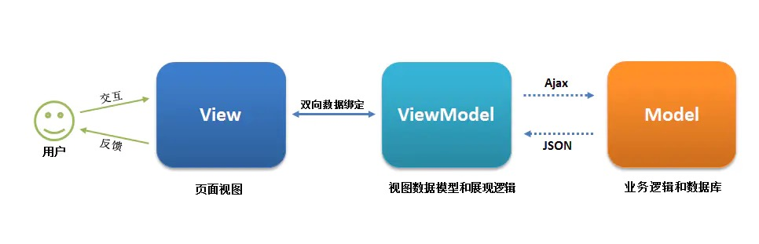

# MVVM

MVVM(Model-View-ViewModel), 源自于经典的 Model–View–Controller（MVC）模式。MVVM 的出现促进了 GUI 前端开发与后端业务逻辑的分离，极大地提高了前端开发效率。

* MVVM 的核心是 ViewModel 层，它就像是一个中转站（value converter），负责转换 Model 中的数据对象来让数据变得更容易管理和使用，该层**向上与视图层进行双向数据绑定，向下与 Model 层通过接口请求进行数据交互**，起呈上启下作用。

* **View 层展现的不是 Model 层的数据，而是 ViewModel 的数据**，由 ViewModel 负责与 Model 层交互，这就完全解耦了 View 层和 Model 层，这个解耦是至关重要的，**它是前后端分离方案实施的最重要一环**。

如下图所示：
