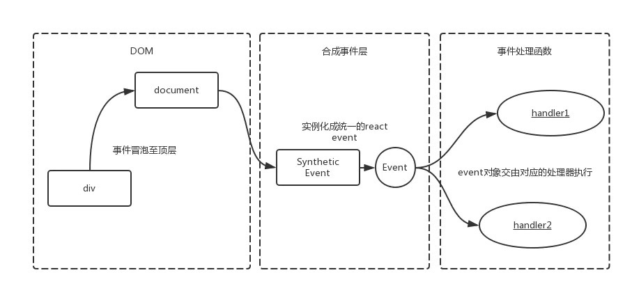

# React 合成事件 
参考： 
* https://juejin.cn/post/6897911576053940231
* https://juejin.cn/post/6844903502729183239
* https://juejin.cn/post/6844903988794671117

**技术储备**：
* [原生事件的基础知识](../JS/事件/事件基本介绍.md)

* [合成(React)事件 与 原生事件 的异同](./React/React必知必会.md)


**一、为什么有合成事件的抽象**？
如果DOM上绑定了过多的事件处理函数，整个页面响应以及内存占用可能都会受到影响。React为了避免这类DOM事件滥用，同时屏蔽底层不同浏览器之间的事件系统差异，实现了一个中间层——SyntheticEvent。

**二、原理**

React中，如果需要绑定事件，我们常常在jsx中这么写：

```js
<div onClick={this.onClick}>
	react事件
</div>
```
**原理大致如下**：

React并**不是**将click事件绑在该div的**真实DOM**上，**而是**在document处监听所有支持的事件，当事件发生并冒泡至document处时，React将事件内容封装并交由真正的处理函数运行。



**三、合成事件的优点**

1. 进行浏览器兼容，实现更好的跨平台

React 采用的是顶层事件代理机制，能够保证冒泡一致性，可以跨浏览器执行。React 提供的合成事件用来抹平不同浏览器事件对象之间的差异，将不同平台事件模拟合成事件。

2. 避免垃圾回收

事件对象可能会被频繁创建和回收，因此 React 引入事件池，在事件池中获取或释放事件对象。即 React 事件对象不会被释放掉，而是存放进一个数组中，当事件触发，就从这个数组中弹出，避免频繁地去创建和销毁(垃圾回收)。

3. 方便事件统一管理和事务机制


**四、合成(React)事件 与 原生事件 执行顺序**
* 原生 DOM 事件
* React合成事件
* document DOM 事件监听

具体样例见：[合成事件1](https://github.com/1194964459/react-demo/blob/master/src/test/event1.js)、[合成事件2](https://github.com/1194964459/react-demo/blob/master/src/test/event2.jsx)、[合成事件3](https://github.com/1194964459/react-demo/blob/master/src/test/event2.1.jsx)


**五、阻止事件冒泡**
* stopPropagation()：合成，原生都可阻止
* e.nativeEvent.stopImmediatePropagation：阻止合成事件不会冒泡到 document 上。

**六、合成与原生是否可以混用**？

合成事件和原生事件最好不要混用。 原生事件中如果执行了stopPropagation方法，则会导致其他React事件失效。因为所有元素的事件将无法冒泡到document上。