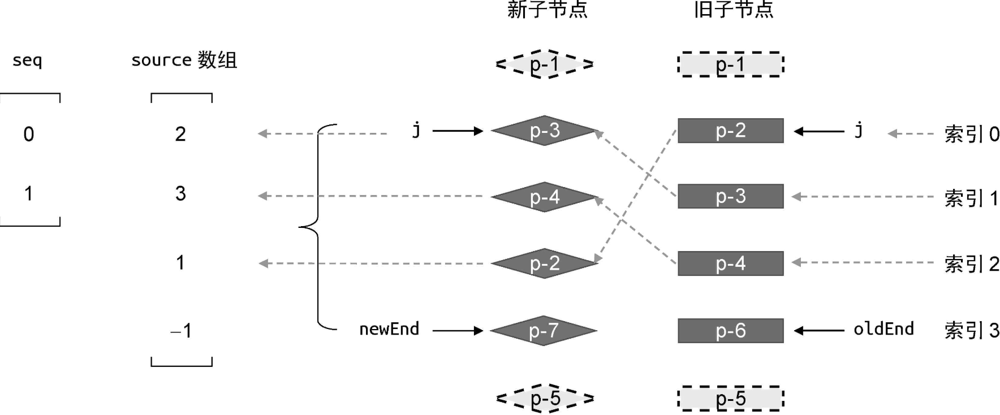
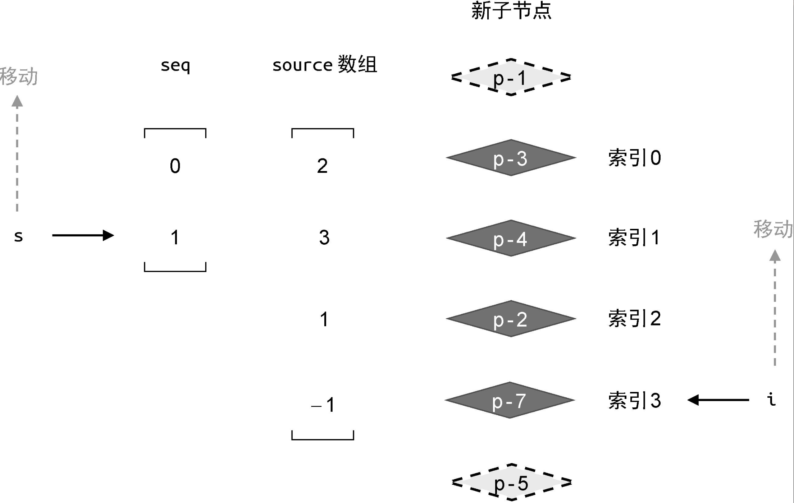

# 快速Diff算法

Vue.js 2 所采用的双端Diff 算法。

快速 Diff 算法是如此高效的。

## 一、相同的前置元素和后置元素
快速 Diff 算法包含**预处理步骤**，这其实是借鉴了纯文本 Diff 算法的思路。
1. **全等比较**
```js
if (text1 === text2) return
```
如果两段文本全等，那么就无须进入核心 Diff 算法的步骤了。

2. **处理两段文本相同的前缀和后缀**，如此，在特定情况下我们能够轻松地判断文本的插入和删除。
```js
TEXT1: I like you
TEXT2: I like you too

// 经预处理后，去掉相同的前缀、后缀后
TEXT1:
TEXT2: too
```

### 借鉴纯文本Diff算法后的DOM Diff算法：

**1. 预处理：处理相同的前缀、后缀**
```js
function patchKeyedChildren(n1, n2, container) {
  const newChildren = n2.children
  const oldChildren = n1.children
  // TODO:更新相同的前置节点
  let j = 0
  let oldVNode = oldChildren[j]
  let newVNode = newChildren[j]
  // while 循环向后遍历，直到遇到拥有不同 key 值的节点为止
  while (oldVNode.key === newVNode.key) {
    // 调用 patch 函数进行更新
    patch(oldVNode, newVNode, container)
    // 更新索引 j，让其递增
    j++
    oldVNode = oldChildren[j]
    newVNode = newChildren[j]
  }

  // TODO:更新相同的后置节点
  // 索引 oldEnd 指向旧的一组子节点的最后一个节点
  let oldEnd = oldChildren.length - 1
  // 索引 newEnd 指向新的一组子节点的最后一个节点
  let newEnd = newChildren.length - 1
  oldVNode = oldChildren[oldEnd]
  newVNode = newChildren[newEnd]
  // while 循环“从后向前遍历”，直到遇到拥有不同 key 值的节点为止
  while (oldVNode.key === newVNode.key) {
    // 调用 patch 函数进行更新
    patch(oldVNode, newVNode, container)
    // 递减 oldEnd 和 nextEnd
    oldEnd--
    newEnd--
    oldVNode = oldChildren[oldEnd]
    newVNode = newChildren[newEnd]
  }
}

```
但上述的情况是特殊情况，不可能新旧节点的都一样的，有可能多了、也有可能少了..

**2.新增、删除**  

**新增：**   
* 旧的一组子节点：p-1、p-2、p-3。
* 新的一组子节点：p-1、p-4、p-2、p-3。

**删除：**
* 旧的一组子节点：p-1、p-2、p-3。
* 新的一组子节点：p-1、p-3。
```js
function patchKeyedChildren(n1, n2, container) {
  const newChildren = n2.children
  const oldChildren = n1.children
  // 更新相同的前置节点
  // 省略部分代码

  // 更新相同的后置节点
  // 省略部分代码
  
  // 预处理完毕后，分别处理新增、删除

  // 新增：旧节点处理完了(j > oldEnd)，新节点还有剩余（从 j -> newEnd 之间的节点应作为新节点插入）
  if (j > oldEnd && j <= newEnd) {
    // 锚点的索引
    const anchorIndex = newEnd + 1
    // 锚点元素，用于精确控制新节点的插入位置。
    const anchor = anchorIndex < newChildren.length ? newChildren[anchorIndex].el : null
    // 采用 while 循环，调用 patch 函数逐个挂载新增节点
    while (j <= newEnd) {
      patch(null, newChildren[j++], container, anchor)
    }
  }

   // 删除：新节点处理完了（j > newEnd），旧节点还有剩余！
   else if (j > newEnd && j <= oldEnd) {
    // j -> oldEnd 之间的节点应该被卸载
    while (j <= oldEnd) {
      unmount(oldChildren[j++])
    }
  }
}
```

## 二、判断是否需要进行 DOM 移动操作
### 1. 举例说明，为什么要移动？
新旧两组子节点的顺序如下：
> 旧的一组子节点：p-1、p-2、p-3、p-4、p-6、p-5。   
> 新的一组子节点：p-1、p-3、p-4、p-2、p-7、p-5。
像这样的案例，无法通过简单的预处理过程完成更新。

因此，所以接下来我们的任务就是，判断哪些节点需要移动，以及应该如何移动？

上述案例，当相同的前置节点和后置节点被处理完毕后，索引j、newEnd 和 oldEnd 不满足下面两个条件中的任何一个：
* j > oldEnd && j <= newEnd
* j > newEnd && j <= oldEnd

因此，我们需要增加新的 else 分支来处理

### 2. 特殊情况处理
1. 需要构造一个数组 **source：**
    * 存储的是**新子节点（用key表示一个节点）在“旧的一组子节点”中的位置索引**。后面**将会使用它计算出一个最长递增子序列，并用于辅助完成 DOM 移动的操作**。  
    * 它的**长度**等于新的一组子节点在**经过预处理之后剩余未处理节点的数量**，并且 source 中每个元素的**初始值都是 -1**
    * 由于数组 source 的索引是从 0 开始的，而未处理节点的索引未必从 0 开始，所以在填充数组时需要使用表达式 k - newStart 的值作为数组的索引值

2. 为了快速填充 source 数组，需要为**新的一组子节点构建一张索引表*KeyIndex*，用来存储节点的 key 和节点位置索引之间的映射**
```js
const keyIndex = {}
for(let i = newStart; i <= newEnd; i++) {
  keyIndex[newChildren[i].key] = i
}
```

完整代码如下：
```js
if (j > oldEnd && j <= newEnd) {
  // 省略部分代码
} else if (j > newEnd && j <= oldEnd) {
  // 省略部分代码
} else {
  const count = newEnd - j + 1
  const source = new Array(count)
  source.fill(-1)
  
  // oldStart 和 newStart 分别为起始索引，即 j
  const oldStart = j
  const newStart = j

  // 构建索引表
  const keyIndex = {}
  for(let i = newStart; i <= newEnd; i++) {
    keyIndex[newChildren[i].key] = i
  }

  // 遍历旧的一组子节点中剩余未处理的节点，并填充source数组
  for(let i = oldStart; i <= oldEnd; i++) {
    oldVNode = oldChildren[i]
    // 通过索引表快速找到新的一组子节点中具有相同 key 值的节点位置
    const k = keyIndex[oldVNode.key]
    if (typeof k !== 'undefined') {
      newVNode = newChildren[k]
      // 调用 patch 函数完成更新
      patch(oldVNode, newVNode, container)
      // 填充 source 数组
      source[k - newStart] = i
    } else {
      // 没找到
      unmount(oldVNode)
    }
  }
}
```
第二个 for 循环用来遍历旧的一组子节点。可以看到，我们**拿旧子节点的 key 值去索引表 keyIndex中查找该节点在新的一组子节点中的位置**，并将查找结果存储到变量 k 中。如果 k 存在，说明该节点是可复用的，所以我们调用 patch 函数进行打补丁，并填充source 数组；否则说明该节点已经不存在于新的一组子节点中了，这时我们需要调用 unmount 函数卸载它。

### 判断是否要移动？
快速 Diff 算法判断节点是否需要移动的方法与*简单Diff 算法*类似，如果在遍历过程中遇到的**索引值呈现递增趋势，则说明不需要移动节点**，反之则需要。（注意，这里是新节点在oldChild中的索引值）

如下面的代码所示：
```js
// 新增两个变量，moved 和 pos
let moved = false  // 是否要移动？
let pos = 0   // 遍历旧的一组子节点的过程中遇到的最大索引值 k

// 判断节点是否需要移动, 其中k是新节点在oldChildren的索引; 具体参看下面的代码
if (k < pos) {    // pos是最大值，若在遍历过程中遇到比他小的则移动
    moved = true
} else {
    pos = k
}  
```

我们还需要一**个数量标识，代表已经更新过的节点数量 patched**。我们知道，**已经更新过的节点数量应该小于新的一组子节点中 “总的需要更新的节点数量”**。一旦前者超过后者，则说明有多余的节点，我们应该将它们卸载。(TODO:这里好绕，如需要更新5个，当前更新了3个..)
```js
// count: 总的要移动的节点数
const count = newEnd - j +1
```

本章节总的代码如下：
```js
if (j > oldEnd && j <= newEnd) {
  // 省略部分代码
} else if (j > newEnd && j <= oldEnd) {
  // 省略部分代码
} else {
  // 构造 source 数组
  const count = newEnd - j + 1
  const source = new Array(count)
  source.fill(-1)
  const oldStart = j
  const newStart = j
  let moved = false
  let pos = 0
  const keyIndex = {}
  for(let i = newStart; i <= newEnd; i++) {
    keyIndex[newChildren[i].key] = i
  }
  // 新增 patched 变量，代表更新过的节点数量
  let patched = 0
  for(let i = oldStart; i <= oldEnd; i++) {
    oldVNode = oldChildren[i]
    // 如果更新过的节点数量小于等于需要更新的节点数量，则执行更新
    if (patched <= count) {
      const k = keyIndex[oldVNode.key]
      if (typeof k !== 'undefined') {
        newVNode = newChildren[k]
        patch(oldVNode, newVNode, container)
        // 每更新一个节点，都将 patched 变量 +1
        patched++
        source[k - newStart] = i
        if (k < pos) {
          moved = true
        } else {
          pos = k
        }
      } else {
        // 没找到
        unmount(oldVNode)
      }
    } else {
      // 如果更新过的节点数量大于需要更新的节点数量，则卸载多余的节点
      unmount(oldVNode)
    }
  }
}
```
## 三、如何移动?
moved 若为 true，说明需要进行DOM 移动操作。
```js
if (j > oldEnd && j <= newEnd) {
  // 省略部分代码
} else if (j > newEnd && j <= oldEnd) {
  // 省略部分代码
} else {
  // 省略部分代码
  for(let i = oldStart; i <= oldEnd; i++) {
    // 省略部分代码
  }
  if (moved) {
    // 如果 moved 为真，则需要进行 DOM 移动操作
  }
}
```
如何求解source 数组的最长递增子序列？
```js
if (moved) {
  // 计算最长递增子序列
  const seq = lis(sources) // source是[2,3,1,-1]，返回值是[0,1]（位置索引，不是值哦！）
}
```
注意📢： lis 函数的返回结果是最长递增子序列中的元素在source 数组中的位置索引，lis返回的结果中对应的节点不需要移动。

在编号时，我们忽略了经过预处理的节点。因此，需要重新编号。重新编号的含义是：在新的一组子节点中，重新编号后索引值为 0 和 1 的这两个节点在**更新前后顺序没有发生变化**。具体如下图所示：<br/><br/>


为了完成节点的移动，我们还需要创建两个索引值 i 和s，如下图所示：
* 用索引 i 指向新的一组子节点 newChild 中的最后一个节点（**不含预处理后的节点**）；  
* 用索引 s 指向最长递增子序列 seq 中的最后一个元素。 <br/>

 <br/>

由于索引 i 是重新编号后的（下标0 从预处理后的节点开始），因此为了得到真实索引值，我们需要计算表达式 i + newStart 的值。  <br/>

```js
if (moved) {
  const seq = lis(sources)
  // s 指向最长递增子序列的最后一个元素
  let s = seq.length - 1
  let i = count - 1 // count是source数组的长度
  for (i; i >= 0; i--) {
    // 说明索引为 i 的节点是全新的节点，应该将其挂载
    if (source[i] === -1) {}

    // 说明该节点需要移动
    else if (i !== seq[s]) {}
    
    // 当 i === seq[s] 时，说明该位置的节点不需要移动，并让 s 指向下一个位置
    else{
      s--
    }
  }
}
```
完整代码如下：
```js
if (moved) {
  const seq = lis(sources)
  // s 指向最长递增子序列的最后一个元素
  let s = seq.length - 1
  let i = count - 1 // count是source数组的长度
  for (i; i >= 0; i--) {
    if (source[i] === -1) {
     // 说明索引为 i 的节点是全新的节点，应该将其挂载
      // 该节点在新 children 中的真实位置索引
      const pos = i + newStart
      const newVNode = newChildren[pos]
      // 该节点的下一个节点的位置索引
      const nextPos = pos + 1
      // 锚点
      const anchor = nextPos < newChildren.length
        ? newChildren[nextPos].el
        : null
      // 挂载
      patch(null, newVNode, container, anchor)
    } 
    
    else if (i !== seq[s]) {
      // 说明该节点需要移动
      // 该节点在新的一组子节点中的真实位置索引
      const pos = i + newStart
      const newVNode = newChildren[pos]
      // 该节点的下一个节点的位置索引
      const nextPos = pos + 1
      // 锚点
      const anchor = nextPos < newChildren.length
        ? newChildren[nextPos].el
        : null
      // 移动
      insert(newVNode.el, container, anchor)
    } 
    
    else {
      // 当 i === seq[s] 时，说明该位置的节点不需要移动
      // 并让 s 指向下一个位置
      s--
    }
  }
}
```