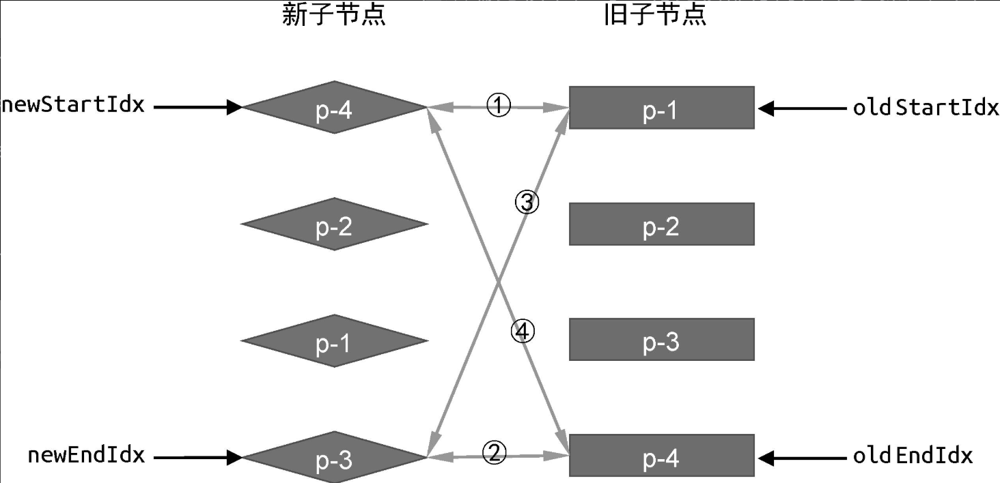

# 虚拟DOM
用 JS 对象描述真实 DOM 的结构，避免频繁操作真实 DOM，可跨平台兼容（虚拟DOM是JS对象）
```JS
{ 
  tag: 'div', 
  props: {}, 
  children: [],
  key: '',
  text：''  // 文本节点内容
}
```
DOM Diff 算法一般都遵循以下思路：   
（1）同层对比，不跨层级  
（2）节点类型优先判断：类型不同，则直接销毁旧节点 并 创建新节点   
（3）列表节点通过 key 优化： key 可以唯一标识一个节点，可以帮助定位、复用已有节点。  

## Vue 3 对虚拟 DOM 进行的主要优化：
* **静态节点提升**：将静态节点提升到渲染函数外，避免每次渲染都重新创建。
* **补丁标记（Patch Flags）**：为动态节点添加标记，Diff 时只关注有变化的节点，减少比较时间。
* **缓存事件处理函数**：避免每次渲染都创建新的事件处理函数，减少不必要的更新。

## 一、简单DOM Diff
通过key来复用DOM元素，通过移动来减少不断创建DOM、销毁DOM带来的性能开销

简单 Diff 算法的核心逻辑是，拿**新的一组子节点中的节点**去**旧的一组子节点**中**寻找可复用的节点**。如果找到了，则记录该节点的**位置索引**。我们把这个位置索引称为**最大索引**。在整个更新过程中，如果一个节点的索引值 小于 最大索引，则说明该节点对应的真实 DOM 元素需要移动。

如何移动、添加、删除 虚拟节点对应的DOM元素呢？
```
# 迭代过程：
for newChildren
  for oldChildren
    新的节点在oldChildren中是否存在？若存在 则记录该节点的位置索引。然后与lastIndex比较...

# 是否要移动？
lastIndex：新节点在oldChildren中的最大索引值，初始为0。当前节点索引比它小 则移动；否则将lastIndex更新为比它大的值...

# 如何移动？
需要找到锚点元素，将节点插入到锚点之前。底层调用的是浏览器原生的insertBefore函数：parent.insertBefore(el, anchor)）

# 如何判断需要添加?
newVNode 在 oldChildren中没找到，则需要新增。
  - 新增位置是？需要找到它对应的真实DOM的下一个兄弟节点作为锚点。若不存在？则newVNode是容器的第一个子节点（即： container.firstChild）

# 需要判断需要删除？
newChildren 遍历完了，oldChildren还有值，则需要删除...
  - oldChildren再遍历一遍，看其子节点的值是否能在newChildren中找到？找不到的话 直接 unmount 掉
```

## 二、双端Diff（Vue2使用）
简单Difff的缺点，对DOM的移动操作 不是最优的...

双端 Diff 的基本流程：
* 4个指针，分别指向新、旧两组子节点的头、尾：oldStartIdx、oldEndIdx、newStartIdx 和 newEndIdx  
* 循环比对节点：
  * “首先”对比首尾节点：
    * 若旧首与新首匹配：复用**节点**，双首**指针**后移。
    * 若旧尾与新尾匹配：复用节点，双尾指针前移。
    * 若旧首与新尾匹配：复用节点，将旧首**节点**移到旧尾后，旧首**指针**后移，新尾指针前移。
    * 若旧尾与新首匹配：复用节点，将旧尾节点移到旧首前，旧尾指针前移，新首指针后移。
  * 若首尾均不匹配：遍历旧的子节点列表，寻找与 新首节点 拥有相同key值的元素
      - 若找到了？找到的节点移动到oldStartVNode.el之前，然后当前位置记为undefined；再更新索引啥的...
      - 若没找到？说明节点是新增的，挂载到oldStartVNode.el之前即可！
* 循环结束后，处理剩余节点，新增或删除：
  * 新节点有剩余，新增；新增范围是newStartIdx 到 newEndIdx 
  * 旧节点有剩余，删除，删除范围是oldStartIdx 到 oldEndIdx 

<br/><br/>


```
- 旧节点移动时参考的锚点，都是oldChildren的

while (oldStartIdx <= oldEndIdx && newStartIdx <= newEndIdx) {
  if (oldStartVNode.key === newStartVNode.key) {
     - 不移动，只更新索引、打补丁
  } else if (oldEndVNode.key === newEndVNode.key) {
     - 不移动，只更新索引、打补丁
  } else if (oldStartVNode.key === newEndVNode.key) {
     - 旧首移动到旧尾，并且更新索引、打补丁
  } else if (oldEndVNode.key === newStartVNode.key) {
    - 旧尾移动到旧首，并且更新索引、打补丁
      - patch(oldEndVNode, newStartVNode, container)
      - insert(oldEndVNode.el, container, oldStartVNode.el)
      - oldEndVNode = oldChildren[--oldEndIdx]
      - newStartVNode = newChildren[++newStartIdx]
  }else{
    - 遍历OldChildren，寻找与newStartVNode拥有相同key值的元素
      - 若找到了？找到的节点移动到oldStartVNode.el之前，然后当前位置记为undefined；再更新索引啥的...
      - 若没找到？说明节点是新增的，挂载到oldStartVNode.el之前即可！
  }
}

- while循环外之后，可能出现的情况：newChildren有剩余？oldChildren有剩余？

- newChildren有剩余，newStartIdx 到 newEndIdx区间内的节点需要新增、挂载... 锚点是oldStartVNode.el
if(oldStartIdx > oldEndIdx && newStartIdx <= newEndIdx){ }

- oldChildren有剩余，删除oldStartIdx至oldEndIdx的节点
else if(newStartIdx > newEndIdx && oldStartIdx <= oldEndIdx)
```

# 三、快速Diff（Vue3 使用）

## 一、算法流程解析
首先，借鉴纯文本 Diff算法思路，分别对头部、尾部进行预处理。

**1. 头部预处理**：从列表头部开始，while循环比较并复用相同的节点，直到遇到不同节点  
```js
let j = 0;  
while(newNode.key == oldNode.key){
    newNode = newChildren[j]
    ...
    j++
}
```

**2. 尾部预处理**：从列表尾部开始，while循环比较并复用相同的节点，直到遇到不同节点
```js
let oldEnd = oldChildren.length - 1   
let newEnd = newChildren.length - 1
while(newNode.key == oldNode.key){
    oldEnd--
    newEnd--
}
```
**3. 头部、尾部处理完后，可能某一方的列表已经处理完了**：
* 若旧节点已处理完了 但新节点没处理完，则批量“创建”剩余的新节点
* 若新节点已处理完了 但旧节点没处理完，则批量“移除”剩余的旧节点
```
跳出while循环
    若 j > oldEnd && j <= newEnd，则...
    若 j > newEnd && j <= oldEnd，则...
```

**4. 若上面的情况均不满足，则需要处理中间差异部分**：
* **构建索引表**：为新列表的节点建立 `key -> 索引` 的映射，便于快速查找。
* **遍历旧节点**：标记**可复用节点**（是否存在新列表中？存在 则复用）并**记录新节点在旧列表中的索引关系，形成“源数组source”**
* 根据source数组，**求最长递增子序列 seq**，序列指向的节点是不需要移动的。
* 根据 最长递增子序列(LIS) 的结果seq、source，**移动或创建节点**
```
seq：最长递增子序列，下标用 s 表示（从末尾开始）
source：新节点在旧列表中的索引，“下标”用 i 表示（从末尾开始），“长度”是新节点中经预处理后剩余节点的数量 newEnd-j+1，“初始值”为-1

迭代i
    若source[i] === -1，则索引 i 的节点是新节点，需挂载
    若source[i] !== -1，则继续判断：
        若seq[s]==i, 节点不需要移动，s--
        若seq[s]!=i，节点需要移动
```

## 二、关键优化解析
* 预处理阶段：通过头部和尾部的快速匹配，减少了需要详细比较的节点数量
* 最长递增子序列：这是 **Vue3 Diff 算法最核心的优化**，通过计算 LIS，可以**找到不需要移动的节点序列，从而将节点移动次数降到最低**
* 映射表查找：使用 key 建立映射表，快速查找可复用节点，避免了 Vue 2 中的多次循环比较

Vue 3 的 Diff 算法在保持 O(n) 时间复杂度的同时，通过 LIS 优化进一步减少了实际 DOM 操作次数，特别是在处理列表重排场景时性能提升显著。理解这些原理有助于我们写出更符合 Vue 3 优化策略的代码，例如在**使用 v-for 时合理设置 key**，以及设计更高效的列表更新逻辑。