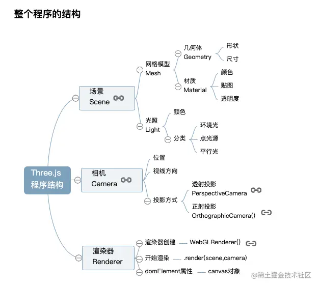

# Three.js 基本介绍

Three.js面试：
* https://zhuanlan.zhihu.com/p/663376778

* https://blog.csdn.net/weixin_40808668/article/details/132550859

Three.js零基础入门：
* https://juejin.cn/post/7334503381199880243
* https://juejin.cn/post/7020396322062598181?searchId=20251010192613C1BB53F987FE569ADFA6

https://segmentfault.com/a/1190000012238576

自己搞的3D项目中总结的：
https://github.com/1194964459/3D-test/tree/main/doc

WebGL/threeJS面试题扫描与总结
https://blog.csdn.net/xyphf/article/details/134605627