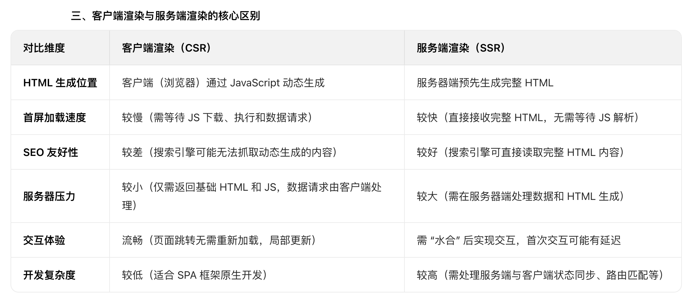

# 客户端渲染（CSR） 与 服务端渲染（SSR）

### 1. 服务端渲染（SSR）：
服务端渲染是指**页面的 HTML 内容在服务器端生成，浏览器直接接收完整的、包含数据的 HTML**的过程。多用于一些内容展示型网站（如电商首页、新闻资讯页）。

* 服务器调用数据接口获取所需数据；
* DOM树在服务端生成，然后返回给前端。
* 更快的首屏加载
* 利于SEO，首屏渲染效率高！
> （吐）服务端在返回 html 之前，在特定的区域、符号里用数据填充，再给客户端，**客户端只负责解析 HTML**。

### 2. 客户端渲染（CSR）：
客户端渲染是指**浏览器从服务器获取初始 HTML（通常是一个空壳或简单框架），然后通过下载的 JavaScript 动态生成页面内容**的过程。多用于一些交互密集型应用（如：后台管理系统）

* 浏览器下载并执行JS
* 前端去后端取数据生成DOM树。
* 有利于前后端分离，局部刷新（不用请求完整页面），交互性好！

> （填）html 仅仅作为静态文件，客户端在请求时，*服务端不做任何处理 直接以原静态文件的形式返回给客户端*，然后前端根据 html 上的 JavaScript，生成 DOM 插入 html。

### 3. 二者本质的区别：
**是谁来完成了html的完整拼接：**
* 服务端渲染是在服务端生成DOM树，因此服务器压力大；
* 客户端渲染是在客户端通过JavaScript 动态生成DOM树。

### 4. 核心区别对比

### 五、传统CSR的弊端：
* 由于页面显示过程要进行JS文件拉取和React代码执行，首屏加载时间会比较慢。
* 对于SEO(Search Engine Optimazition,即搜索引擎优化)，完全无能为力，因为搜索引擎爬虫只认识html结构的内容，而不能识别JS代码内容。

SSR的出现，就是为了解决这些传统CSR的弊端。

