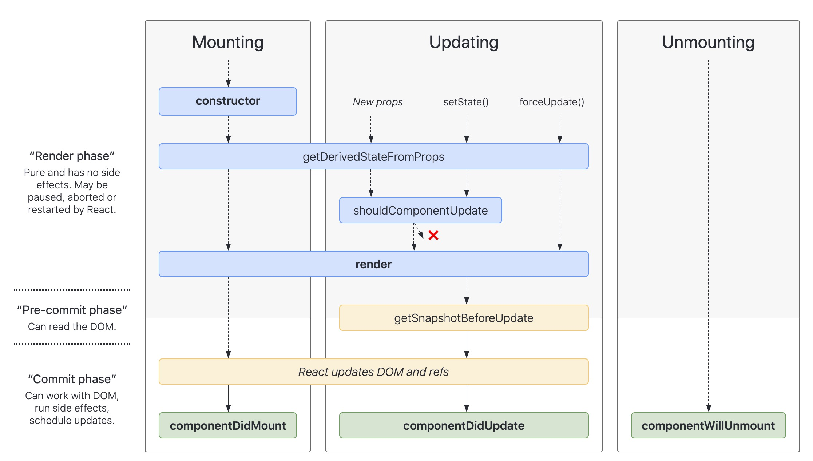

# 类组件的生命周期
参考：

[React 官网中提到的生命周期](https://zh-hans.react.dev/reference/react/Component#getsnapshotbeforeupdate)

[生命周期](https://www.doubao.com/thread/w65b172c2b588b0a2)

[React生命周期 变动历史？有哪些旧的生命周期被移除了？为什么？](https://www.doubao.com/thread/we97bb05586364032)

[渲染与副作用 详细区分下](./3.1__副作用.md)

* constructor(props)
* **static** getDerivedStateFromProps(nextProps, prevState)
* shouldComponentUpdate(nextProps, nextState)
* render()
<!-- 以上几个渲染阶段相关的，尽量设计为纯函数、且无副作用！ -->

* getSnapshotBeforeUpdate(prevProps, prevState)
* componentDidUpdate(prevProps, prevState, snapshot)

<!-- 以下这2个 没有参数 -->
* componentDidMount()
* componentWillUnmount()  

貌似：pre-commit 或者 commit 阶段的，都是prev...，render阶段的 props 都是next，state getDerived.. 是prev， shouldComponentUpdate中是next）


## 生命周期
旧版生命周期：


React v16.3（2018 年）
引入了 Fiber 架构（为了支持增量渲染和中断/恢复机制），对生命周期进行了重大调整：
* 新增了 getDerivedStateFromProps 和 getSnapshotBeforeUpdate **两个方法**，用于替代部分旧生命周期的功能。
* 对 componentWillMount、componentWillReceiveProps、componentWillUpdate 三个方法添加了「 UNSAFE_ 」前缀，标记为不安全，计划在未来移除。
  > 三者都是渲染前(调用render方法之前)执行的，引入Fiber后 可能会执行多次..

新版生命周期：


三个阶段，共有两种纬度：
* 挂载、更新、卸载
* Render、Pre-Commit、Commit
  * Render：Pure and has no side effects. May be paused, aborted or restarted by React
  * Pre-Commit：can read the Dom
  * Commit：can work with Dom，run side effects，schedule updates

**1. render()**   
* render() 方法是 class 组件中唯一必须实现的方法。**调用该函数 最终拿到的“虚拟Dom”**
* render() 函数应该为纯函数，这意味着在不修改组件 state 的情况下，每次调用时都返回相同的结果，并且它不会直接与浏览器交互。

**2. constructor()**
```js
constructor(props)
```
* 如果不初始化 state 或不进行方法绑定，则不需要为 React 组件实现构造函数。
* 在 ```constructor()``` 中需调用 ```super(props)```。
* 在 ```constructor()``` 中不要调用```setState()```方法。只能在构造函数中直接为 this.state 赋值。

## 一、getDerivedStateFromProps（静态方法）
静态生命周期方法，**用于在 props 变化时同步派生组件状态**。为了替代 ```componentWillReceiveProps``` 而设计的，旨在解决旧方法带来的**副作用和不可预测性**问题。

```js
static getDerivedStateFromProps(nextProps, prevState)
```
基本特性
* 调用时机：**组件挂载时**和**每次接收新 props 或 state 时**（在 render 方法之前调用）
* 静态方法：**必须定义为 static 方法，没有 this 指向，无法访问组件实例**
* **纯函数**：相同的输入（nextProps 和 prevState）必须始终返回相同的输出，确保行为**可预测**。
* 返回值：**返回新的状态对象 (更新 state)** 或 **null（不更新状态）**
* 参数：
    * **nextProps**：即将传入的新 props
    * **prevState**：组件当前的状态

注意：
* 该方法**仅用于从 props 派生状态（**也是**唯一作用**），即：```根据 props 计算并返回新的 state```，state改变后也会重新渲染。应**避免在这里执行任何副作用**（如数据请求、DOM 操作、事件订阅等）。
* 若需要基于 props 执行副作用（如数据请求），应在 ```componentDidUpdate``` 中处理

参考：[常见的副作用](./3.1__副作用.md)
```js
class ExampleComponent extends React.Component {
  state = {
    derivedValue: this.props.someValue,
    lastUpdated: Date.now()
  };

  static getDerivedStateFromProps(nextProps, prevState) {
    // 比较新props和旧状态，决定是否更新状态
    if (nextProps.someValue !== prevState.derivedValue) {
      return {
        derivedValue: nextProps.someValue,
        // 可以同时更新多个状态字段
        lastUpdated: Date.now()
      };
    }
    // 不需要更新状态时返回null
    return null;
  }

  // ...其他组件逻辑
}
```

### componentWillReceiveProps 的问题
componentWillReceiveProps 的触发时机是**父组件重渲染时**（无论 props 是否真的发生变化）。
* 即使传入组件的 props 与之前完全相同，只要父组件重新渲染（如自身状态变化），该方法就会被调用。
* 开发者必须手动在方法内部判断 props 是否真的改变，否则会执行无意义的逻辑。

主要有三大问题：
* componentWillReceiveProps 在 render 前执行，**若在此处执行副作用（如修改 DOM），可能被后续的渲染逻辑覆盖，导致不可预期的结果**。
* componentWillReceiveProps **常被用于「从 props 派生 state」（即根据 props 变化更新 state）**，但这种模式容易导致状态来源模糊，难以追溯是props？还是state导致的？
* 与 Fiber 架构冲突，导致逻辑执行异常
React 16 引入 Fiber 架构后，组件渲染过程可能被中断、暂停或重启。而 componentWillReceiveProps 属于「渲染前阶段」的生命周期，可能被多次调用，导致逻辑异常（如重复请求、数据错乱）。

**替代方案：getDerivedStateFromProps 和 useEffect**  
getDerivedStateFromProps(类组件)：
* 静态方法，无 this 指向，所以也不能调用this.setState、this.props，this.refs 等实例相关的属性或方法，强制开发者编写纯函数逻辑（仅根据 props 和 prevState 计算新状态，无副作用）。
* 明确区分「状态派生」和「副作用」，避免逻辑混杂。


## 二、componentDidUpdate
处理组件更新后的逻辑

可以安全地执行副作用（如数据请求、DOM 操作），因为此时 DOM 已经完成更新。

```js
componentDidUpdate(prevProps, prevState, snapshot) {
// 组件更新后的逻辑（如副作用、数据请求等）
}
```
参数：
* prevProps：**上一次渲染时的 props** 对象，**用于与当前 this.props 对比**，判断 props 是否变化。
* prevState：**上一次渲染时的 state** 对象，用于与**当前 this.state** 对比，判断 state 是否变化。
* snapshot（可选）：
仅当组件同时实现了 getSnapshotBeforeUpdate 时才会存在，其值为 getSnapshotBeforeUpdate 的返回值（用于获取 DOM 更新前的快照信息）。

### 注意：   
**1. 避免在其中执行耗时操作**   
componentDidUpdate 会阻塞浏览器渲染（同步执行），若在其中处理大量计算、复杂 DOM 操作等耗时任务，会导致页面卡顿。

优化建议：
* 耗时操作异步化（如用 setTimeout 或 requestIdleCallback）。
* 复杂计算可考虑用 shouldComponentUpdate 或 React.memo 减少不必要的更新。

**2. 必须添加条件判断，避免无限循环**     
**若在 componentDidUpdate 中调用 setState，必须添加条件判断**（对比 prevProps/prevState 与当前值），**否则会导致无限循环**。```更新 -> setState -> 触发重渲染 -> 再次进入 componentDidUpdate -> 再次 setState 的无限循环。```
```js
componentDidUpdate() {
  // 危险！无条件调用 setState 会导致无限循环
  this.setState({ count: this.state.count + 1 });
}
```
正确做法：
通过对比 prevProps/prevState 与当前 props/state，仅在特定条件下执行更新逻辑：

```js
componentDidUpdate(prevProps, prevState) {
  // 仅当 id 变化时才执行操作
  if (this.props.id !== prevProps.id) {
    this.fetchData(this.props.id); // 安全调用数据请求
  }
  
  // 或当 state 变化时执行
  if (this.state.filterText !== prevState.filterText) {
    this.filterList();
  }
}
```

## 三、getSnapshotBeforeUpdate
在 render 之后、DOM 实际更新之前执行（处于「预提交阶段」）。此时组件已经计算出了新的虚拟 DOM

主要用于在 **DOM 更新前捕获一些 DOM 信息（如滚动位置、元素尺寸等）**，并将这些信息传递给 componentDidUpdate 用于后续处理。若不需要传递信息，返回 null 即可。

```js
static getDerivedStateFromProps(nextProps, prevState)
```

该方法设计用于 Fiber 架构，即使渲染过程被中断或重启，也能保证捕获的 DOM 信息是准确的（避免了旧生命周期 componentWillUpdate 的缺陷）。

```js
getSnapshotBeforeUpdate(prevProps, prevState) {
    // 在 DOM 更新前捕获信息
    if (prevProps.list.length !== this.props.list.length) {
        // 例如：获取列表容器的滚动位置
        const listRef = this.refs.listContainer;
        return listRef.scrollHeight - listRef.scrollTop;
    }
    return null; // 不需要传递信息时返回 null
}
```

示例：捕获元素尺寸变化
```js
class ResizableComponent extends React.Component {
  containerRef = React.createRef();

  getSnapshotBeforeUpdate() {
    // 记录更新前的容器宽度
    return this.containerRef.current.offsetWidth;
  }

  componentDidUpdate(prevProps, prevState, prevWidth) {
    const currentWidth = this.containerRef.current.offsetWidth;
    if (prevWidth !== currentWidth) {
      // 当宽度变化时执行响应式逻辑
      this.handleResize(currentWidth);
    }
  }

  handleResize(width) {
    // 处理尺寸变化（如调整内部元素布局）
  }

  render() {
    return <div ref={this.containerRef}>{this.props.children}</div>;
  }
}
```

## 四、React中的副作用一般放在哪个生命周期中？
「副作用」指那些与组件渲染无关的操作，比如数据请求、订阅事件、操作 DOM、设置定时器等。

* 类组件：componentDidMount、componentDidUpdate、componentWillUnmount
* 函数组件：副作用用 useEffect 处理

核心原则：**副作用应在组件渲染完成后执行，且需在组件卸载前清理**，以保证组件行为可预测，避免内存泄漏。

为什么其他地方不能放副作用？
* render 方法：会被频繁调用（每次渲染都执行），可能导致性能问题或重复执行（```如多次发送请求```）。
* 旧生命周期（如 componentWillMount、componentWillUpdate）：在 Fiber 架构下可能被中断和重启，导致副作用多次执行（```如重复订阅事件，事件触发时 会被多次调用，若没被正确移除，可能导致内存泄漏！```）。
* getDerivedStateFromProps：```静态方法，设计为纯函数```，不允许有副作用（如数据请求、DOM 操作）。

注意：React 的严格模式（通过 <React.StrictMode> 包裹组件）为了帮助开发者发现潜在问题，在开发环境下，对于类组件的getDerivedStateFromProps、shouldComponentUpdate 等方法可能会被调用两次，以此来检测副作用等可能存在的问题。
