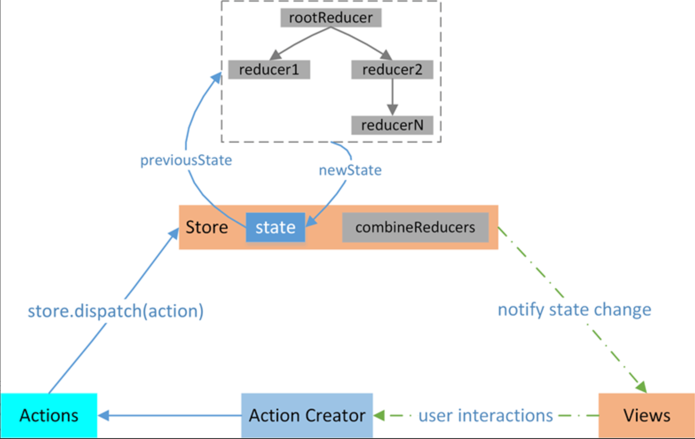

# Redux

核心点：
* Redux 基本介绍、原则
* 组件中如何使用？react-redux、 Redux Toolkit 联合一起使用
* 如何管理多个state：定义多个reducer，然后调用 combineReducers 将所有的reducer合并后传给 Store
* 如何处理异步的情况：中间件redux-thunk
* Redux Toolkit：Redux官方推荐的工具集，简化了Redux 原生的很多操作，也支持异步、多reducer管理
* react-redux：将Redux 与 React组件连接起来，在组件中可以直接使用store。Provider组件、useSelector/useDispatch 钩子、connect高阶函数等

Redux 是一个用于 JavaScript 应用的状态管理库，主要用于集中管理应用中多个组件共享的状态（State）。它基于函数式编程思想。



### 一、Redux 的三大核心原则
1. 单一数据源  
整个应用的状态被存储在一个单一的 Store 中，形成一棵状态树（State Tree）。

2. 状态只读  
不能直接修改状态（禁止 state.value = 1 这类操作）

3. 使用纯函数修改   
状态的更新通过 Reducer 实现，Reducer 是一个纯函数（输入相同则输出一定相同，无副作用），格式为：```（(state, action) => newState）```

### 二、Redux 的核心成员
1. Store：保存整个应用状态的容器，整个应用只有一个 Store。

    核心方法：
    * **getState()**：获取当前状态；
    * **dispatch(action)**：触发 Action 以更新状态（唯一修改状态的方式）；
    * **subscribe(listener)**：订阅Store的改变，只要store发生改变，store.subscribe接受的回调函数就会执行（通常用于触发组件重新渲染）。

    ```js
    // 创建 Store
    const store = createStore(Reducer);
    ```

2. Action：状态变化的 “指令”，一个 JS 对象：必须包含 type 字段（字符串，描述动作类型），其他数据（如 payload）都是可选的

3. Reducer：根据 Action 计算新状态的**纯函数**，接收 ```(state, action)```作为参数，返回新状态。

    注意：
    * 不能修改原状态，需返回新对象。如：```return { ...state, count: state.count + 1 }```  
        > 遵循React不可变数据规则
    * 无副作用（不修改外部变量、事件处理...）；
    * 对于复杂应用，可拆分**多个子 Reducer**（通过 **combineReducers** 合并）。

```js
import { ADD_TODO } from './actions';

// 初始状态
const initialState = {
  todos: []
};

// Reducer 函数
function todoReducer(state = initialState, action) {
  switch (action.type) {
    case ADD_TODO:
      // 返回新状态（不修改原状态）
      return {
        ...state,
        todos: [...state.todos, action.payload]
      };
    default:
      // 未知 Action 时返回原状态
      return state;
  }
}
```

### 三、Redux 工作流程
Redux 遵循单向数据流，流程如下：
* 用户操作（如：点击按钮） 
* 组件通过```dispatch(Action)```发送一个Action 
* Reducer 计算新状态
* Store 更新自身状态，并通知订阅者 
* 组件通过```store.getState()```获取新状态，重新渲染

疑问：
[redux 如何处理多个state的情况？](https://www.doubao.com/thread/w552e7ee69f740a0c)，基于```combineReducers```,Redux Toolkit 中的configureStore 会自动合并所有切片的 reducer，不过也是基于combineReducers来的。

### 四、处理异步操作（中间件）
**Redux 本身只能处理同步 Action**（因为 **Reducer 是纯函数，不能包含异步逻辑**）。对于异步操作（如 API 请求），需要使用**中间件**，常用的有：

**1. redux-thunk**：  
允许 Action Creator 返回函数（而非普通对象），在函数中执行异步操作，完成后再 dispatch 同步 Action。

```js
// 异步 Action Creator（需配置 redux-thunk 中间件）
function fetchUser(userId) {
  // 返回函数，接收 dispatch 和 getState 作为参数
  return (dispatch) => {
    dispatch({ type: 'FETCH_USER_START' });
    // 异步请求
    fetch(`/api/users/${userId}`)
      .then(res => res.json())
      .then(user => {
        dispatch({ type: 'FETCH_USER_SUCCESS', payload: user });
      })
      .catch(error => {
        dispatch({ type: 'FETCH_USER_ERROR', payload: error });
      });
  };
}

// 触发异步 Action
store.dispatch(fetchUser(123));
```
如果 dispatch 的参数是 “函数”，就自动调用这个函数，并传入 dispatch 和 getState 作为参数。

2. 其他中间件：redux-saga（处理复杂异步流程）、redux-observable（基于 RxJS）等。

## 五、Redux ToolKit
Redux Toolkit（RTK） 是官方推荐的工具集，简化了 Redux 开发。Redux 原生用法需要编写大量样板代码

* 内置 configureStore（替代 createStore，自动配置中间件）；
* createSlice（自动生成 Action type 和 Action Creator，简化 Reducer 编写）；
* 内置 createAsyncThunk（处理异步操作）。

### createSlice 详细介绍
RTK 的 createSlice 会自动生成：  
* 每个切片的 reducer（管理对应的 state 切片）；
* Action Creator（如 counterSlice.actions.increment）；
* 无需手动调用 combineReducers，configureStore 会自动合并所有切片的 reducer。

一、createSlice主要干了4件事：
1. **为每个独立的 state 模块 创建单独的切片**，每个切片自动管理**状态树中的一个分支**。
2. 会自动生成这三类代码：
    * Action Type：根据 name + reducers 函数名生成（如 counter/increment）；
    * Action Creator：直接导出可调用的函数（如 counterSlice.actions.increment）；
    * Reducer函数

3. 内置 Immer：“直接修改” state 也安全
    > Redux 要求不可直接修改 state（必须返回新对象），
4. 自动合并多个切片的 Reducer
    > configureStore 可以自动合并所有切片的 reducer，无需手动调用 ```combineReducers```。

二、createSlice返回对象的具体内容：
1. name：切片名
2. actions：一个对象，键是 reducers 中定义的函数名，值是自动生成的 action creator。
    作用：在组件中通过 dispatch(actionCreator()) 触发状态更新。
```js
// counterSlice.actions 结构
{
  increment: () => ({ type: 'counter/increment' }),
  decrement: () => ({ type: 'counter/decrement' }),
  incrementByAmount: (payload) => ({ type: 'counter/incrementByAmount', payload })
}

// 组件中使用
dispatch(counterSlice.actions.increment()); // 触发 increment 逻辑
dispatch(counterSlice.actions.incrementByAmount(5)); // 传入 payload
```
3. reducer：一个合并后的 reducer 函数，负责处理该切片的所有状态更新逻辑（包括 reducers 中定义的同步逻辑和 extraReducers 中处理的外部 action 逻辑）。
是切片的状态处理器，需要注册到 Redux store 中。
```js
// 注册到 store
import { configureStore } from '@reduxjs/toolkit';
import counterReducer from './counterSlice'; // 即 counterSlice.reducer

const store = configureStore({
  reducer: {
    counter: counterReducer, // 该 reducer 管理 store.counter 分支
  },
});
```

组件中如何使用？
类组件：

## 六、Redux 与 React 的结合
参考：[Redux 与 React 如何连接起来？](https://www.doubao.com/thread/w67aa9b830f999d1f)

[react-redux中的Provider](https://www.doubao.com/thread/w84ece74ac71d0488)

使用 react-redux 库将 Redux 与 React 组件连接：

* Provider 组件：将 Store 传递给所有子组件（避免手动传递）；
* 类组件：通过 connect 高阶组件连接
* 函数组件：通过 useSelector 和 useDispatch Hooks 连接
  * useSelector 钩子：在组件中获取 Store 中的状态；
  * useDispatch 钩子：获取 dispatch 函数，用于触发 Action。
