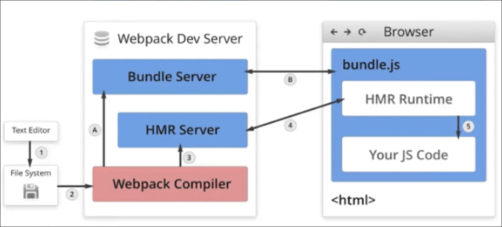

# 热更新

[webpack 热更新原理](https://www.doubao.com/thread/w49eafd4102c43ce0)

热更新（Hot Module Replacement，简称 HMR）

热更新 的核心是**在应用运行时，将修改后的模块替换为新模块，同时保持应用状态不丢失，而无需*完全刷新页面***。整个过程涉及 Webpack 构建系统、浏览器端、开发服务器（webpack-dev-server 或 webpack-dev-middleware）的协作。


## 一、详细工作流程
**1. 构建阶段 - 生成 HMR 相关代码**
* Webpack 在编译时会**为每个模块添加 HMR Runtime 代码**（通过 HotModuleReplacementPlugin）
* 生成特殊的 **manifest 文件**，记录模块间的依赖关系
* 为每个模块分配**唯一的 moduleId**，便于后续识别和替换

**2. 开发服务器与浏览器建立连接**
* 启动开发服务器时，会同时启动一个 WebSocket 服务器，主要是在代码变化时，向浏览器推送更新信息。
* *浏览器页面加载时*，会在 ```HMR socket Server 和 HMR Runtime 之间建立 websocket```，用于实时更新文件变化

    > 双服务器架构：
    > * Bundle Server(HTTP 资源服务器)：负责打包和提供经过 Webpack 编译后的资源文件。当浏览器首次请求页面时，Bundle Server 会将打包好的资源发送给浏览器，让页面得以正常渲染。

**3. 文件变化检测**
* 开发服务器**通过文件系统监听（如 chokidar 库）监测到文件变化**
* 触发 Webpack **重新编译修改的模块**（增量编译，只处理变化的部分）。这时会生成一个唯一的**模块 hash值**，并根据**变化内容**生成两个文件：
    * .json（manifest文件）：记录了*发生变化的模块相关元数据，比如哪些模块发生了变化、模块的路径、模块之间的依赖关系等*。
    * .js 文件（update chunk）：更新后模块代码的文件，是实际需要替换到浏览器端的代码块。

**4. 推送更新通知**  
* *编译完成后*，服务器**通过 WebSocket 向浏览器中被注入的 HMR runtime 发送更新通知**
* 通知中包含“哪些模块需要更新”的关键信息，如：更新模块的哈希值、 chundId 等。
    > 注意📢：此处的更新清单（更简洁） 并不等同于上面的 manifest.json文件（更全面）

**5. 浏览器请求并加载新模块**
* 浏览器接收到通知后，会向服务器发起 **Http请求**，去获取 变化内容的manifest文件、update chunk。
    > 疑问❓：为什么是http请求？而不是websocket？   
    > * **WebSocket 更适合 “低体积、高频次的通知类消息”**。    
    > * 而 **“新模块的代码 chunk” 通常体积较大**，用 HTTP 请求（甚至JSONP，早期 Webpack 常用）来加载更稳妥、易兼容。

**6. 模块替换逻辑**
* 新模块加载完成后，**HMR 运行时（runtime）会执行模块替换**：
    * 调用```旧模块的 module.hot.dispose() ```方法（如果有），清理资源、状态保存
    * 执行新模块代码，更新模块缓存
    * 调用```新模块的 module.hot.accept() ```方法（如果有），执行自定义更新逻辑
* 对于依赖链上的模块，会递归处理更新

**7. 状态保持**   
通过设计合理的 accept 和 dispose 方法，实现状态保留
例如：React 组件的 HMR 会保留组件状态，只更新渲染逻辑


详细过程请看图：   


## 关键技术点
* 模块依赖图追踪：Webpack 维护着模块间的依赖关系，确保更新能正确传播
* 热更新边界控制：通过 module.hot.accept() 定义模块更新的边界，避免全量更新
* 运行时代码注入：HMR 运行时作为独立模块存在，负责协调更新过程
* 缓存管理：浏览器端维护着模块缓存，更新时会替换相应的缓存项

## 模块边界是如何确定的？
> 示例：A 依赖 B，B 依赖 C，则形成 A → B → C 的链条。
> 
> 当某个模块（如 C）发生变化时，HMR 的初始更新范围是：
> 
> * 直接修改的模块（C）
> * 所有依赖它的上游模块（B 和 A，因为它们依赖 C，C 变化可能影响它们）

更新边界的关键：**module.hot.accept 声明**
 
如果仅依赖依赖图，更新可能会无限制地向上传播（甚至到入口模块），导致大范围更新（接近全量刷新）。因此，HMR 设计了 module.hot.accept 接口，允许开发者 **显式声明更新的边界**，阻止更新继续向上传播。   

有 两种形式：
* ```module.hot.accept()```：无参数，表示仅接受自身更新，不触及父模块更新。
* ```module.hot.accept(child_module， callback)```：接受子模块的更新，但是再向上 就不继续向上传播了。


其作用如下：  
* 定义 “当前模块是否接受其依赖模块的更新”。
* 如果声明接受，则更新到当前模块为止（不继续向上传播）。
* 如果不声明，则更新会继续向上传播，直到找到一个声明了 accept 的模块，或到达入口模块（此时会降级为全量刷新）。

示例1：
```js
// 模块 A（父模块）
import B from './B'; // A 依赖 B

// 声明：A 接受 B 的更新，更新到 A 为止，不继续向上传播
if (module.hot) {
  // 第一个参数：监听的依赖模块（B）
  // 第二个参数：B 更新后执行的回调（如重新渲染、更新逻辑）
  module.hot.accept('./B', () => {
    console.log('B 已更新，A 会处理这个更新');
    // 这里可以写具体的更新逻辑，比如重新执行 A 中依赖 B 的代码
  });
}
```
在这个例子中：

* 当 B 发生变化时，HMR 会更新 B 模块。
* A 声明了 accept('./B', ...)，更新会在 A 这里 “停止”，不会继续向上传播到 A 的父模块。

## HMR 是如何做到“模块更新时不丢失应用状态”的？
HMR 允许开发者通过特定 API 手动处理状态的保存与恢复，确保关键状态在模块替换时不丢失。
* module.hot.dispose()：**旧模块被替换前调用**，用于保存当前模块的状态到 HMR 运行时的缓存中。
```js
// 旧模块中：保存状态
let count = 0; // 需要保留的状态
if (module.hot) {
  module.hot.dispose(data => {
    // 将状态存入 data 对象，HMR 会暂存该数据
    data.count = count;
  });
}
```
* module.hot.data：**新模块加载**时，可通过该属性获取旧模块在 dispose 中保存的状态。
```js
// 新模块中：恢复状态
let count;
if (module.hot && module.hot.data) {
  // 从旧模块的缓存中恢复状态
  count = module.hot.data.count;
} else {
  // 首次加载时的初始状态
  count = 0;
}
```

## 与自动刷新的区别
自动刷新（Live Reload）会重新加载整个页面，导致应用状态丢失

HMR 只更新修改的模块，保持应用状态，提升开发体验

