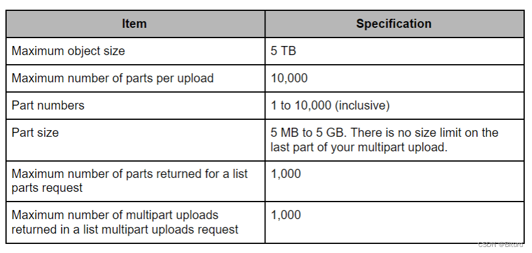
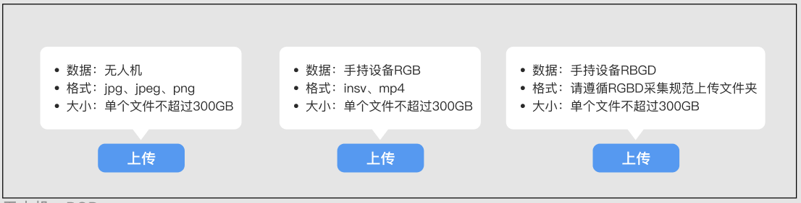
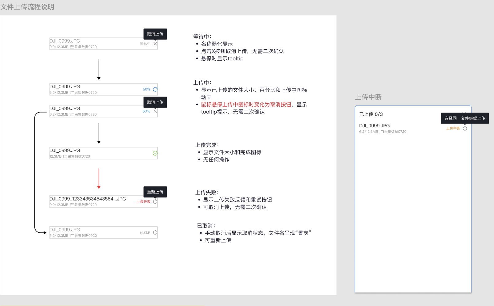

# 大文件上传
参考：https://blog.csdn.net/qq_43220213/article/details/130120575

【有道云笔记】技术调研 及 接口设计
https://share.note.youdao.com/s/RjHqZAeV

resourceID：资源的 “身份证号”
resourceURL：资源的 “访问地址”

uploadId：一个文件上传时的标识


### 一、前端直接用SDK上传：
前端不能直接存储长期 Access Key ID/Secret Access Key（浏览器端易被扒取，风险极高），生产环境必须用 **临时凭证**。

基本过程如下：
* 前端先通过你的业务接口登录（如账号密码登录），后端验证身份；
* 后端调用 AWS STS（Security Token Service），基于自身 IAM 角色生成 限定权限的临时凭证
* 后端将临时凭证返回给前端，前端用该凭证初始化 SDK。

10分钟刷新一次令牌！

### 为什么要用预签名url？
* **安全性更高点**：预签名 URL 是 “**一次性/短期授权**”，且权限范围有限，只能对**单一资源的单次操作**。（SDK的话，只要在有效期内 次数是不受限的，权限范围也更大！）
* 无需集成 SDK，**项目体积**会少一些
* 后端生成带权限的临时 URL（包含签名），前端不需要凭证，直接用Http url上传即可

分片大小100MB，总文件大小300GB，总分片数不超过10000个，单个分片5MB~5GB




## 其他
```js
，你只要讲你是怎么读的文件，读出来什么类型，然后怎么去做的分片states，然后分多少片？然后你的数据，你这分片信息不包含文件吗？分片信息是存在了服务端，对不对？嗯，他讲分片信息存在服务端，然后我们去每次上传，上传成功之后会去更新服务端的状态，然后下次进来还可以拿到。然后你拿到的是上传到 AWS 的一个那个路径每一片，然后丢到 AWS 上面去

记录文件的唯一标识符、文件上传的Id、总片数、已上传片数、每个分片的状态等信息
```

大文件分片上传：前端将一个体积庞大的文件拆分成多个小片段，通过并发请求分别上传，最后在服务器端重新合并成完整文件。

[除了分片上传，还有哪些常见的大规模数据上传优化方法？](https://www.doubao.com/thread/w70774dab4285d922)

预签名Url：
aws可以允许用户在**没有 AWS 安全凭证或权限**的情况下，使用预签名 URL 将资源上传到 Amazon S3 存储桶中，预签名Url有过期时间。

## 上传流程
这2个都是基于Vue的**虚拟滚动列表**来的：
* 有个全局的上传队列：可在不同的项目中分别上传部分文件
* 文件列表：展示上传成功的文件

按目录展示时粘性布局如何与虚拟滚动列表配合啊？ 


支持**文件、文件夹**批量上传，RGBD是按照目录上传和展示的
```js
input(ref="filePicker"  multiple @change="handleBatchUploadFile" :accept="SUPPORT_FILE.suffixSet" type="file")

input(ref="folderPicker"  webkitdirectory multiple directory @change="hanleUploadFolder" type="file")
```

**1. 小文件直接上传** 获取预签名URL后直接上传，支持上传进度获取、取消上传

**2. 大文件分片上传**
* 上传前，上传前会进行大小、格式、重名检查。最大不超过300G，支持无人机、手持设备RGB/RGBD的数据上传，**分片的大小是30M** 
* 上传前，前端会**计算文件 MD5 并提交给后端，后端记录该哈希值，用于最终合并后校验文件完整性**，防止分片被篡改。

并发量怎么控制啊？ 答：4个，浏览器并发量在 3-5 个比较好

分片上传基本过程：
* 前端切割分片
* 批量获取预签名url（TODO:很重要）
    * 有2个比较重要的请求参数
        * partSize分片个数：后端生成预签名url依赖它
        * uploadId：也允许参数中直接携带uploadId（就不会创建新的字段）
    * 返回值：返回uploadId，后期分片上传就是基于uploadId来的。
* 基于预签名url，对分片并发上传 （具体并发过程：[商汤_分片并发上传](../JS/promise_generator_async/并发控制/商汤_分片并发上传.ts)）
* 获取分片上传进度：接口返回已上传的分片信息，size累加
* 分片全都上传成功后发 完成分片上传的请求（completeMultipartUpload），告给后端可以拼接了，这个操作完成时通过后端更新文件上传的状态
* 如果有一个分片上传失败了，整个文件相当于都失败了，剩下来的分片也没必要传了，然后调用 取消分片上传的请求（abortMultipartUpload：s3会删除已上传的分片，避免占用空间产生费用），然后通知后端更新状态


### 断点续传：
（1）进入界面后，会获取状态是`未开始、失败、上传中的全量Resource列表`，上传到一半断网的这些资源是有uploadId的，断点续传时继续用这个uploadId传即可
（2）断点续传的是上传中的..


上传失败、取消上传的区别：
1. cancel：
    * 主动放弃，清理资源，不支持续传(原来的上传ID失效了)，代表 “明确终止”；
    * 必须主动调用 abortMultipartUpload 接口，让 S3 删除已上传的分片（避免占用空间产生费用）

2. fail：
    * 意外中断，保留资源，支持重试，代表 “未完成但可恢复”。


```js
this.concurrentRequest(onUploadProgress).then(async (res) => {
    console.warn("多路并发是否已全部上传：", res);

    if (!res) {  // 有分片失败了
        onUploadFinish && (await onUploadFinish(false));
    } else {  // 所有分片都成功了
        const res = await this.completeMultipartUpload(args);
        console.warn("completeMultipartUpload: ", res);
        if (res) {
            onUploadFinish && (await onUploadFinish(true));
        }
        else {
            onUploadError && onUploadError();
            if (this.uploadId) {
                await this.abortMultipartUpload({
                    uploadId: this.uploadId,
                    storageType: this.storageType,
                    path: this.path,
                });
            }
        }
    }
});
```

## 如何提升大文件上传效率？TODO:
**1. 启用 HTTP/2 或 HTTP/3**  
HTTP/2 多路复用：在单个连接上并行传输多个资源，  
HTTP/3（基于 QUIC）：用 UDP 协议，支持 0-RTT 连接、更好的丢包处理，弱网环境下优势明显

**2. 基于网络状况动态调整**：   
前端通过navigator.connection获取网络类型（如 4G/5G/WiFi）和带宽估算，自动调整分片大小和并发数：
* 弱网（如 4G、延迟 > 300ms）：减小分片（如 2MB）+ 降低并发（1~2 个），减少超时重试；
* 强网（如 WiFi、带宽 > 100Mbps）：增大分片（如 32MB）+ 提高并发（5~8 个），充分利用带宽。

**3. Web Worker** 离线计算文件 MD5，不阻塞主线程


## 文件状态、操作
* 文件状态：排队中、上传中、上传成功、上传失败、已取消、上传中断   
    > 上传中断与取消的区别：中断是网络等问题被意外终止的；取消是用户主动操作的  TODO:
    > 项目中是如何标记“上传中断”的？前端的状态，后端仍旧将其归为“上传中”

    ```js 
    item.status === upload.FILE_STATUS.UPLOAD && !upload.isUploading(item)

    isUploading(item: UploadItem) {
        const it = this.uploaders.find(
            (up) => up.item?.resourceId === item.resourceId
        );
        return !!it;
    }
    ```

* 支持用户取消上传、重新上传（失败的、取消的），以及断网或关闭浏览器等导致的上传中断后的重新上上传。


主要负责的是：资源重建


本质是围绕：把什么样的资源文件（RESOURCE_TYPE） 上传 到哪（OSS_TYPE）?
建图所需的数据，无人机、rgb等采集工具采集的数据 上传到
`RESOURCE_TYPE.RT_RECONSTRUCTION ---> OSS_TYPE.AUTO`

纹理编辑：`RESOURCE_TYPE.RT_TEXTUREEDIT ---> OSS_TYPE.AUTO`

重建结果的模型数据：
`RESOURCE_TYPE.RT_MODELASSET ---> OSS_TYPE.AUTO`


## Upload Manage 模块：
```
<!-- 变量 -->
uploadList(响应式的)
FILE_STATUS：INIT、上传中、上传成功、失败...
RESOURCE_TYPE
OSS_TYPE：
    默认是 AUTO
    AOSS（商汤大装置兼容aws s3）、
    其他几种(阿里云对象存储 ALIOSS、MINIO、微软AZURE)


队列相关的：queueVector（reactive类型）、currentQueueId（ref类型）

<!-- 方法 -->
findQueueItem、updateQueueName
duplicate()
addFiles()
startUpload()
restartItems()：针对“上传失败”的，全部重试；
startItem()：“上传中断”的重传，仅仅是针对单个的；除此之外和restartItems是一样的
clear()

<!-- 事件 -->
on、off 等事件方法
upload.on(upload.UPLOAD_EVENT.ASSET_STATUS_CHANGE, onItemStatusChange);

事件类型：UPLOAD_EVENT，如ASSET_STATUS_CHANGE
```

## Upload 模块
资源上传成功后，更新status;
若是上传失败、取消，则批量删除，然后设置其resourceId = ''

```
createResource(items：UploadItem[])：初始化资源、模型，获取resourceId、resourceUrl等

start(item: UploadItem) 调用相应的client的upload()进行上传
stop()  停止、取消上传，需调用对应的Client
setStatus()

<!-- 事件 -->
this.onUploadInit 
this.onUploadProgress 
this.onUploadFinish
this.onUploadError 
```

```js
// 只有AOSS有uploadId字段，其他像
case OSSType.AOSS:
    await assetsApi.v1AssetsAssetIdResourcesResourceIdPut(
        this.ownerId, 
        this.resourceId,
        { status: value, uploadId: this.uploadId }
    );
```



```
// 状态的变化：

失败的：可reUpload(item)
排队中的：可cancelUpload(item)
上传中的进度展示：可cancelUpload(item)
上传中断的：<a-upload>需要重新选择同名文件上传，resumeUpload(item,file)
取消上传的：可reUpload(item)
```

```js
// 排队中的，可取消上传
const cancelUpload = async (item: any) => {
  return upload.stopItem(item);
};

// 失败的/取消上传的，可reUpload
const reUpload = async (item: any) => {
  return upload.restartItems([item]);
};

// 上传中断后执行...
const resumeUpload = async (todoItem, file) => {
  // 判断是否是同名文件..  
  upload.startItem(todoItem);
}
```