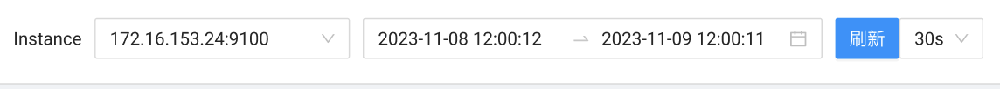
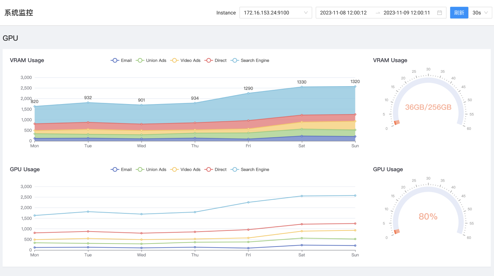

# Echarts 

参考：https://echarts.apache.org/handbook/zh/best-practices/canvas-vs-svg

Echarts优化：
https://www.doubao.com/thread/we4015e04e6d80a73

* 数据采样（减少渲染点数，sampling配置） 
* Canvas渲染（减少 DOM 节点开销） 
* 关闭动画：动画会增加渲染帧计算，大数据场景可关闭
* 基于dataZoom 组件，数据按时间/范围分片加载，初始只加载可见范围内的数据
* WebGL 加速（适合超大数据）

数据采样/降采样：当数据量非常大时，直接渲染所有数据点性能会比较差。数据采样就是在不丢失关键信息（像数据的峰值、谷值、趋势变化的拐点等）的前提下，筛选出一部分最能代表原始数据特征的点进行渲染，从而降低渲染负担。

核心是通过减少实际渲染的数据点数量，

## 使用 Canvas渲染？SVG渲染？
Canvas 更适合绘制图形元素数量较多（这一般是由数据量大导致）的图表。

SVG渲染：它的内存占用更低（这对移动端尤其重要）、并且用户使用浏览器内置的**缩放功能时不会模糊**，有多少个图表数据点，就有多少个SVG元素，每个元素都需要独立的 DOM 节点。

选择哪种渲染器，我们可以根据软硬件环境、数据量、功能需求综合考虑。  
* 在软硬件环境较好，数据量不大的场景下，两种渲染器都可以适用，并不需要太多纠结。
* 在环境较差，出现性能问题需要优化的场景下：
    * 在需要创建很多 ECharts 实例且浏览器易崩溃的情况下（可能是因为 Canvas 数量多导致内存占用超出手机承受能力），可以使用 SVG 渲染器来进行改善。大略的说，如果图表运行在低端安卓机，或者我们在使用一些特定图表如 水球图 等，SVG 渲染器可能效果更好。
    * 数据量较大（经验判断 > 1k）、较多交互时，建议选择 Canvas 渲染器。

在 v5.3.0 中使用虚拟 DOM 技术对 SVG 渲染器进行了重构，从而使其渲染性能提升了 2~10 倍，在某些特殊场景中甚至能有数十倍的提升