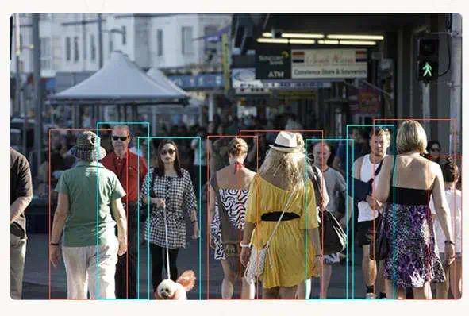
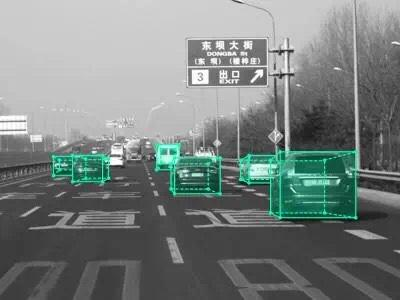
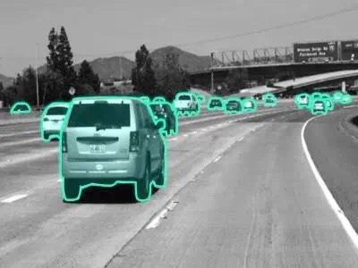
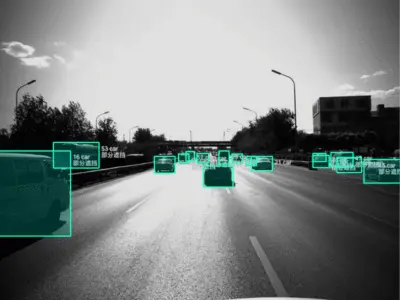

# 北京“滴滴出行”Dophin 标注系统
[UML类图的6种关系](https://blog.csdn.net/xiaojin21cen/article/details/104718622)

[滴滴标注系统图](https://zhuanlan.zhihu.com/p/336219924)

[华为文章“如何做一个标注系统？”](https://bbs.huaweicloud.com/blogs/393224)

[WebGL/threeJS面试题扫描与总结](https://blog.csdn.net/xyphf/article/details/134605627)

前端开发工程师	2018.11-2019.02	

主要是识别各种交通参与者（如行人、车辆、交通标志）和道路环境。

标注员在自动驾驶汽车传感器捕捉到的图像和点云数据上，绘制出各种元素的边界框、多边形等，并进行分类（例如，将一个行人标为“行人”，将一辆车标为“汽车”）。

* 实现任务分配、标注、质检(含随机)、返工等界面实现与Js逻辑代码书写;
* 增加批量操作：批量创建、批量分配、批量下载等，并将其集成到一起;
* Polygon， Polyline, Points线性插值；前端界面加水印;
* 标注 Polygon 时，实现对点的批量选取以及批量变换；贝兹曲线实现10%;
* 负责 Dophin 标注系统的新界面开发，基本界面已经实现。

## 

要求标注员一定要用标签集里的标签来对数据进行标注，这样最终得到的标注数据便是规整的。
图像标注任务：XXX(Data) 是 XXX(Label)
物体检测任务：
    在 XXX（Data）中， XXX（Region）是 XXX（Label）
    在图像（Data）中某个局部区域物品（region）是什么类别（Label）。

## 线标注

## 边框

## 3D边框

## 多边形polygin

## 视频标注
在视频或者连续的图像中跟踪标注检测对象，形成有ID关联的运动轨迹。

