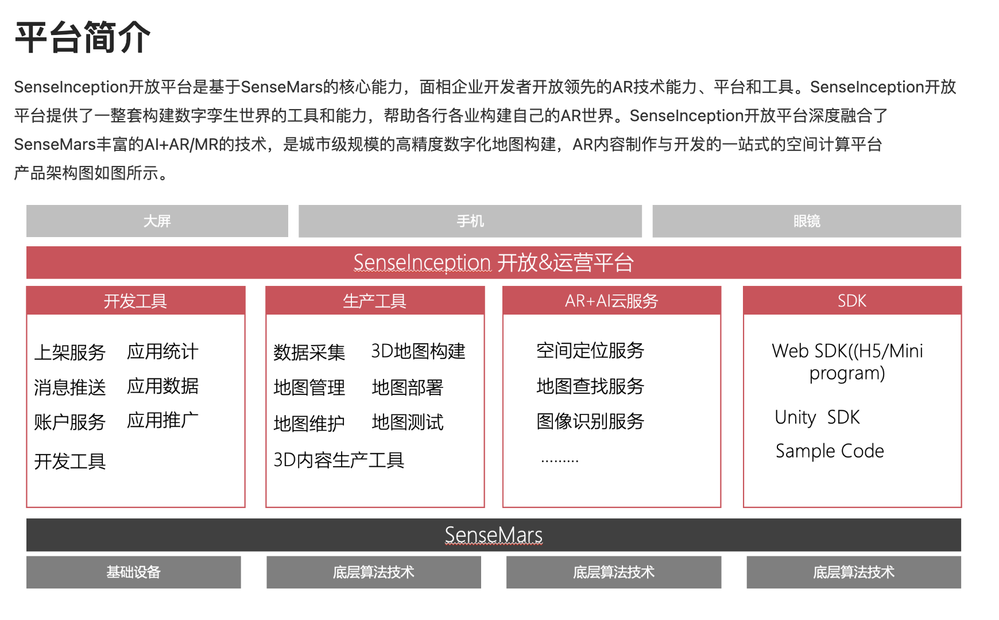

# 开放平台
参考：[SenseInception相关页面](https://blog.csdn.net/2302_81579422/article/details/149420166)

参考：[monorepo](./monorepo与微前端.md)

开放平台相关的技术栈：
Vue + TS + Tailwind + Vue Router + Vuex + Ant Design Vue（Antd）
Monorepo + Lerna + pnpm/yarn 

一共有的项目：
<!-- 主线平台 -->
sense-admin：权限管理后台
sense-magic：运营平台
sense-inception：开放平台

<!-- 提供给Sony的环境：基本是之前“主线平台”的一个子集，也会有一些Sony定制的需求 -->
xr-admin：
xr-magic：
xr-platform：

SenseInception开放平台是基于**SenseMars**的核心能力，**面相企业开发者开放领先的AR技术能力、平台和工具**。SenseInception开放平台提供了一整套构建数字孪生世界的工具和能力，帮助各行各业构建自己的AR世界。SenseInception开放平台深度融合了**SenseMars丰富的AI+AR/MR的技术**，是城市级规模的**高精度数字化地图构建**，**AR内容制作与开发**的一站式的空间计算平台

产品架构图：

开放平台：
* 层级管理：园区、建筑、区块
* 账户权限管理：用户管理、角色管理、项目管理
* 3D建图：全新建图、增量建图
* 地图部署：地图部署、停用
* 应用管理：创建/配置/删除 应用

运营平台：
* poi点位管理：POI点位/创建/导入、查看/编辑/删除、批量导入
* AR资源管理：资源上传、查看/编辑/删除/下载/搜索

## 简历修改

Sony
