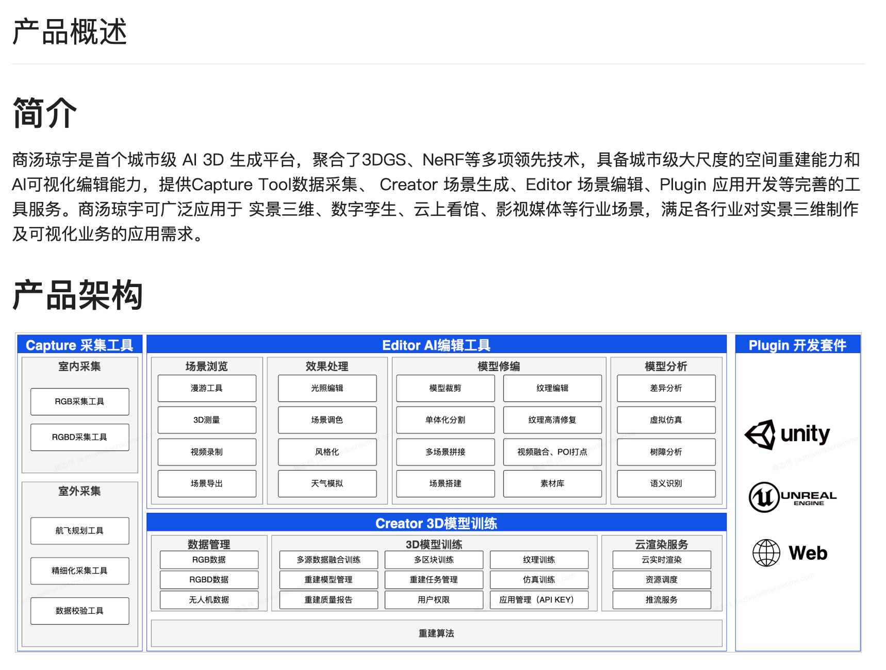

# 琼宇
【有道云笔记】琼宇待了解的点
https://share.note.youdao.com/s/PYuHYrSu

【有道云笔记】用到的技术
https://share.note.youdao.com/s/5IpXQmJX

【有道云笔记】代码层面，sensespace工程项目介绍（贤斌）
https://share.note.youdao.com/s/8P4LQv8U

参考：[琼宇Editor](./琼宇Editor.md)

项目背景：商汤琼宇是基于 3DGS、NeRF 技术 的高精实景三维重建平台，主要包括Capture Tool数据采集、 Creator 场景生成、Editor 场景编辑等几大功能，另外有专门的Admin权限管理平台对用户、企业、重建任务等进行管理。

技术栈：Vue + Vite + VueRouter + Pinia + Ts + Antd + Tailwind + Monorepo（Lerna）+ Pug模版

主要贡献：
* 支持长列表分目录吸顶展示及滚动优化；
* 封装 uploader 模块，大文件分片后并行传输，支持中断取消等功能；
* 项目中后端 API 是在 Yapi 上托管的，基于 openapi-generator-cli 将接口自动转成基于 TypeScript语言、使用 Axios 库的 API 客户端代码；
* 支持私有化客户的个性化定制，如：域名、网页 title、logo、文案等。
* 作为唯一代码手，从零到一完成琼宇【Admin 权限管理平台】的搭建、开发上线及后续版本迭代；
* 支持【Admin】用户管理、企业管理、文件管理、重建任务、云渲染日志、系统监控六大模块列
表及详情页开发；
* 在【Admin】系统监控模块中，基于 Echarts 将 CPU、GPU、RAM、Disk 等数据以折线图、仪表盘的形式展示出来；
* Editor编辑工具：在UE虚幻引擎中内嵌H5页面，H5页面实现对Nerf模型的2D裁剪优化。首先会加载谷歌地图或天地图，然后基于Vue-cesium在地图上展示Nerf区域、绘制多边形裁剪框，绘制完成后通知UE。
* 支持以 monorepo 的方式来管理主线侧的运营平台、开放平台、Admin后台及给Sony大客户专门提供的三种平台。