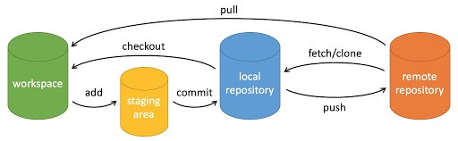

# Git

SVN与Git区别：https://blog.csdn.net/bruce_6/article/details/38299677

Git：https://www.liaoxuefeng.com/wiki/896043488029600/897013573512192

## SVN：集中式管理
版本库集中存放在中央服务器，自己在开发时，需要先从中央服务器获取最新的版本，开发完成后，再将代码 push 到中央服务器

## Git：分布式..
无中央服务器的概念，每台服务器都是一个完整的版本库；工作的时候，不需要联网！

add：提交到暂存区
commit：提交到本地仓库
push：提交到远端仓库

