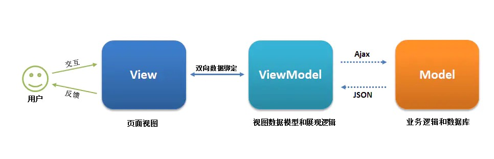

# MVC与MVVM

## 一、MVC架构
* MVC 分为三个主要组件：模型（Model）、视图（View）和控制器（Controller）。
* MVC（Model-View-Controller）的核心是 **“流程控制与职责分离”**，通过将应用分为三个核心组件，实现数据、界面、交互逻辑的解耦：
* **单向通信为主**：核心数据流是 “*View→Controller→Model→Controller→View”，View 通常不直接与 Model 交互*。

    > 在早期或简化的 MVC 实现中，可能存在Model 直接通知 View 更新的情况（例如通过 “观察者模式”，Model 作为被观察者，View 作为观察者）。但这种模式存在明显缺陷：
    > 1. 会导致 Model 与 View 产生耦合，违背了 MVC “分离关注点” 的核心设计目标。
    > 2. 不利于代码维护（例如修改 View 时可能需要改动 Model）。       
    > 所以，主流的 MVC 架构中，Model 不直接参与 View 的更新，而是严格通过 Controller 作为中间层协调，确保 Model 专注于数据逻辑，View 专注于展示，二者完全解耦*。 
* 常见的 MVC 框架有 Spring MVC、Djang等

### 1. Model（模型）
模型主要是管理**数据和业务逻辑**（如数据库操作、数据验证等）。

在模型中，**数据被有效地管理、存储和操作**，包括*从各种数据源获取数据、对数据进行验证和处理、执行业务规则*等。
> 对数据进行校验和验证：确保数据的完整性、有效性和一致性。

模型通常包括数据访问对象（Data Access Objects,DAO），用于与数据存储交互，以及实体类来**表示应用程序中的核心数据结构**。除此之外，模型也负责**数据的通知和变化**，确保数据变化时其他组件（如视图和控制器）能够及时获取到更新的数据。

### 2. View（视图）
视图是 MVC 框架中的另一个关键组件，它负责**模型数据的展示，并且接收用户的输入**。

与模型相对应的是**视图不包含业务逻辑**，它**专注于数据的展示和用户交互**。

### 3. Controller（控制器）
主要职责：
* 接收 View 传递的用户交互请求（如点击登录按钮）；
* 调用 Model 的方法处理业务逻辑（如调用 UserModel.login() 验证登录）；
* 根据 Model 的处理结果，通知 View 更新展示（如登录成功则跳转首页，失败则显示错误提示）。

    > 更详细的解释：
    >1. 控制器不仅仅是**接收请求**和*调用Model层相应的处理方法*。控制器负责从用户端接收各种类型的请求，包括 HTTP 请求、AJAX 请求等，然后根据请求的特征和内容进行路由和处理。  
    >2. 协调模型和视图之间的交互，*将“模型层”返回的数据传递给视图层*。  
    >3. 控制器可能会在处理过程中进行一些*数据处理、格式化或转换*，*以确保数据能够被正确地显示在视图中*。  
    >4. 控制器还可能涉及到一些**与业务逻辑相关的操作**，如数*据验证、权限控制、日志记录*等，以确保应用程序的安全性和稳定性。  

控制器的设计应该遵循单一职责原则，即每个控制器应该只负责处理特定类型或特定功能范围内的请求。

交互模式：
“模型”负责管理应用程序的数据，它从“控制器”接收用户输入，“视图”以特定格式呈现“模型”。
控制器响应用户输入，并在数据模型对象上执行交互。
控制器接收输入，可选择性地验证输入，然后将输入传递给模型。

### 该架构的优点：
* 清晰的结构：MVC将应用程序分为三部分——模型（Model）、视图（View）和控制器（Controller），使代码结构清晰，方便修改和维护。
* 高可维护性：由于代码分离，修改业务逻辑时无需更改视图，视图的更改也不会影响控制器，便于后期维护。
* 便于模块化开发以及开发人员并行工作：例如后端开发人员可以专注于模型和控制器，而前端开发人员专注于视图的实现。
* 可重用性高：模型和视图的解耦使得相同的模型可以在不同的视图中使用，减少了代码冗余，提高了代码复用性。

## 二、MVVM架构
MVVM(Model-View-ViewModel), 源自于经典的 Model–View–Controller（MVC）模式。MVVM 的出现促进了 GUI 前端开发与后端业务逻辑的分离，极大地提高了前端开发效率。

* MVVM 的核心是 ViewModel 层，它就像是一个中转站（value converter），负责转换 Model 中的数据对象来让数据变得更容易管理和使用，该层**向上与视图层进行双向数据绑定，向下与 Model 层通过接口请求进行数据交互**，起呈上启下作用。

* **View 层展现的不是 Model 层的数据，而是 ViewModel 的数据**，由 ViewModel 负责与 Model 层交互，这就完全解耦了 View 层和 Model 层，这个解耦是至关重要的，**它是前后端分离方案实施的最重要一环**。

如下图所示：

## 三、MVVM架构中的VM 与 MVC的controller 比较
MVVM 中的ViewModel（VM） 与 MVC 中的Controller（控制器） 都是架构中连接视图与数据的中间层。

### 一、核心设计目标不同
**Controller（MVC）：**
核心是 **“流程控制”**，**负责接收用户输入（来自 View），决定调用哪个 Model 处理数据，以及处理完成后选择哪个 View 展示结果**。它更像一个 “调度员”，聚焦于用户操作到数据处理的流程协调。

**ViewModel（MVVM）：**
核心是 **“数据映射与状态管理**”，它将 Model 中的数据转换为 View 可直接使用的格式（如处理日期格式化、状态转换等），同时暴露 View 所需的命令和事件。它更像 View 的数据 “镜像”，聚焦于View 与数据的同步关系。

### 二、职责范围对比
|  对比纬度   |   Controller（MVC）  | ViewModel（MVVM）  |
|  ----  | ----  |----  |
|  业务逻辑 | 可能包含部分业务逻辑（或转发给 Model 处理）。| 完全不包含业务逻辑，仅处理数据格式转换（与 View 适配）。 | 
|  数据处理 | 自身不存储数据，也不直接处理数据，而是调用 Model 完成业务逻辑 | “存储“ View 所需的 “视图状态”（如表单临时值、UI 状态），并对 Model 数据进行格式化（供 View 使用）。 |
| 怎样更新View | 需手动编写代码更新 View（如 DOM 操作）。| 通过双向绑定自动同步 View 与 ViewModel 的数据，无需手动更新 View。 | 
| 复用性 | 复用性低，Controller与特定 View 绑定	| 复用性高。与 View 松耦合，同一 ViewModel 可适配多个 View（如 PC 端和移动端视图）。|