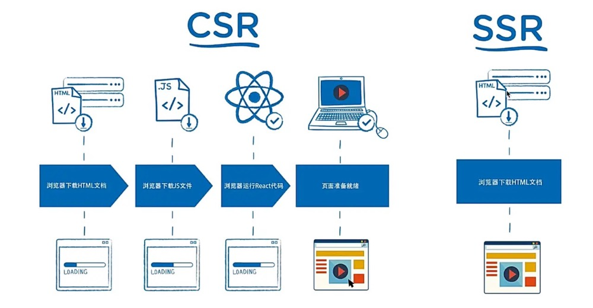

# 客户端渲染（CSR） 与 服务端渲染（SSR）

服务端渲染（SSR）：DOM树在服务端生成，然后返回给前端。利于SEO，首屏渲染效率高！
> （吐）服务端在返回 html 之前，在特定的区域，符号里用数据填充，再给客户端，客户端只负责解析 HTML 。

客户端渲染（CSR）：前端去后端取数据生成DOM树。有利于前后端分离，局部刷新（不用请求完整页面），交互性好！
> （填）html 仅仅作为静态文件，客户端端在请求时，服务端不做任何处理，直接以原文件的形式返回给客户端客户端，然后根据 html 上的 JavaScript，生成 DOM 插入 html。

二者本质的区别：是谁来完成了html的完整拼接，服务端渲染是在服务端生成DOM树，因此服务器压力大；客户端渲染是在客户端生成DOM树。

传统CSR的弊端：
* 由于页面显示过程要进行JS文件拉取和React代码执行，首屏加载时间会比较慢。
* 对于SEO(Search Engine Optimazition,即搜索引擎优化)，完全无能为力，因为搜索引擎爬虫只认识html结构的内容，而不能识别JS代码内容。

SSR的出现，就是为了解决这些传统CSR的弊端。

