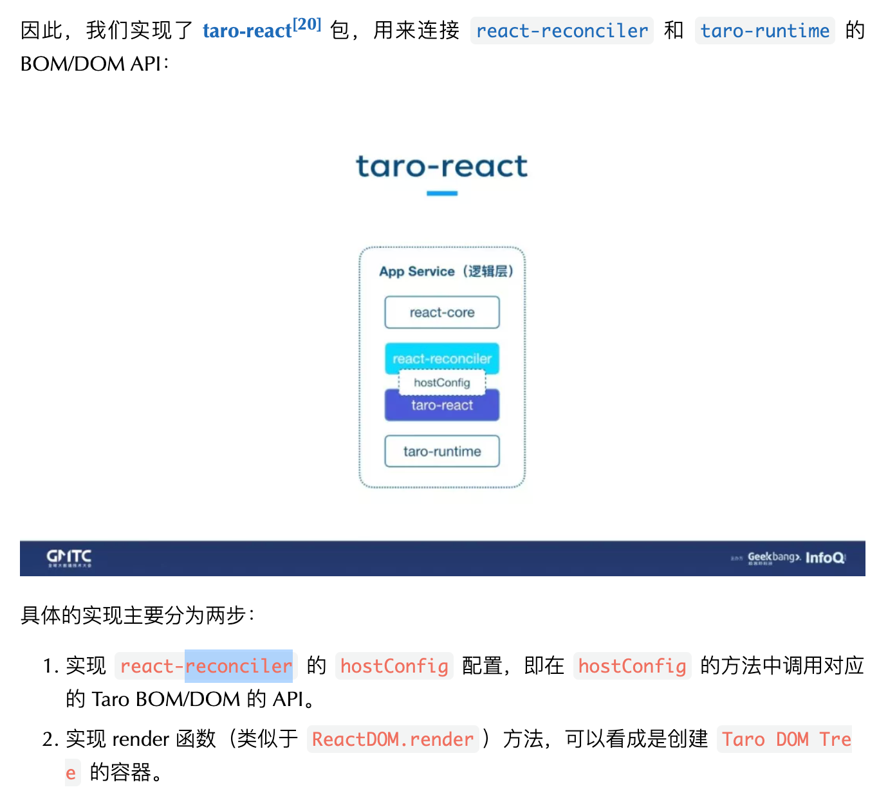

# Taro编译时、运行时
参考：https://mp.weixin.qq.com/s?__biz=MzU3NDkzMTI3MA==&mid=2247483770&idx=1&sn=ba2cdea5256e1c4e7bb513aa4c837834&poc_token=HGW0Ammj2bAA-m73Pdl4VRomgnOcVL3WvMngvpMU

https://www.doubao.com/thread/w637d8f9ae500a324

https://juejin.cn/collection/6951421692875014180

编译时 vs 运行时的核心区别
* 编译时：代码在 “打包构建阶段” 的处理（比如用 Babel 转换语法），输出的是 “可在目标平台运行的代码”，不涉及代码执行。
* 运行时：代码在 “用户设备上执行的阶段”（比如小程序运行时、浏览器中），负责处理实际的渲染、事件、数据更新等。

## 小程序的架构

微信小程序主要分为 逻辑层 和 视图层，以及在他们之下的原生部分。逻辑层主要负责 JS 运行，视图层主要负责页面的渲染，它们之间主要通过 Event 和 Data 进行通信，同时通过 JSBridge 调用原生的 API

## Taro 当前的架构
主要分为：编译时 和 运行时。

### 编译时
编译时主要是将 Taro 代码 使用 babel-parser 将 Taro 代码解析成抽象语法树，然后通过 babel-types 对抽象语法树进行一系列修改、转换操作，最后再通过 babel-generate生成对应的目标代码。

要进行各种语法的适配，如JSX，是通过 穷举 的方式来实现的，这个工作量是相当大的！！

主要是将 Taro 代码通过 Babel 转换成 小程序的代码，如：JS、WXML、WXSS、JSON。

Taro1,2 主要是重编译时，轻运行时

**Taro 2 不依赖 React 自身的 JSX 处理逻辑，而是自己 “解析 JSX 语法” 并直接转换为目标平台代码。**
问题：如果遇到未穷举的 JSX 语法（如复杂的三元表达式、函数组件嵌套），转换会失败，兼容性差。

Taro Next 不再自己解析 JSX 或模板，而是让 React/Vue 自己处理语法到虚拟 DOM 的转换，Taro 只在 **“框架引擎” 和 “平台视图”** 之间做适配。标签、属性、事件的映射，如：把 React JSX 中的 `
` 换成 Taro 统一的 `<view>`，JSX 中的条件渲染、for循环等语法都是JSX编译器处理的

### 运行时
运行时主要是进行一些：生命周期、事件、data 等部分的处理和对接。
React 的一些核心方法：setState、forceUpdate 等进行了替换和重写，Taro 当前架构只是在开发时遵循了 React 的语法，在代码编译之后实际运行时，和 React 并没有关系。

## 新架构 Taro Next
无论开发这是用的是什么框架，React 也好，Vue 也罢，最终代码经过运行之后都是调用了浏览器的那几个 BOM/DOM 的 API ，如：createElement、appendChild、removeChild 等。

创建了 taro-runtime 的包，然后在这个包中实现了 一套 高效、精简版的 DOM/BOM API，然后通过 Webpack 的 ProvidePlugin 插件，注入到小程序的逻辑层。

## 疑惑点：

Taro2及以前：编译时适配语法的转换，DOM/BOM相关的操作很少
Taro next中：模板转换（如小程序 .wxml）由 Taro 运行时根据 Taro DOM 的操作动态生成或更新。

React 渲染函数 → 虚拟 DOM → Taro 视图的完整流程
* 开发者写 JSX → **React 编译器**（而非 Taro）转成 React.createElement 渲染函数；
* 渲染函数执行 → 生成 React 虚拟 DOM（Fiber 树）；
* React Reconciler 处理 Fiber 树的 diff 和更新；
* Reconciler 调用 Taro 的 hostConfig 方法 → 触发 Taro DOM 的操作；
* Taro DOM 将操作转换为平台指令（如小程序 setData）→ 最终渲染到视图。

第二步：通过 hostConfig 和 Taro DOM 桥接平台视图
