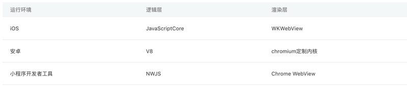

### 背景：
在小程序没有出来之前，最初'微信WebView'逐渐成为'移动web'重要入口，微信发布了一整套网页开发工具包，称之为 JS-SDK。他让所有开发者都可以使用到微信的原生能力，去完成一些之前做不到或者难以做到的事情。
    
但是这种模式有以下缺点：
* 没有解决使用'移动网页'遇到的'体验不良'的问题，如受限于设备性能、网络速度，会出现'白屏的可能'。

后来又设计了一个增强版JS-SDK，也就是“微信 Web 资源离线存储”，但他仍有以下缺点：
* 复杂页面上依然会出现白屏
* 页面切换比较生硬
* 点击的迟滞感

因此，这个时候需要一个 JS-SDK 所处理不了的，使用户体验更好的一个系统，小程序应运而生。

### 小程序的优点：
* 快速的加载
* 原生的体验
* 易用且安全的微信数据开放
* 高效而简单的开发
* 更强大的能力

### 小程序与普通网页开发 区别：
共同点：都是基于 js 开发；

区别：

|     | 小程序开发  | 网页开发  |
|  ----  | ----  |----  |
| 是否含window对象  | 没有 | 有 |
| 是否可使用浏览器提供的DOM API | 不能 |可以 |
| 渲染/脚本线程 | 双线程开发 | 这两个线程是互斥的，因此长时间的脚本运行可能会导致页面失去响应 |
| 开发工具 | 需要经过申请小程序帐号、安装小程序开发者工具、配置项目等等过程方可完成。 |只需要使用到浏览器，并且搭配上一些辅助工具、编辑器即可 |

小程序的执行环境：

