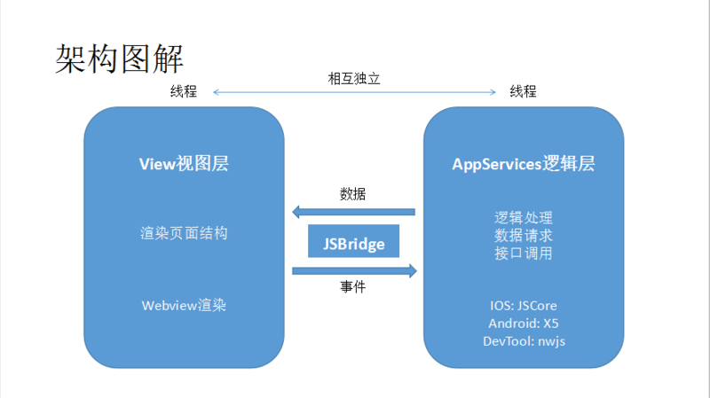

## 小程序双线程模型：
* 双线程架构
    * 渲染层（WebView 线程）：负责页面渲染，每个页面对应一个 WebView（但无完整浏览器 API）。
    * 逻辑层（JS 线程）：负责处理业务逻辑（如数据处理、事件响应），运行在独立的 JS 引擎中（如 V8）。

    两者通过原生桥接层通信，避免了单线程中 JS 执行阻塞渲染的问题。

* 为什么要这样设计呢？   
答：方便管控和安全。假如像 Web开发 一样可跳转、可改变页面内容，那么会存在一些不可控因素和安全风险。因此为了解决这些问题，我们需要阻止开发者使用一些，例如浏览器的window对象，跳转页面、操作DOM、动态执行脚本的开放性接口。这就是小程序双线程模型的由来。

<br/>



<br/>


* 详细解释：
1. 逻辑层：创建一个单独的线程去执行 JavaScript，在这里执行的都是有关小程序业务逻辑的代码，负责逻辑处理、数据请求、接口调用等
2. 视图层：界面渲染相关的任务全都在 WebView 线程里执行，通过逻辑层代码去控制渲染哪些界面。**一个小程序存在多个界面，所以视图层存在多个 WebView 线程**（提升渲染隔离性）
    > 一般来说，最多同时存在 N个 WebView。N 由宿主环境决定，如微信通常为 5 - 10 个。当页面数量超过上限，框架会销毁最久未使用的 WebView，用其容器加载新页面内容。
3. JSBridge **不仅是逻辑层与视图层通信的核心媒介**（双线程架构下，逻辑层与视图层的消息传递通过 JSBridge 转发），也是 “**上层开发与 Native（系统层）的桥梁**”，从而小程序可通过API使用原生的功能，有更好的体验。

JSBridge：桥接层


## 小程序的交互通信机制
小程序的通信主要涉及三个层面：

1. **逻辑层与渲染层通信**
    * 开发者调用 setData() 时，逻辑层会将数据通过**原生桥接层**传递给渲染层，渲染层重新渲染视图。
    * 渲染层的事件（如点击）会通过桥接层传递到逻辑层，由逻辑层的事件处理函数响应。
    * 通信是**异步**的，且有数据大小限制（避免性能问题）。

2. **页面间通信**
    * 通过 wx.navigateTo() 跳转时，可通过 URL 参数传递数据（适合少量数据）。
    * 通过全局对象 ```getApp()``` 共享数据（需注意数据同步问题）。
    * 通过本地存储 wx.setStorageSync()/wx.getStorageSync() 持久化数据。

3. **与宿主环境通信**
小程序通过**API 接口**调用宿主环境的功能（如获取用户信息、支付、定位等），例如 wx.getUserInfo()、wx.request()（网络请求）。```这些 API 本质上是通过原生桥接层调用宿主客户端的原生能力```。
