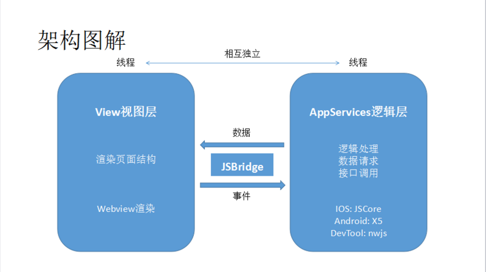
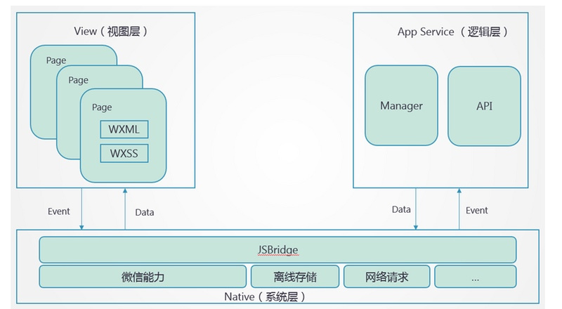

## 小程序双线程模型：
* 小程序的渲染层和逻辑层分别由 2 个线程管理：视图层的界面使用了 WebView 进行渲染，逻辑层采用 JsCore 线程运行 JS脚本。

* 为什么要这样设计呢？
答：方便管控和安全。假如像 Web开发 一样可跳转、可改变页面内容，那么会存在一些不可控因素和安全风险。因此为了解决这些问题，我们需要阻止开发者使用一些，例如浏览器的window对象，跳转页面、操作DOM、动态执行脚本的开放性接口。这就是小程序双线程模型的由来。

* 详细解释：
1. 逻辑层：创建一个单独的线程去执行 JavaScript，在这里执行的都是有关小程序业务逻辑的代码，负责逻辑处理、数据请求、接口调用等
2. 视图层：界面渲染相关的任务全都在 WebView 线程里执行，通过逻辑层代码去控制渲染哪些界面。一个小程序存在多个界面，所以视图层存在多个 WebView 线程
3. JSBridge 起到架起上层开发与Native（系统层）的桥梁，使得小程序可通过API使用原生的功能，且部分组件为原生组件实现，从而有良好体验
