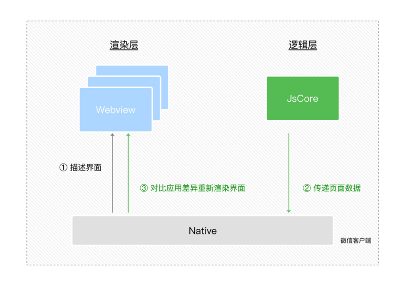

## 小程序双线程通信
* 一、客观现实：
    把开发者的 JS 逻辑代码放到单独的线程去运行，但在 Webview 线程里，开发者就没法直接操作 DOM。那要怎么去实现动态更改界面呢？

* 二、在双线程模型中，逻辑层和视图层的通信会由 Native （微信客户端）做中转，逻辑层发送网络请求也经由 Native 转发。因此，我们可以把 DOM 的更新通过简单的数据通信来实现。

> 就像 Virtual DOM 更新过程一样：用 JS 对象模拟 DOM 树 -> 比较两棵虚拟 DOM 树的差异 -> 把差异应用到真正的 DOM 树上。

* 三、双线程通信过程：

1. 在渲染层把 WXML 转化成对应的 JS 对象。
2. 在逻辑层发生数据变更的时候，通过宿主环境提供的 setData 方法把数据从逻辑层传递到 Native，再转发到渲染层。
3. 经过对比前后差异，把差异应用在原来的 DOM 树上，更新界面。

* 四、小程序基础库：
小程序的基础库可以被注入到视图层和逻辑层运行，主要用于以下几个方面：
    
        在视图层，提供各类组件来组建界面的元素
        在逻辑层，提供各类 API 来处理各种逻辑
        处理数据绑定、组件系统、事件系统、通信系统等一系列框架逻辑
    
小程序的基础库不会被打包在某个小程序的代码包里边，它会被提前内置在微信客户端。这样可以：
1. 降低业务小程序的代码包大小
2. 可以单独修复基础库中的 Bug，无需修改到业务小程序的代码包

