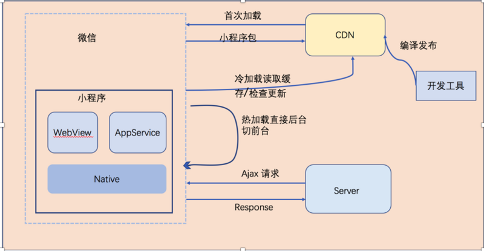

## 小程序启动机制
小程序启动会有两种情况，一种是「冷启动」，一种是「热启动」。

* 热启动：
假如用户已经打开过某小程序，然后在一定时间内再次打开该小程序，此时无需重新启动，只需将后台状态的小程序切换到前台，这个过程就是「热启动」
> 1. 当小程序进入后台，客户端会维持一段时间的运行状态，超过一定时间后（目前是5分钟）会被微信主动销毁
> 2. 当短时间内（5s）连续收到两次以上收到系统内存告警，会进行小程序的销毁

* 冷启动：
「冷启动」指的是用户首次打开或小程序被微信主动销毁后再次打开的情况，此时小程序需要重新加载启动。

## 小程序更新机制
小程序冷启动时如果发现有新版本，将会异步下载新版本的代码包，并同时用客户端本地的包进行启动，即新版本的小程序需要等下一次冷启动才会应用上。 

如果需要马上应用最新版本，可以使用 wx.getUpdateManager API 进行处理。