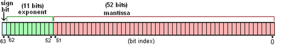

# 0.1+0.2==0.3

参考：
* https://cloud.tencent.com/developer/article/1499704
* https://blog.csdn.net/weixin_45396666/article/details/99684857

```js
console.log(0.1+0.2===0.3)   // false
```
1. JavaScript 使用 IEEE 754 标准的双精度浮点数 来表示数字。即：JS中所有数字都是浮点数，使用 64 位二进制来表示。



> IEEE 754 中规定：   
> * 对于 32 位的浮点数，最高的 1 位是符号位 S，接着的 **8** 位是指数 E，剩下的 **23** 位为有效数字 M；  
> * 对于 64 位的浮点数，最高的 1 位是符号位 S，接着的**11**位是指数 E，剩下的 **52** 位为有效数字 M。   


2. 这种表示方式**无法精确地存储某些十进制小数**，比如 0.1 和 0.2。

具体来说：

* 0.1 在二进制中是一个无限循环的小数（类似十进制中的 1/3 = 0.3333...），**但是计算机中只能处理52位的有效数字**
* 0.2 在二进制中也是一个无限循环的小数
* 当它们相加时，由于浮点数的精度限制（约 16 位小数），计算结果会是一个近似值 0.30000000000000004，所以条件判断结果为false。

这个是二进制浮点数最大的问题（不仅JavaScript，所有遵循IEEE 754规范的语言都是如此）。

那么应该怎样来解决0.1+0.2等于0.3呢? 

### 方法1：设置一个极小的误差范围值，通常称为”机器精度“
对于Javascript来说，这个值通常是2^-52,而在ES6中，已经为我们提供了这样一个

属性：<code>Number.EPSILON（epsilon）</code>，而这个值正等于<code>2^-52</code>。

```js
function numbersequal(a, b) {
    return Math.abs(a - b) < Number.EPSILON;
}
var a = 0.1 + 0.2, b = 0.3;
console.log(numbersequal(a, b)); //true
```
在chrome中支持这个属性，但是IE并不支持，所以**需解决IE的不兼容问题**。

```js
function numbersequal(a, b) {
    return Math.abs(a - b) < Number.EPSILON || Math.pow(2, -52);  // 适配
}
var a = 0.1 + 0.2, b = 0.3;
console.log(numbersequal(a, b)); //true
```

### 方法2：**转换为整数运算（推荐）**
将浮点数放大为整数进行计算，再缩小回原比例，避免精度丢失：

```js
// 例如计算 0.1 + 0.2
const result = (1 + 2) / 10; // 先转换为整数 1 和 2 计算
console.log(result); // 0.3
console.log(result === 0.3); // true
```

整数缩放法的性能是最优的，但只适用于固定小数位数的场景